# 一. 初识算法

## 1.1 什么是算法？

**定义**

在数学和计算机科学领域，算法是一系列有限的严谨指令，通常用于解决一类特定问题或执行计算

> In mathematics and computer science, an **algorithm** (/ˈælɡərɪðəm/) is a finite sequence of rigorous instructions, typically used to solve a class of specific problems or to perform a computation.[^1]


**Introduction to Algorithm[^2]**

不正式的说，算法就是任何定义优良的计算过程：接收一些值作为输入，在有限的时间内，产生一些值作为输出。

> Informally, an algorithm is any well-defined computational procedure that takes some value, or set of values, as input and produces some value, or set of values, as output in a finite amount of time.

## 1.2 什么是数据结构？

**定义**

在计算机科学领域，数据结构是一种数据组织、管理和存储格式，通常被选择用来高效访问数据

> In computer science, a **data structure** is a data organization, management, and storage format that is usually chosen for efficient access to data


**Introduction to Algorithm[^2]**

数据结构是一种存储和组织数据的方式，旨在便于访问和修改

> A data structure is a way to store and organize data in order to facilitate access and modifications


接下来我们通过对一个非常著名的二分查找算法的讲解来认识一下算法

## 1.3 二分查找 [^3]

二分查找算法也称折半查找，是一种非常高效的工作于有序数组的查找算法。后续的课程中还会学习更多的查找算法，但在此之前，不妨用它作为入门。

### 二分查找基础版

需求：在**有序**数组 $A$ 内，查找值 $target$

* 如果找到返回索引
* 如果找不到返回 $-1$

| 算法描述 |                                                              |
| -------- | ------------------------------------------------------------ |
| 前提     | 给定一个内含 $n$ 个元素的有序数组 $A$，满足 $A_{0}\leq A_{1}\leq A_{2}\leq \cdots \leq A_{n-1}$，一个待查值 $target$ |
| 1        | 设置 $i=0$，$j=n-1$                                          |
| 2        | 如果 $i \gt j$，结束查找，没找到                             |
| 3        | 设置 $m = floor(\frac {i+j}{2})$ ，$m$ 为中间索引，$floor$ 是向下取整（$\leq \frac {i+j}{2}$ 的最小整数） |
| 4        | 如果 $target < A_{m}$ 设置 $j = m - 1$，跳到第2步            |
| 5        | 如果 $A_{m} < target$ 设置 $i = m + 1$，跳到第2步            |
| 6        | 如果 $A_{m} = target$，结束查找，找到了                      |

java 实现


```java
public static int binarySearch(int[] a, int target) {
    int i = 0, j = a.length - 1;
    while (i <= j) {
        int m = (i + j) >>> 1;
        if (target < a[m]) {			// 在左边
            j = m - 1;
        } else if (a[m] < target) {		// 在右边
            i = m + 1;
        } else {
            return m;
        }
    }
    return -1;
}
```

* $i,j$ 对应着搜索区间 $[0,a.length-1]$（注意是闭合的区间），$i<=j$ 意味着搜索区间内还有未比较的元素，$i,j$ 指向的元素也可能是比较的目标
  * 思考：如果不加 $i==j$ 行不行？
  * 回答：不行，因为这意味着 $i,j$ 指向的元素会漏过比较
* $m$ 对应着中间位置，中间位置左边和右边的元素可能不相等（差一个），不会影响结果
* 如果某次未找到，那么缩小后的区间内不包含 $m$


### 二分查找改变版

另一种写法

```java
public static int binarySearch(int[] a, int target) {
    int i = 0, j = a.length;
    while (i < j) {
        int m = (i + j) >>> 1;
        if (target < a[m]) {			// 在左边
            j = m;
        } else if (a[m] < target) {		// 在右边
            i = m + 1;
        } else {
            return m;
        }
    }
    return -1;
}
```

* $i,j$ 对应着搜索区间 $[0,a.length)$（注意是左闭右开的区间），$i<j$ 意味着搜索区间内还有未比较的元素，$j$ 指向的**一定不是**查找目标
  * 思考：为啥这次不加 $i==j$ 的条件了？
  * 回答：这回 $j$ 指向的不是查找目标，如果还加 $i==j$ 条件，就意味着 $j$ 指向的还会再次比较，找不到时，会死循环
* 如果某次要缩小右边界，那么 $j=m$，因为此时的 $m$ 已经**不是**查找目标了


### 衡量算法好坏

**时间复杂度**

下面的查找算法也能得出与之前二分查找一样的结果，那你能说出它差在哪里吗？

```java
public static int search(int[] a, int k) {
    for (
        int i = 0;
        i < a.length;
        i++
    ) {
        if (a[i] == k) {
            return i;
        }
    }
    return -1;
}
```

考虑最坏情况下（没找到）例如 `[1,2,3,4]` 查找 5

* `int i = 0` 只执行一次
* `i < a.length` 受数组元素个数 $n$ 的影响，比较 $n+1$ 次
* `i++` 受数组元素个数 $n$ 的影响，自增 $n$ 次
* `a[i] == k` 受元素个数 $n$ 的影响，比较 $n$ 次
* `return -1`，执行一次

粗略认为每行代码执行时间是 $t$，假设 $n=4$ 那么

* 总执行时间是 $(1+4+1+4+4+1)*t = 15t$
* 可以推导出更一般地公式为，$T = (3*n+3)t$ 


如果套用二分查找算法，还是 `[1,2,3,4]` 查找 5

```java
public static int binarySearch(int[] a, int target) {
    int i = 0, j = a.length - 1;
    while (i <= j) {
        int m = (i + j) >>> 1;
        if (target < a[m]) {			// 在左边
            j = m - 1;
        } else if (a[m] < target) {		// 在右边
            i = m + 1;
        } else {
            return m;
        }
    }
    return -1;
}
```

* `int i = 0, j = a.length - 1` 各执行 1 次
* `i <= j` 比较 $floor(\log_{2}(n)+1)$ 再加 1 次
* `(i + j) >>> 1` 计算 $floor(\log_{2}(n)+1)$ 次
* 接下来 `if() else if() else` 会执行 $3* floor(\log_{2}(n)+1)$ 次，分别为
  * if 比较
  * else if 比较
  * else if 比较成立后的赋值语句

* `return -1`，执行一次

结果：

* 总执行时间为 $(2 + (1+3) + 3 + 3 * 3 +1)*t = 19t$
* 更一般地公式为 $(4 + 5 * floor(\log_{2}(n)+1))*t$

> **注意：**
>
> 左侧未找到和右侧未找到结果不一样，这里不做分析


两个算法比较，可以看到 $n$ 在较小的时候，二者花费的次数差不多


但随着 $n$ 越来越大，比如说 $n=1000$ 时，用二分查找算法（红色）也就是 $54t$，而蓝色算法则需要 $3003t$


> 画图采用的是 [Desmos | 图形计算器](https://www.desmos.com/calculator?lang=zh-CN)


计算机科学中，**时间复杂度**是用来衡量：一个算法的执行，随数据规模增大，而增长的时间成本

* 不依赖于环境因素


如何表示时间复杂度呢？

* 假设算法要处理的数据规模是 $n$，代码总的执行行数用函数 $f(n)$ 来表示，例如：
  * 线性查找算法的函数 $f(n) = 3*n + 3$
  * 二分查找算法的函数 $f(n) = (floor(log_2(n)) + 1) * 5 + 4$

* 为了对 $f(n)$ 进行化简，应当抓住主要矛盾，找到一个变化趋势与之相近的表示法


**大 $O$ 表示法[^4]**


其中

* $c, c_1, c_2$ 都为一个常数
* $f(n)$ 是实际执行代码行数与 n 的函数
* $g(n)$ 是经过化简，变化趋势与 $f(n)$ 一致的 n 的函数


**渐进上界**

渐进上界（asymptotic upper bound）：从某个常数 $n_0$开始，$c*g(n)$ 总是位于 $f(n)$ 上方，那么记作 $O(g(n))$

* 代表算法执行的最差情况

例1

* $f(n) = 3*n+3$ 
* $g(n) = n$
* 取 $c=4$，在$n_0=3$ 之后，$g(n)$ 可以作为 $f(n)$ 的渐进上界，因此表示法写作 $O(n)$


例2

* $f(n) = 5*floor(log_2(n)) + 9$
* $g(n) = log_2(n)$
* $O(log_2(n))$


已知 $f(n)$ 来说，求 $g(n)$

* 表达式中相乘的常量，可以省略，如
  * $f(n) = 100*n^2$ 中的 $100$
* 多项式中数量规模更小（低次项）的表达式，如
  * $f(n)=n^2+n$ 中的 $n$
  * $f(n) = n^3 + n^2$ 中的 $n^2$
* 不同底数的对数，渐进上界可以用一个对数函数 $\log n$ 表示
  * 例如：$log_2(n)$ 可以替换为 $log_{10}(n)$，因为 $log_2(n) = \frac{log_{10}(n)}{log_{10}(2)}$，相乘的常量 $\frac{1}{log_{10}(2)}$ 可以省略
* 类似的，对数的常数次幂可省略
  * 如：$log(n^c) = c * log(n)$ 


**常见大 $O$ 表示法**


 按时间复杂度从低到高

* 黑色横线 $O(1)$，常量时间，意味着算法时间并不随数据规模而变化
* 绿色 $O(log(n))$，对数时间
* 蓝色 $O(n)$，线性时间，算法时间与数据规模成正比
* 橙色 $O(n*log(n))$，拟线性时间
* 红色 $O(n^2)$ 平方时间
* 黑色朝上 $O(2^n)$ 指数时间
* 没画出来的 $O(n!)$


**渐进下界**

渐进下界（asymptotic lower bound）：从某个常数 $n_0$开始，$c*g(n)$ 总是位于 $f(n)$ 下方，那么记作 $\Omega(g(n))$


**渐进紧界**

渐进紧界（asymptotic tight bounds）：从某个常数 $n_0$开始，$f(n)$ 总是在 $c_1*g(n)$ 和 $c_2*g(n)$ 之间，那么记作 $\Theta(g(n))$


**空间复杂度**

与时间复杂度类似，一般也使用大 $O$ 表示法来衡量：一个算法执行随数据规模增大，而增长的**额外**空间成本

```java
public static int binarySearchBasic(int[] a, int target) {
    int i = 0, j = a.length - 1;    // 设置指针和初值
    while (i <= j) {                // i~j 范围内有东西
        int m = (i + j) >>> 1;
        if(target < a[m]) {         // 目标在左边
            j = m - 1;
        } else if (a[m] < target) { // 目标在右边
            i = m + 1;
        } else {                    // 找到了
            return m;
        }
    }
    return -1;
}
```


**二分查找性能**

下面分析二分查找算法的性能

时间复杂度

* 最坏情况：$O(\log n)$
* 最好情况：如果待查找元素恰好在数组中央，只需要循环一次 $O(1)$

空间复杂度

* 需要常数个指针 $i,j,m$，因此额外占用的空间是 $O(1)$ 


### 二分查找平衡版

```java
public static int binarySearchBalance(int[] a, int target) {
    int i = 0, j = a.length;
    while (1 < j - i) {
        int m = (i + j) >>> 1;
        if (target < a[m]) {
            j = m;
        } else {
            i = m;
        }
    }
    return (a[i] == target) ? i : -1;
}
```

思想：

1. 左闭右开的区间，$i$ 指向的可能是目标，而 $j$ 指向的不是目标
2. 不奢望循环内通过 $m$ 找出目标, 缩小区间直至剩 1 个, 剩下的这个可能就是要找的（通过 $i$）
   * $j - i > 1$ 的含义是，在范围内待比较的元素个数 > 1
3. 改变 $i$ 边界时，它指向的可能是目标，因此不能 $m+1$
4. 循环内的平均比较次数减少了
5. 时间复杂度 $\Theta(log(n))$


### 二分查找 Java 版

```java
private static int binarySearch0(long[] a, int fromIndex, int toIndex,
                                     long key) {
    int low = fromIndex;
    int high = toIndex - 1;

    while (low <= high) {
        int mid = (low + high) >>> 1;
        long midVal = a[mid];

        if (midVal < key)
            low = mid + 1;
        else if (midVal > key)
            high = mid - 1;
        else
            return mid; // key found
    }
    return -(low + 1);  // key not found.
}
```

* 例如 $[1,3,5,6]$ 要插入 $2$ 那么就是找到一个位置，这个位置左侧元素都比它小
  * 等循环结束，若没找到，low 左侧元素肯定都比 target 小，因此 low 即插入点
* 插入点取负是为了与找到情况区分
* -1 是为了把索引 0 位置的插入点与找到的情况进行区分


### Leftmost 与 Rightmost

有时我们希望返回的是最左侧的重复元素，如果用 Basic 二分查找

* 对于数组 $[1, 2, 3, 4, 4, 5, 6, 7]$，查找元素4，结果是索引3

* 对于数组 $[1, 2, 4, 4, 4, 5, 6, 7]$，查找元素4，结果也是索引3，并不是最左侧的元素

```java
public static int binarySearchLeftmost1(int[] a, int target) {
    int i = 0, j = a.length - 1;
    int candidate = -1;
    while (i <= j) {
        int m = (i + j) >>> 1;
        if (target < a[m]) {
            j = m - 1;
        } else if (a[m] < target) {
            i = m + 1;
        } else {
            candidate = m; // 记录候选位置
            j = m - 1;     // 继续向左
        }
    }
    return candidate;
}
```

如果希望返回的是最右侧元素

```java
public static int binarySearchRightmost1(int[] a, int target) {
    int i = 0, j = a.length - 1;
    int candidate = -1;
    while (i <= j) {
        int m = (i + j) >>> 1;
        if (target < a[m]) {
            j = m - 1;
        } else if (a[m] < target) {
            i = m + 1;
        } else {
            candidate = m; // 记录候选位置
            i = m + 1;	   // 继续向右
        }
    }
    return candidate;
}
```


**应用**

对于 Leftmost 与 Rightmost，可以返回一个比 -1 更有用的值

Leftmost 改为

```java
public static int binarySearchLeftmost(int[] a, int target) {
    int i = 0, j = a.length - 1;
    while (i <= j) {
        int m = (i + j) >>> 1;
        if (target <= a[m]) {
            j = m - 1;
        } else {
            i = m + 1;
        }
    }
    return i; 
}
```

* leftmost 返回值的另一层含义：$\lt target$ 的元素个数
* 小于等于中间值，都要向左找

Rightmost 改为

```java
public static int binarySearchRightmost(int[] a, int target) {
    int i = 0, j = a.length - 1;
    while (i <= j) {
        int m = (i + j) >>> 1;
        if (target < a[m]) {
            j = m - 1;
        } else {
            i = m + 1;
        }
    }
    return i - 1;
}
```

* 大于等于中间值，都要向右找

几个名词


**范围查询**：

* 查询 $x \lt 4$，$0 .. leftmost(4) - 1$
* 查询 $x \leq 4$，$0 .. rightmost(4)$
* 查询 $4 \lt x$，$rightmost(4) + 1 .. \infty $
* 查询 $4 \leq x$， $leftmost(4) .. \infty$
* 查询 $4 \leq x \leq 7$，$leftmost(4) .. rightmost(7)$
* 查询 $4 \lt x \lt 7$，$rightmost(4)+1 .. leftmost(7)-1$

**求排名**：$leftmost(target) + 1$

* $target$ 可以不存在，如：$leftmost(5)+1 = 6$
* $target$ 也可以存在，如：$leftmost(4)+1 = 3$

**求前任（predecessor）**：$leftmost(target) - 1$

* $leftmost(3) - 1 = 1$，前任 $a_1 = 2$
* $leftmost(4) - 1 = 1$，前任 $a_1 = 2$

**求后任（successor）**：$rightmost(target)+1$

* $rightmost(5) + 1 = 5$，后任 $a_5 = 7$
* $rightmost(4) + 1 = 5$，后任 $a_5 = 7$

**求最近邻居**：

* 前任和后任距离更近者


# 二. 基础数据结构


## 2.1 数组

### 概述

**定义**

在计算机科学中，数组是由一组元素（值或变量）组成的数据结构，每个元素有至少一个索引或键来标识

>In computer science, an **array** is a data structure consisting of a collection of *elements* (values or variables), each identified by at least one *array index* or *key*


因为数组内的元素是**连续存储**的，所以数组中元素的地址，可以通过其索引计算出来，例如：

```java
int[] array = {1,2,3,4,5}
```


知道了数组的**数据**起始地址 $BaseAddress$，就可以由公式 $BaseAddress + i * size$ 计算出索引 $i$ 元素的地址

* $i$ 即索引，在 Java、C 等语言都是从 0 开始
* $size$ 是每个元素占用字节，例如 $int$ 占 $4$，$double$ 占 $8$


**小测试**

```java
byte[] array = {1,2,3,4,5}
```

已知 array 的**数据**的起始地址是 0x7138f94c8，那么元素 3 的地址是什么？

> 答：0x7138f94c8 + 2 * 1 = 0x7138f94ca


**空间占用**

Java 中数组结构为

* 8 字节 markword
* 4 字节 class 指针（压缩 class 指针的情况）
* 4 字节 数组大小（决定了数组最大容量是 $2^{32}$）
* 数组元素 + 对齐字节（java 中所有对象大小都是 8 字节的整数倍[^12]，不足的要用对齐字节补足）

例如

```java
int[] array = {1, 2, 3, 4, 5};
```

的大小为 40 个字节，组成如下

```
8 + 4 + 4 + 5*4 + 4(alignment)
```


**随机访问性能**

即根据索引查找元素，时间复杂度是 $O(1)$


### 动态数组

**java 版本**

```java
public class DynamicArray implements Iterable<Integer> {
    private int size = 0; // 逻辑大小
    private int capacity = 8; // 容量
    private int[] array = {};


    /**
     * 向最后位置 [size] 添加元素
     *
     * @param element 待添加元素
     */
    public void addLast(int element) {
        add(size, element);
    }

    /**
     * 向 [0 .. size] 位置添加元素
     *
     * @param index   索引位置
     * @param element 待添加元素
     */
    public void add(int index, int element) {
        checkAndGrow();

        // 添加逻辑
        if (index >= 0 && index < size) {
            // 向后挪动, 空出待插入位置
            System.arraycopy(array, index,
                    array, index + 1, size - index);
        }
        array[index] = element;
        size++;
    }

    private void checkAndGrow() {
        // 容量检查
        if (size == 0) {
            array = new int[capacity];
        } else if (size == capacity) {
            // 进行扩容, 1.5 1.618 2
            capacity += capacity >> 1;
            int[] newArray = new int[capacity];
            System.arraycopy(array, 0,
                    newArray, 0, size);
            array = newArray;
        }
    }

    /**
     * 从 [0 .. size) 范围删除元素
     *
     * @param index 索引位置
     * @return 被删除元素
     */
    public int remove(int index) { // [0..size)
        int removed = array[index];
        if (index < size - 1) {
            // 向前挪动
            System.arraycopy(array, index + 1,
                    array, index, size - index - 1);
        }
        size--;
        return removed;
    }


    /**
     * 查询元素
     *
     * @param index 索引位置, 在 [0..size) 区间内
     * @return 该索引位置的元素
     */
    public int get(int index) {
        return array[index];
    }

    /**
     * 遍历方法1
     *
     * @param consumer 遍历要执行的操作, 入参: 每个元素
     */
    public void foreach(Consumer<Integer> consumer) {
        for (int i = 0; i < size; i++) {
            // 提供 array[i]
            // 返回 void
            consumer.accept(array[i]);
        }
    }

    /**
     * 遍历方法2 - 迭代器遍历
     */
    @Override
    public Iterator<Integer> iterator() {
        return new Iterator<Integer>() {
            int i = 0;

            @Override
            public boolean hasNext() { // 有没有下一个元素
                return i < size;
            }

            @Override
            public Integer next() { // 返回当前元素,并移动到下一个元素
                return array[i++];
            }
        };
    }

    /**
     * 遍历方法3 - stream 遍历
     *
     * @return stream 流
     */
    public IntStream stream() {
        return IntStream.of(Arrays.copyOfRange(array, 0, size));
    }
}
```

* 这些方法实现，都简化了 index 的有效性判断，假设输入的 index 都是合法的


**插入或删除性能**

头部位置，时间复杂度是 $O(n)$

中间位置，时间复杂度是 $O(n)$

尾部位置，时间复杂度是 $O(1)$（均摊来说）


### 二维数组

```java
int[][] array = {
    {11, 12, 13, 14, 15},
    {21, 22, 23, 24, 25},
    {31, 32, 33, 34, 35},
};
```

内存图如下


* 二维数组占 32 个字节，其中 array[0]，array[1]，array[2] 三个元素分别保存了指向三个一维数组的引用

* 三个一维数组各占 40 个字节

* 它们在内层布局上是**连续**的

更一般的，对一个二维数组 $Array[m][n]$

* $m$ 是外层数组的长度，可以看作 row 行
* $n$ 是内层数组的长度，可以看作 column 列
* 当访问 $Array[i][j]$，$0\leq i \lt m, 0\leq j \lt n$时，就相当于
  * 先找到第 $i$ 个内层数组（行）
  * 再找到此内层数组中第 $j$ 个元素（列）


**小测试**

Java 环境下（不考虑类指针和引用压缩，此为默认情况），有下面的二维数组

```java
byte[][] array = {
    {11, 12, 13, 14, 15},
    {21, 22, 23, 24, 25},
    {31, 32, 33, 34, 35},
};
```

已知 array **对象**起始地址是 0x1000，那么 23 这个元素的地址是什么？

> 答：
>
> * 起始地址 0x1000
> * 外层数组大小：16字节对象头 + 3元素 * 每个引用4字节 + 4 对齐字节 = 32 = 0x20
> * 第一个内层数组大小：16字节对象头 + 5元素 * 每个byte1字节 + 3 对齐字节 = 24 = 0x18
> * 第二个内层数组，16字节对象头 = 0x10，待查找元素索引为 2
> * 最后结果 = 0x1000 + 0x20 + 0x18 + 0x10 + 2*1 = 0x104a


### 局部性原理

这里只讨论空间局部性

* cpu 读取内存（速度慢）数据后，会将其放入高速缓存（速度快）当中，如果后来的计算再用到此数据，在缓存中能读到的话，就不必读内存了
* 缓存的最小存储单位是缓存行（cache line），一般是 64 bytes，一次读的数据少了不划算啊，因此最少读 64 bytes 填满一个缓存行，因此读入某个数据时也会读取其**临近的数据**，这就是所谓**空间局部性**


**对效率的影响**

比较下面 ij 和 ji 两个方法的执行效率

```java
int rows = 1000000;
int columns = 14;
int[][] a = new int[rows][columns];

StopWatch sw = new StopWatch();
sw.start("ij");
ij(a, rows, columns);
sw.stop();
sw.start("ji");
ji(a, rows, columns);
sw.stop();
System.out.println(sw.prettyPrint());
```

ij 方法

```java
public static void ij(int[][] a, int rows, int columns) {
    long sum = 0L;
    for (int i = 0; i < rows; i++) {
        for (int j = 0; j < columns; j++) {
            sum += a[i][j];
        }
    }
    System.out.println(sum);
}
```

ji 方法

```java
public static void ji(int[][] a, int rows, int columns) {
    long sum = 0L;
    for (int j = 0; j < columns; j++) {
        for (int i = 0; i < rows; i++) {
            sum += a[i][j];
        }
    }
    System.out.println(sum);
}
```

执行结果

```
0
0
StopWatch '': running time = 96283300 ns
---------------------------------------------
ns         %     Task name
---------------------------------------------
016196200  017%  ij
080087100  083%  ji
```

可以看到 ij 的效率比 ji 快很多，为什么呢？

* 缓存是有限的，当新数据来了后，一些旧的缓存行数据就会被覆盖
* 如果不能充分利用缓存的数据，就会造成效率低下

以 ji 执行为例，第一次内循环要读入 $[0,0]$ 这条数据，由于局部性原理，读入 $[0,0]$ 的同时也读入了 $[0,1] ... [0,13]$，如图所示


但很遗憾，第二次内循环要的是 $[1,0]$ 这条数据，缓存中没有，于是再读入了下图的数据


这显然是一种浪费，因为 $[0,1] ... [0,13]$ 包括 $[1,1] ... [1,13]$ 这些数据虽然读入了缓存，却没有及时用上，而缓存的大小是有限的，等执行到第九次内循环时


缓存的第一行数据已经被新的数据 $[8,0] ... [8,13]$ 覆盖掉了，以后如果再想读，比如 $[0,1]$，又得到内存去读了

同理可以分析 ij 函数则能充分利用局部性原理加载到的缓存数据

**举一反三**

1. I/O 读写时同样可以体现局部性原理

2. 数组可以充分利用局部性原理，那么链表呢？

   > 答：链表不行，因为链表的元素并非相邻存储


### 越界检查

java 中对数组元素的读写都有越界检查，类似于下面的代码

```c++
bool is_within_bounds(int index) const        
{ 
    return 0 <= index && index < length(); 
}
```

* 代码位置：`openjdk\src\hotspot\share\oops\arrayOop.hpp`

只不过此检查代码，不需要由程序员自己来调用，JVM 会帮我们调用


## 2.2 链表

### 概述

**定义**

在计算机科学中，链表是数据元素的线性集合，其每个元素都指向下一个元素，元素存储上并不连续

> In computer science, a **linked list** is a linear collection of data elements whose order is not given by their physical placement in memory. Instead, each element points to the next. 


可以分类为[^5]

* 单向链表，每个元素只知道其下一个元素是谁


* 双向链表，每个元素知道其上一个元素和下一个元素


* 循环链表，通常的链表尾节点 tail 指向的都是 null，而循环链表的 tail 指向的是头节点 head


链表内还有一种特殊的节点称为哨兵（Sentinel）节点，也叫做哑元（ Dummy）节点，它不存储数据，通常用作头尾，用来简化边界判断，如下图所示


**随机访问性能**

根据 index 查找，时间复杂度 $O(n)$

**插入或删除性能**

* 起始位置：$O(1)$
* 结束位置：如果已知 tail 尾节点是 $O(1)$，不知道 tail 尾节点是 $O(n)$
* 中间位置：根据 index 查找时间 + $O(1)$


### 单向链表

根据单向链表的定义，首先定义一个存储 value 和 next 指针的类 Node，和一个描述头部节点的引用

```java
public class SinglyLinkedList {
    
    private Node head; // 头部节点
    
    private static class Node { // 节点类
        int value;
        Node next;

        public Node(int value, Node next) {
            this.value = value;
            this.next = next;
        }
    }
}
```

* Node 定义为内部类，是为了对外**隐藏**实现细节，没必要让类的使用者关心 Node 结构
* 定义为 static 内部类，是因为 Node **不需要**与 SinglyLinkedList 实例相关，多个 SinglyLinkedList实例能共用 Node 类定义


**头部添加**

```java
public class SinglyLinkedList {
    // ...
    public void addFirst(int value) {
		this.head = new Node(value, this.head);
    }
}
```

* 如果 this.head == null，新增节点指向 null，并作为新的 this.head
* 如果 this.head != null，新增节点指向原来的 this.head，并作为新的 this.head
  * 注意赋值操作执行顺序是从右到左


**while 遍历**

```java
public class SinglyLinkedList {
    // ...
    public void loop() {
        Node curr = this.head;
        while (curr != null) {
            // 做一些事
            curr = curr.next;
        }
    }
}
```


**for 遍历**

```java
public class SinglyLinkedList {
    // ...
    public void loop() {
        for (Node curr = this.head; curr != null; curr = curr.next) {
            // 做一些事
        }
    }
}
```

* 以上两种遍历都可以把**要做的事**以 Consumer 函数的方式传递进来
  * Consumer 的规则是**一个参数**，**无返回值**，因此像 System.out::println 方法等都是 Consumer
  * 调用 Consumer 时，将当前节点 curr.value 作为参数传递给它


**迭代器遍历**

```java
public class SinglyLinkedList implements Iterable<Integer> {
    // ...
    private class NodeIterator implements Iterator<Integer> {
        Node curr = head;
        
        public boolean hasNext() {
            return curr != null;
        }

        public Integer next() {
            int value = curr.value;
            curr = curr.next;
            return value;
        }
    }
    
    public Iterator<Integer> iterator() {
        return new NodeIterator();
    }
}
```

* hasNext 用来判断是否还有必要调用 next
* next 做两件事
  * 返回当前节点的 value
  * 指向下一个节点
* NodeIterator 要定义为**非 static 内部类**，是因为它与 SinglyLinkedList 实例相关，是对某个 SinglyLinkedList 实例的迭代


**递归遍历**

```java
public class SinglyLinkedList implements Iterable<Integer> {
    // ...
    public void loop() {
        recursion(this.head);
    }

    private void recursion(Node curr) {
        if (curr == null) {
            return;
        }
        // 前面做些事
        recursion(curr.next);
        // 后面做些事
    }
}
```


**尾部添加**

```java
public class SinglyLinkedList {
    // ...
    private Node findLast() {
        if (this.head == null) {
            return null;
        }
        Node curr;
        for (curr = this.head; curr.next != null; ) {
            curr = curr.next;
        }
        return curr;
    }
    
    public void addLast(int value) {
        Node last = findLast();
        if (last == null) {
            addFirst(value);
            return;
        }
        last.next = new Node(value, null);
    }
}
```

* 注意，找最后一个节点，终止条件是 curr.next == null 
* 分成两个方法是为了代码清晰，而且 findLast() 之后还能复用


**尾部添加多个**

```java
public class SinglyLinkedList {
    // ...
	public void addLast(int first, int... rest) {
        
        Node sublist = new Node(first, null);
        Node curr = sublist;
        for (int value : rest) {
            curr.next = new Node(value, null);
            curr = curr.next;
        }
        
        Node last = findLast();
        if (last == null) {
            this.head = sublist;
            return;
        }
        last.next = sublist;
    }
}
```

* 先串成一串 sublist
* 再作为一个整体添加


**根据索引获取**

```java
public class SinglyLinkedList {
    // ...
	private Node findNode(int index) {
        int i = 0;
        for (Node curr = this.head; curr != null; curr = curr.next, i++) {
            if (index == i) {
                return curr;
            }
        }
        return null;
    }
    
    private IllegalArgumentException illegalIndex(int index) {
        return new IllegalArgumentException(String.format("index [%d] 不合法%n", index));
    }
    
    public int get(int index) {
        Node node = findNode(index);
        if (node != null) {
            return node.value;
        }
        throw illegalIndex(index);
    }
}
```

* 同样，分方法可以实现复用


**插入**

```java
public class SinglyLinkedList {
    // ...
	public void insert(int index, int value) {
        if (index == 0) {
            addFirst(value);
            return;
        }
        Node prev = findNode(index - 1); // 找到上一个节点
        if (prev == null) { // 找不到
            throw illegalIndex(index);
        }
        prev.next = new Node(value, prev.next);
    }
}
```

* 插入包括下面的删除，都必须找到上一个节点


**删除**

```java
public class SinglyLinkedList {
    // ...
	public void remove(int index) {
        if (index == 0) {
            if (this.head != null) {
                this.head = this.head.next;
                return;
            } else {
                throw illegalIndex(index);
            }
        }
        Node prev = findNode(index - 1);
        Node curr;
        if (prev != null && (curr = prev.next) != null) {
            prev.next = curr.next;
        } else {
            throw illegalIndex(index);
        }
    }
}
```

* 第一个 if 块对应着 removeFirst 情况
* 最后一个 if 块对应着至少得两个节点的情况
  * 不仅仅判断上一个节点非空，还要保证当前节点非空


### 单向链表（带哨兵）

观察之前单向链表的实现，发现每个方法内几乎都有判断是不是 head 这样的代码，能不能简化呢？

用一个不参与数据存储的特殊 Node 作为哨兵，它一般被称为哨兵或哑元，拥有哨兵节点的链表称为带头链表

```java
public class SinglyLinkedListSentinel {
    // ...
    private Node head = new Node(Integer.MIN_VALUE, null);
}
```

* 具体存什么值无所谓，因为不会用到它的值

加入哨兵节点后，代码会变得比较简单，先看几个工具方法

```java
public class SinglyLinkedListSentinel {
    // ...
    
    // 根据索引获取节点
    private Node findNode(int index) {
        int i = -1;
        for (Node curr = this.head; curr != null; curr = curr.next, i++) {
            if (i == index) {
                return curr;
            }
        }
        return null;
    }
    
    // 获取最后一个节点
    private Node findLast() {
        Node curr;
        for (curr = this.head; curr.next != null; ) {
            curr = curr.next;
        }
        return curr;
    }
}
```

* findNode 与之前类似，只是 i 初始值设置为 -1 对应哨兵，实际传入的 index 也是 $[-1, \infty)$
* findLast 绝不会返回 null 了，就算没有其它节点，也会返回哨兵作为最后一个节点


这样，代码简化为

```java
public class SinglyLinkedListSentinel {
    // ...
    
    public void addLast(int value) {
        Node last = findLast();
        /*
        改动前
        if (last == null) {
            this.head = new Node(value, null);
            return;
        }
        */
        last.next = new Node(value, null);
    }
    
    public void insert(int index, int value) {
        /*
        改动前
        if (index == 0) {
            this.head = new Node(value, this.head);
            return;
        }
        */
        // index 传入 0 时，返回的是哨兵
        Node prev = findNode(index - 1);
        if (prev != null) {
            prev.next = new Node(value, prev.next);
        } else {
            throw illegalIndex(index);
        }
    }
    
    public void remove(int index) {
        /*
        改动前
        if (index == 0) {
            if (this.head != null) {
                this.head = this.head.next;
                return;
            } else {
                throw illegalIndex(index);
            }
        }
        */
        // index 传入 0 时，返回的是哨兵
        Node prev = findNode(index - 1);
        Node curr;
        if (prev != null && (curr = prev.next) != null) {
            prev.next = curr.next;
        } else {
            throw illegalIndex(index);
        }
    }
    
    public void addFirst(int value) {
        /*
        改动前
        this.head = new Node(value, this.head);
        */
		this.head.next = new Node(value, this.head.next);
        // 也可以视为 insert 的特例, 即 insert(0, value);
    }
}
```

* 对于删除，前面说了【最后一个 if 块对应着至少得两个节点的情况】，现在有了哨兵，就凑足了两个节点


### 双向链表（带哨兵）

```java
public class DoublyLinkedListSentinel implements Iterable<Integer> {

    private final Node head;
    private final Node tail;

    public DoublyLinkedListSentinel() {
        head = new Node(null, 666, null);
        tail = new Node(null, 888, null);
        head.next = tail;
        tail.prev = head;
    }

    private Node findNode(int index) {
        int i = -1;
        for (Node p = head; p != tail; p = p.next, i++) {
            if (i == index) {
                return p;
            }
        }
        return null;
    }

    public void addFirst(int value) {
        insert(0, value);
    }

    public void removeFirst() {
        remove(0);
    }

    public void addLast(int value) {
        Node prev = tail.prev;
        Node added = new Node(prev, value, tail);
        prev.next = added;
        tail.prev = added;
    }

    public void removeLast() {
        Node removed = tail.prev;
        if (removed == head) {
            throw illegalIndex(0);
        }
        Node prev = removed.prev;
        prev.next = tail;
        tail.prev = prev;
    }

    public void insert(int index, int value) {
        Node prev = findNode(index - 1);
        if (prev == null) {
            throw illegalIndex(index);
        }
        Node next = prev.next;
        Node inserted = new Node(prev, value, next);
        prev.next = inserted;
        next.prev = inserted;
    }

    public void remove(int index) {
        Node prev = findNode(index - 1);
        if (prev == null) {
            throw illegalIndex(index);
        }
        Node removed = prev.next;
        if (removed == tail) {
            throw illegalIndex(index);
        }
        Node next = removed.next;
        prev.next = next;
        next.prev = prev;
    }

    private IllegalArgumentException illegalIndex(int index) {
        return new IllegalArgumentException(
                String.format("index [%d] 不合法%n", index));
    }

    @Override
    public Iterator<Integer> iterator() {
        return new Iterator<Integer>() {
            Node p = head.next;

            @Override
            public boolean hasNext() {
                return p != tail;
            }

            @Override
            public Integer next() {
                int value = p.value;
                p = p.next;
                return value;
            }
        };
    }

    static class Node {
        Node prev;
        int value;
        Node next;

        public Node(Node prev, int value, Node next) {
            this.prev = prev;
            this.value = value;
            this.next = next;
        }
    }
}
```


### 环形链表（带哨兵）

双向环形链表带哨兵，这时哨兵**既作为头，也作为尾**

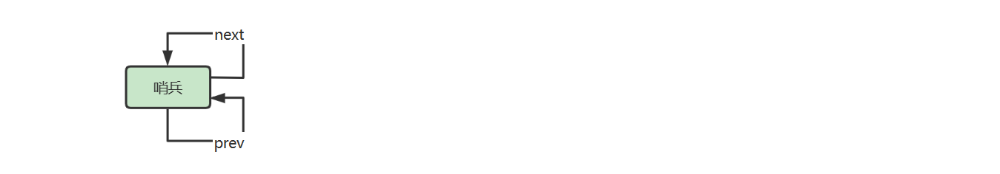

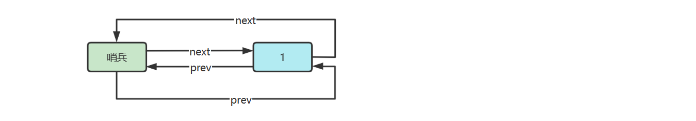

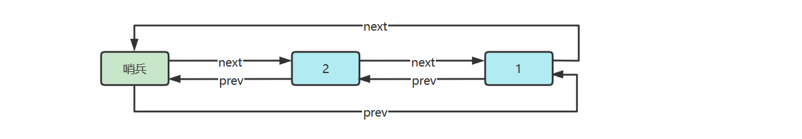

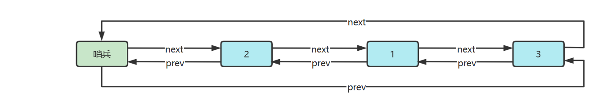

参考实现

```java
public class DoublyLinkedListSentinel implements Iterable<Integer> {

    @Override
    public Iterator<Integer> iterator() {
        return new Iterator<>() {
            Node p = sentinel.next;

            @Override
            public boolean hasNext() {
                return p != sentinel;
            }

            @Override
            public Integer next() {
                int value = p.value;
                p = p.next;
                return value;
            }
        };
    }

    static class Node {
        Node prev;
        int value;
        Node next;

        public Node(Node prev, int value, Node next) {
            this.prev = prev;
            this.value = value;
            this.next = next;
        }
    }

    private final Node sentinel = new Node(null, -1, null); // 哨兵

    public DoublyLinkedListSentinel() {
        sentinel.next = sentinel;
        sentinel.prev = sentinel;
    }

    /**
     * 添加到第一个
     * @param value 待添加值
     */
    public void addFirst(int value) {
        Node next = sentinel.next;
        Node prev = sentinel;
        Node added = new Node(prev, value, next);
        prev.next = added;
        next.prev = added;
    }

    /**
     * 添加到最后一个
     * @param value 待添加值
     */
    public void addLast(int value) {
        Node prev = sentinel.prev;
        Node next = sentinel;
        Node added = new Node(prev, value, next);
        prev.next = added;
        next.prev = added;
    }
    
    /**
     * 删除第一个
     */
    public void removeFirst() {
        Node removed = sentinel.next;
        if (removed == sentinel) {
            throw new IllegalArgumentException("非法");
        }
        Node a = sentinel;
        Node b = removed.next;
        a.next = b;
        b.prev = a;
    }

    /**
     * 删除最后一个
     */
    public void removeLast() {
        Node removed = sentinel.prev;
        if (removed == sentinel) {
            throw new IllegalArgumentException("非法");
        }
        Node a = removed.prev;
        Node b = sentinel;
        a.next = b;
        b.prev = a;
    }

    /**
     * 根据值删除节点
     * <p>假定 value 在链表中作为 key, 有唯一性</p>
     * @param value 待删除值
     */
    public void removeByValue(int value) {
        Node removed = findNodeByValue(value);
        if (removed != null) {
            Node prev = removed.prev;
            Node next = removed.next;
            prev.next = next;
            next.prev = prev;
        }
    }

    private Node findNodeByValue(int value) {
        Node p = sentinel.next;
        while (p != sentinel) {
            if (p.value == value) {
                return p;
            }
            p = p.next;
        }
        return null;
    }

}
```


## 2.3 递归

### 概述

**定义**

计算机科学中，递归是一种解决计算问题的方法，其中解决方案取决于同一类问题的更小子集

> In computer science, **recursion** is a method of solving a computational problem where the solution depends on solutions to smaller instances of the same problem.

比如单链表递归遍历的例子：

```java
void f(Node node) {
    if(node == null) {
        return;
    }
    println("before:" + node.value)
    f(node.next);
    println("after:" + node.value)
}
```

说明：

1. 自己调用自己，如果说每个函数对应着一种解决方案，自己调用自己意味着解决方案是一样的（有规律的）
2. 每次调用，函数处理的数据会较上次缩减（子集），而且最后会缩减至无需继续递归
3. 内层函数调用（子集处理）完成，外层函数才能算调用完成


**原理**

假设链表中有 3 个节点，value 分别为 1，2，3，以上代码的执行流程就类似于下面的**伪码**

```java
// 1 -> 2 -> 3 -> null  f(1)

void f(Node node = 1) {
    println("before:" + node.value) // 1
    void f(Node node = 2) {
        println("before:" + node.value) // 2
        void f(Node node = 3) {
            println("before:" + node.value) // 3
            void f(Node node = null) {
                if(node == null) {
                    return;
                }
            }
            println("after:" + node.value) // 3
        }
        println("after:" + node.value) // 2
    }
    println("after:" + node.value) // 1
}
```


**思路**

1. 确定能否使用递归求解
2. 推导出递推关系，即父问题与子问题的关系，以及递归的结束条件


例如之前遍历链表的递推关系为
$$
f(n) = 
\begin{cases}
停止& n = null \\
f(n.next) & n \neq null
\end{cases}
$$


* 深入到最里层叫做**递**
* 从最里层出来叫做**归**
* 在**递**的过程中，外层函数内的局部变量（以及方法参数）并未消失，**归**的时候还可以用到


### 单路递归 Single Recursion

**E01. 阶乘**

用递归方法求阶乘 

* 阶乘的定义 $n!= 1⋅2⋅3⋯(n-2)⋅(n-1)⋅n$，其中 $n$ 为自然数，当然 $0! = 1$

* 递推关系


$$
f(n) = 
\begin{cases}
1 & n = 1\\
n * f(n-1) & n > 1
\end{cases}
$$

代码

```java
private static int f(int n) {
    if (n == 1) {
        return 1;
    }
    return n * f(n - 1);
}
```

拆解**伪码**如下，假设 n 初始值为 3

```java
f(int n = 3) { // 解决不了,递
    return 3 * f(int n = 2) { // 解决不了,继续递
        return 2 * f(int n = 1) {
            if (n == 1) { // 可以解决, 开始归
                return 1;
            }
        }
    }
}
```


**E02. 反向打印字符串**

用递归反向打印字符串，n 为字符在整个字符串 str 中的索引位置

* **递**：n 从 0 开始，每次 n + 1，一直递到 n == str.length() - 1
* **归**：从 n == str.length() 开始归，从归打印，自然是逆序的

递推关系
$$
f(n) = 
\begin{cases}
停止 & n = str.length() \\
f(n+1) & 0 \leq n \leq str.length() - 1
\end{cases}
$$
代码为

```java
public static void reversePrint(String str, int index) {
    if (index == str.length()) {
        return;
    }
    reversePrint(str, index + 1);
    System.out.println(str.charAt(index));
}
```

拆解**伪码**如下，假设字符串为 "abc"

```java
void reversePrint(String str, int index = 0) {
    void reversePrint(String str, int index = 1) {
        void reversePrint(String str, int index = 2) {
            void reversePrint(String str, int index = 3) { 
                if (index == str.length()) {
                    return; // 开始归
                }
            }
            System.out.println(str.charAt(index)); // 打印 c
        }
        System.out.println(str.charAt(index)); // 打印 b
    }
    System.out.println(str.charAt(index)); // 打印 a
}
```


### 多路递归 Multi Recursion

**E01. 斐波那契数列**

* 之前的例子是每个递归函数只包含一个自身的调用，这称之为 single recursion
* 如果每个递归函数例包含多个自身调用，称之为 multi recursion

**递推关系**
$$
f(n) = 
\begin{cases}
0 & n=0 \\
1 & n=1 \\
f(n-1) + f(n-2) & n>1
\end{cases}
$$


下面的表格列出了数列的前几项

| *F*0 | *F*1 | *F*2 | *F*3 | *F*4 | *F*5 | *F*6 | *F*7 | *F*8 | *F*9 | *F*10 | *F*11 | *F*12 | *F*13 |
| ---- | ---- | ---- | ---- | ---- | ---- | ---- | ---- | ---- | ---- | ----- | ----- | ----- | ----- |
| 0    | 1    | 1    | 2    | 3    | 5    | 8    | 13   | 21   | 34   | 55    | 89    | 144   | 233   |

**实现**

```java
public static int f(int n) {
    if (n == 0) {
        return 0;
    }
    if (n == 1) {
        return 1;
    }
    return f(n - 1) + f(n - 2);
}
```

**执行流程**


* 绿色代表正在执行（对应递），灰色代表执行结束（对应归）
* 递不到头，不能归，对应着深度优先搜索

**时间复杂度**

* 递归的次数也符合斐波那契规律，$2 * f(n+1)-1$
* 时间复杂度推导过程
  * 斐波那契通项公式 $f(n) = \frac{1}{\sqrt{5}}*({\frac{1+\sqrt{5}}{2}}^n - {\frac{1-\sqrt{5}}{2}}^n)$
  * 简化为：$f(n) = \frac{1}{2.236}*({1.618}^n - {(-0.618)}^n)$
  * 带入递归次数公式 $2*\frac{1}{2.236}*({1.618}^{n+1} - {(-0.618)}^{n+1})-1$
  * 时间复杂度为 $\Theta(1.618^n)$


> 1. 更多 Fibonacci 参考[^8][^9][^10]
> 2. 以上时间复杂度分析，未考虑大数相加的因素


**变体1 - 兔子问题[^8]**

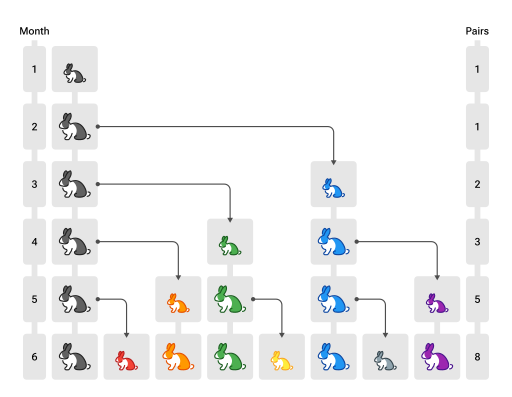

* 第一个月，有一对未成熟的兔子（黑色，注意图中个头较小）
* 第二个月，它们成熟
* 第三个月，它们能产下一对新的小兔子（蓝色）
* 所有兔子遵循相同规律，求第 $n$ 个月的兔子数

**分析**

兔子问题如何与斐波那契联系起来呢？设第 n 个月兔子数为 $f(n)$

* $f(n)$ = 上个月兔子数 + 新生的小兔子数
* 而【新生的小兔子数】实际就是【上个月成熟的兔子数】
* 因为需要一个月兔子就成熟，所以【上个月成熟的兔子数】也就是【上上个月的兔子数】
* 上个月兔子数，即 $f(n-1)$
* 上上个月的兔子数，即 $f(n-2)$

因此本质还是斐波那契数列，只是从其第一项开始


**变体2 - 青蛙爬楼梯**

* 楼梯有 $n$ 阶
* 青蛙要爬到楼顶，可以一次跳一阶，也可以一次跳两阶
* 只能向上跳，问有多少种跳法

**分析**

| n    | 跳法                                                | 规律                                                         |
| ---- | --------------------------------------------------- | ------------------------------------------------------------ |
| 1    | (1)                                                 | 暂时看不出                                                   |
| 2    | (1,1)  (2)                                          | 暂时看不出                                                   |
| 3    | (1,1,1)  (1,2)  (2,1)                               | 暂时看不出                                                   |
| 4    | (1,1,1,1)    (1,2,1)    (2,1,1)<br />(1,1,2)  (2,2) | 最后一跳，跳一个台阶的，基于f(3)<br />最后一跳，跳两个台阶的，基于f(2) |
| 5    | ...                                                 | ...                                                          |

* 因此本质上还是斐波那契数列，只是从其第二项开始

* 对应 leetcode 题目 [70. 爬楼梯 - 力扣（LeetCode）](https://leetcode.cn/problems/climbing-stairs/)


### 递归优化-记忆法

上述代码存在很多重复的计算，例如求 $f(5)$ 递归分解过程

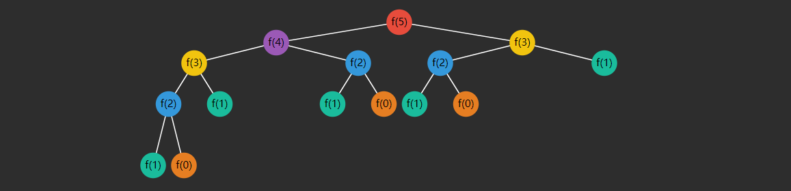

可以看到（颜色相同的是重复的）：

* $f(3)$ 重复了 2 次
* $f(2)$ 重复了 3 次
* $f(1)$ 重复了 5 次
* $f(0)$ 重复了 3 次

随着  $n$ 的增大，重复次数非常可观，如何优化呢？


**Memoization** 记忆法（也称备忘录）是一种优化技术，通过存储函数调用结果（通常比较昂贵），当再次出现相同的输入（子问题）时，就能实现加速效果，改进后的代码

```java
public static void main(String[] args) {
    int n = 13;
    int[] cache = new int[n + 1];
    Arrays.fill(cache, -1);
    cache[0] = 0;
    cache[1] = 1;
    System.out.println(f(cache, n));
}

public static int f(int[] cache, int n) {
    if (cache[n] != -1) {
        return cache[n];
    }

    cache[n] = f(cache, n - 1) + f(cache, n - 2);
    return cache[n];
}
```

优化后的图示，只要结果被缓存，就**不会执行其子问题**

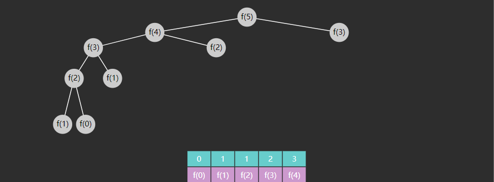

* 改进后的时间复杂度为 $O(n)$
* 请自行验证改进后的效果
* 请自行分析改进后的空间复杂度

> **注意**
>
> 1. 记忆法是动态规划的一种情况，强调的是自顶向下的解决
> 2. 记忆法的本质是空间换时间


### 递归优化-尾递归

**爆栈**

用递归做 $n + (n-1) + (n-2) ... + 1$

```java
public static long sum(long n) {
    if (n == 1) {
        return 1;
    }
    return n + sum(n - 1);
}
```

在我的机器上  $n = 12000$ 时，爆栈了

```
Exception in thread "main" java.lang.StackOverflowError
	at Test.sum(Test.java:10)
	at Test.sum(Test.java:10)
	at Test.sum(Test.java:10)
	at Test.sum(Test.java:10)
	at Test.sum(Test.java:10)
	...
```

为什么呢？

* 每次方法调用是需要消耗一定的栈内存的，这些内存用来存储方法参数、方法内局部变量、返回地址等等
* 方法调用占用的内存需要等到**方法结束时**才会释放
* 而递归调用我们之前讲过，不到最深不会回头，最内层方法没完成之前，外层方法都结束不了
  * 例如，$sum(3)$ 这个方法内有个需要执行 $3 + sum(2)$，$sum(2)$ 没返回前，加号前面的 $3$ 不能释放 
  * 看下面伪码

```java
long sum(long n = 3) {
    return 3 + long sum(long n = 2) {
        return 2 + long sum(long n = 1) {
            return 1;
        }
    }
}
```


**尾调用**

如果函数的最后一步是调用一个函数，那么称为尾调用，例如

```js
function a() {
    return b()
}
```


下面三段代码**不能**叫做尾调用

```js
function a() {
    const c = b()
    return c
}
```

* 因为最后一步并非调用函数

```js
function a() {
    return b() + 1
}
```

* 最后一步执行的是加法

```js
function a(x) {
    return b() + x
}
```

* 最后一步执行的是加法


**一些语言**[^11]的编译器能够对尾调用做优化，例如

```js
function a() {
    // 做前面的事
    return b() 
}

function b() {
    // 做前面的事
    return c()
}

function c() {
    return 1000
}

a()
```

没优化之前的**伪码**

```js
function a() {
    return function b() {
        return function c() {
            return 1000
        }
    }
}
```

优化后**伪码**如下

```js
a()
b()
c()
```

为何尾递归才能优化？

调用 a 时

* a 返回时发现：没什么可留给 b 的，将来返回的结果 b 提供就可以了，用不着我 a 了，我的内存就可以释放

调用 b 时

* b 返回时发现：没什么可留给 c 的，将来返回的结果 c 提供就可以了，用不着我 b 了，我的内存就可以释放

如果调用 a 时

* 不是尾调用，例如 return b() + 1，那么 a 就不能提前结束，因为它还得利用 b 的结果做加法


**尾递归**

尾递归是尾调用的一种特例，也就是最后一步执行的是同一个函数


**尾递归避免爆栈**

安装 Scala

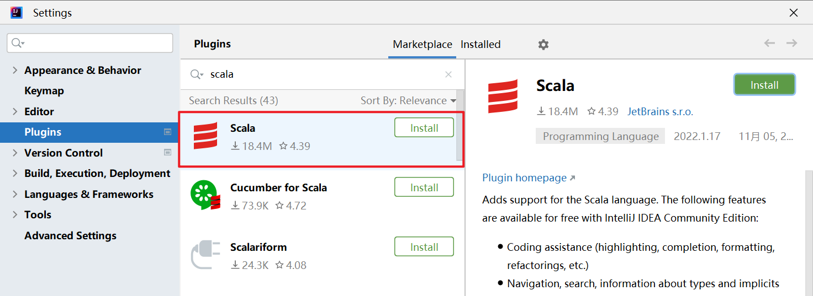

Scala 入门

```scala
object Main {
  def main(args: Array[String]): Unit = {
    println("Hello Scala")
  }
}
```

* Scala 是 java 的近亲，java 中的类都可以拿来重用
* 类型是放在变量后面的
* Unit 表示无返回值，类似于 void
* 不需要以分号作为结尾，当然加上也对


还是先写一个会爆栈的函数

```scala
def sum(n: Long): Long = {
    if (n == 1) {
        return 1
    }
    return n + sum(n - 1)
}
```

* Scala 最后一行代码若作为返回值，可以省略 return

不出所料，在 $n = 11000$ 时，还是出了异常

```scala
println(sum(11000))

Exception in thread "main" java.lang.StackOverflowError
	at Main$.sum(Main.scala:25)
	at Main$.sum(Main.scala:25)
	at Main$.sum(Main.scala:25)
	at Main$.sum(Main.scala:25)
	...
```


这是因为以上代码，还不是尾调用，要想成为尾调用，那么：

1. 最后一行代码，必须是一次函数调用
2. 内层函数必须**摆脱**与外层函数的关系，内层函数**执行后**不依赖于外层的变量或常量

```scala
def sum(n: Long): Long = {
    if (n == 1) {
        return 1
    }
    return n + sum(n - 1)  // 依赖于外层函数的 n 变量
}
```

如何让它执行后就摆脱对 n 的依赖呢？

* 不能等递归回来再做加法，那样就必须保留外层的 n
* 把 n 当做内层函数的一个参数传进去，这时 n 就属于内层函数了
* 传参时就完成累加, 不必等回来时累加

```
sum(n - 1, n + 累加器)
```


改写后代码如下

```scala
@tailrec
def sum(n: Long, accumulator: Long): Long = {
    if (n == 1) {
        return 1 + accumulator
    } 
    return sum(n - 1, n + accumulator)
}
```

* accumulator 作为累加器
* @tailrec 注解是 scala 提供的，用来检查方法是否符合尾递归
* 这回 sum(10000000, 0) 也没有问题，打印 50000005000000


执行流程如下，以**伪码**表示 $sum(4, 0)$

```scala
// 首次调用
def sum(n = 4, accumulator = 0): Long = {
    return sum(4 - 1, 4 + accumulator)
}

// 接下来调用内层 sum, 传参时就完成了累加, 不必等回来时累加，当内层 sum 调用后，外层 sum 空间没必要保留
def sum(n = 3, accumulator = 4): Long = {
    return sum(3 - 1, 3 + accumulator)
}

// 继续调用内层 sum
def sum(n = 2, accumulator = 7): Long = {
    return sum(2 - 1, 2 + accumulator)
}

// 继续调用内层 sum, 这是最后的 sum 调用完就返回最后结果 10, 前面所有其它 sum 的空间早已释放
def sum(n = 1, accumulator = 9): Long = {
    if (1 == 1) {
        return 1 + accumulator
    }
}
```

本质上，尾递归优化是将函数的**递归**调用，变成了函数的**循环**调用


**改循环避免爆栈**

```java
public static void main(String[] args) {
    long n = 100000000;
    long sum = 0;
    for (long i = n; i >= 1; i--) {
        sum += i;
    }
    System.out.println(sum);
}
```


### 递归时间复杂度-Master theorem[^14]

若有递归式
$$
T(n) = aT(\frac{n}{b}) + f(n)
$$
其中 

* $T(n)$ 是问题的运行时间，$n$ 是数据规模
* $a$ 是子问题个数
* $T(\frac{n}{b})$ 是子问题运行时间，每个子问题被拆成原问题数据规模的 $\frac{n}{b}$
* $f(n)$ 是除递归外执行的计算

令 $x = \log_{b}{a}$，即 $x = \log_{子问题缩小倍数}{子问题个数}$

那么
$$
T(n) = 
\begin{cases}
\Theta(n^x) & f(n) = O(n^c) 并且 c \lt x\\
\Theta(n^x\log{n}) & f(n) = \Theta(n^x)\\
\Theta(n^c) & f(n) = \Omega(n^c) 并且 c \gt x
\end{cases}
$$

**例1**

$T(n) = 2T(\frac{n}{2}) + n^4$ 

* 此时 $x = 1 < 4$，由后者决定整个时间复杂度 $\Theta(n^4)$
* 如果觉得对数不好算，可以换为求【$b$ 的几次方能等于 $a$】


**例2**

$T(n) = T(\frac{7n}{10}) + n$

* $a=1, b=\frac{10}{7}, x=0, c=1$
* 此时 $x = 0 < 1$，由后者决定整个时间复杂度 $\Theta(n)$


**例3**

$T(n) = 16T(\frac{n}{4}) + n^2$

* $a=16, b=4, x=2, c=2$
* 此时 $x=2 = c$，时间复杂度 $\Theta(n^2 \log{n})$


**例4**

$T(n)=7T(\frac{n}{3}) + n^2$

* $a=7, b=3, x=1.?, c=2$
* 此时 $x = \log_{3}{7} < 2$，由后者决定整个时间复杂度 $\Theta(n^2)$


**例5**

$T(n) = 7T(\frac{n}{2}) + n^2$

* $a=7, b=2, x=2.?, c=2$
* 此时 $x = log_2{7} > 2$，由前者决定整个时间复杂度 $\Theta(n^{\log_2{7}})$


**例6**

$T(n) = 2T(\frac{n}{4}) + \sqrt{n}$

* $a=2, b=4, x = 0.5, c=0.5$
* 此时 $x = 0.5 = c$，时间复杂度 $\Theta(\sqrt{n}\ \log{n})$


**例7. 二分查找递归**

```java
int f(int[] a, int target, int i, int j) {
    if (i > j) {
        return -1;
    }
    int m = (i + j) >>> 1;
    if (target < a[m]) {
        return f(a, target, i, m - 1);
    } else if (a[m] < target) {
        return f(a, target, m + 1, j);
    } else {
        return m;
    }
}
```

* 子问题个数 $a = 1$
* 子问题数据规模缩小倍数 $b = 2$
* 除递归外执行的计算是常数级 $c=0$

$T(n) = T(\frac{n}{2}) + n^0$

* 此时 $x=0 = c$，时间复杂度 $\Theta(\log{n})$


**例8. 归并排序递归**

```python
void split(B[], i, j, A[])
{
    if (j - i <= 1)                    
        return;                                
    m = (i + j) / 2;             
    
    // 递归
    split(A, i, m, B);  
    split(A, m, j, B); 
    
    // 合并
    merge(B, i, m, j, A);
}
```

* 子问题个数 $a=2$
* 子问题数据规模缩小倍数 $b=2$
* 除递归外，主要时间花在合并上，它可以用 $f(n) = n$ 表示

$T(n) = 2T(\frac{n}{2}) + n$

* 此时 $x=1=c$，时间复杂度 $\Theta(n\log{n})$


**例9. 快速排序递归**

```python
algorithm quicksort(A, lo, hi) is 
  if lo >= hi || lo < 0 then 
    return
  
  // 分区
  p := partition(A, lo, hi) 
  
  // 递归
  quicksort(A, lo, p - 1) 
  quicksort(A, p + 1, hi) 
```

* 子问题个数 $a=2$
* 子问题数据规模缩小倍数
  * 如果分区分的好，$b=2$
  * 如果分区没分好，例如分区1 的数据是 0，分区 2 的数据是 $n-1$
* 除递归外，主要时间花在分区上，它可以用 $f(n) = n$ 表示


情况1 - 分区分的好

$T(n) = 2T(\frac{n}{2}) + n$

* 此时 $x=1=c$，时间复杂度 $\Theta(n\log{n})$


情况2 - 分区没分好

$T(n) = T(n-1) + T(1) + n$

* 此时不能用主定理求解


### 递归时间复杂度-展开求解

像下面的递归式，都不能用主定理求解

**例1 - 递归求和**

```java
long sum(long n) {
    if (n == 1) {
        return 1;
    }
    return n + sum(n - 1);
}
```

$T(n) = T(n-1) + c$，$T(1) = c$

下面为展开过程

$T(n) = T(n-2) + c + c$

$T(n) = T(n-3) + c + c + c$

...

$T(n) = T(n-(n-1)) + (n-1)c$ 

* 其中 $T(n-(n-1))$ 即 $T(1)$
* 带入求得 $T(n) = c + (n-1)c = nc$

时间复杂度为 $O(n)$


**例2 - 递归冒泡排序**

```java
void bubble(int[] a, int high) {
    if(0 == high) {
        return;
    }
    for (int i = 0; i < high; i++) {
        if (a[i] > a[i + 1]) {
            swap(a, i, i + 1);
        }
    }
    bubble(a, high - 1);
}
```

$T(n) = T(n-1) + n$，$T(1) = c$

下面为展开过程

$T(n) = T(n-2) + (n-1) + n$

$T(n) = T(n-3) + (n-2) + (n-1) + n$

...

$T(n) = T(1) + 2 + ... + n = T(1) + (n-1)\frac{2+n}{2} = c + \frac{n^2}{2} + \frac{n}{2} -1$

时间复杂度 $O(n^2)$

> 注：
>
> * 等差数列求和为 $个数*\frac{\vert首项-末项\vert}{2}$ 


**例3 - 递归快排**

快速排序分区没分好的极端情况

$T(n) = T(n-1) + T(1) + n$，$T(1) = c$

$T(n) = T(n-1) + c + n$

下面为展开过程

$T(n) = T(n-2) + c + (n-1) + c + n$

$T(n) = T(n-3) + c + (n-2) + c + (n-1) + c + n$

...

$T(n) = T(n-(n-1)) + (n-1)c + 2+...+n = \frac{n^2}{2} + \frac{2cn+n}{2} -1$

时间复杂度 $O(n^2)$


不会推导的同学可以进入 https://www.wolframalpha.com/

* 例1 输入 f(n) = f(n - 1) + c, f(1) = c
* 例2 输入 f(n) = f(n - 1) + n, f(1) = c
* 例3 输入 f(n) = f(n - 1) + n + c, f(1) = c


## 2.4 队列

### 概述

计算机科学中，queue 是以顺序的方式维护的一组数据集合，在一端添加数据，从另一端移除数据。习惯来说，添加的一端称为**尾**，移除的一端称为**头**，就如同生活中的排队买商品

> In computer science, a **queue** is a collection of entities that are maintained in a sequence and can be modified by  the addition of entities at one end of the sequence and the removal of  entities from the other end of the sequence

先定义一个简化的队列接口

```java
public interface Queue<E> {

    /**
     * 向队列尾插入值
     * @param value 待插入值
     * @return 插入成功返回 true, 插入失败返回 false
     */
    boolean offer(E value);

    /**
     * 从对列头获取值, 并移除
     * @return 如果队列非空返回对头值, 否则返回 null
     */
    E poll();

    /**
     * 从对列头获取值, 不移除
     * @return 如果队列非空返回对头值, 否则返回 null
     */
    E peek();

    /**
     * 检查队列是否为空
     * @return 空返回 true, 否则返回 false
     */
    boolean isEmpty();

    /**
     * 检查队列是否已满
     * @return 满返回 true, 否则返回 false
     */
    boolean isFull();
}
```


### 链表实现

下面以**单向环形带哨兵**链表方式来实现队列

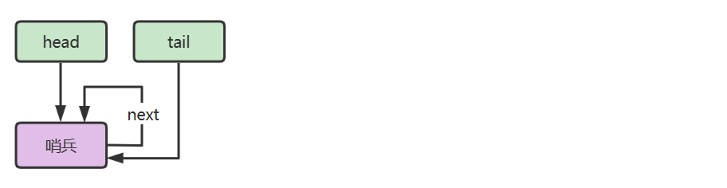


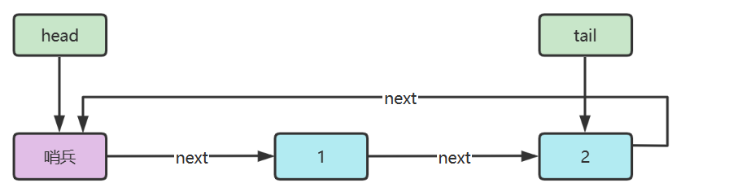

代码

```java
public class LinkedListQueue<E>
        implements Queue<E>, Iterable<E> {

    private static class Node<E> {
        E value;
        Node<E> next;

        public Node(E value, Node<E> next) {
            this.value = value;
            this.next = next;
        }
    }

    private Node<E> head = new Node<>(null, null);
    private Node<E> tail = head;
    private int size = 0;
    private int capacity = Integer.MAX_VALUE;

    {
        tail.next = head;
    }

    public LinkedListQueue() {
    }

    public LinkedListQueue(int capacity) {
        this.capacity = capacity;
    }

    @Override
    public boolean offer(E value) {
        if (isFull()) {
            return false;
        }
        Node<E> added = new Node<>(value, head);
        tail.next = added;
        tail = added;
        size++;
        return true;
    }

    @Override
    public E poll() {
        if (isEmpty()) {
            return null;
        }
        Node<E> first = head.next;
        head.next = first.next;
        if (first == tail) {
            tail = head;
        }
        size--;
        return first.value;
    }

    @Override
    public E peek() {
        if (isEmpty()) {
            return null;
        }
        return head.next.value;
    }

    @Override
    public boolean isEmpty() {
        return head == tail;
    }

    @Override
    public boolean isFull() {
        return size == capacity;
    }

    @Override
    public Iterator<E> iterator() {
        return new Iterator<E>() {
            Node<E> p = head.next;
            @Override
            public boolean hasNext() {
                return p != head;
            }
            @Override
            public E next() {
                E value = p.value;
                p = p.next;
                return value;
            }
        };
    }
}
```


### 环形数组实现

**好处**

1. 对比普通数组，起点和终点更为自由，不用考虑数据移动
2. “环”意味着不会存在【越界】问题
3. 数组性能更佳
4. 环形数组比较适合实现有界队列、RingBuffer 等


**下标计算**

例如，数组长度是 5，当前位置是 3 ，向前走 2 步，此时下标为 $(3 + 2)\%5 = 0$


$$
(cur + step) \% length
$$

* cur 当前指针位置
* step 前进步数
* length 数组长度

> 注意：
>
> * 如果 step = 1，也就是一次走一步，可以在 >= length 时重置为 0 即可


**判断空**

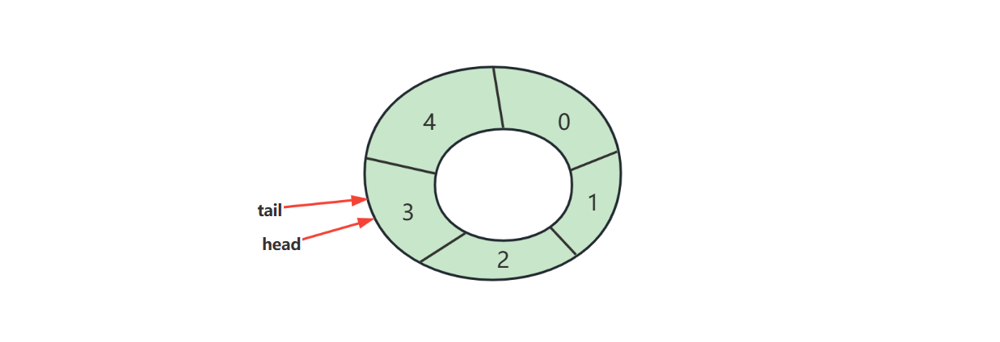

**判断满**

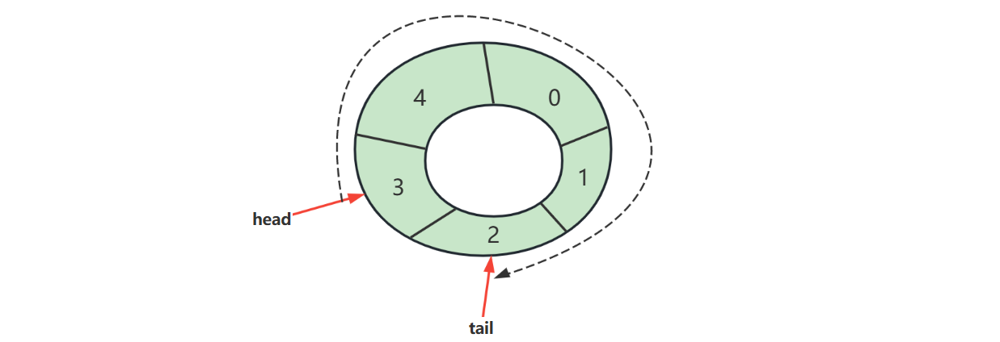

满之后的策略可以根据业务需求决定

* 例如我们要实现的环形队列，满之后就拒绝入队

代码

```java
public class ArrayQueue<E> implements Queue<E>, Iterable<E>{

    private int head = 0;
    private int tail = 0;
    private final E[] array;
    private final int length;

    @SuppressWarnings("all")
    public ArrayQueue(int capacity) {
        length = capacity + 1;
        array = (E[]) new Object[length];
    }

    @Override
    public boolean offer(E value) {
        if (isFull()) {
            return false;
        }
        array[tail] = value;
        tail = (tail + 1) % length;
        return true;
    }

    @Override
    public E poll() {
        if (isEmpty()) {
            return null;
        }
        E value = array[head];
        head = (head + 1) % length;
        return value;
    }

    @Override
    public E peek() {
        if (isEmpty()) {
            return null;
        }
        return array[head];
    }

    @Override
    public boolean isEmpty() {
        return tail == head;
    }

    @Override
    public boolean isFull() {
        return (tail + 1) % length == head;
    }

    @Override
    public Iterator<E> iterator() {
        return new Iterator<E>() {
            int p = head;
            @Override
            public boolean hasNext() {
                return p != tail;
            }

            @Override
            public E next() {
                E value = array[p];
                p = (p + 1) % array.length;
                return value;
            }
        };
    }
}
```


**判断空、满方法2**

引入 size 

```java
public class ArrayQueue2<E> implements Queue<E>, Iterable<E> {

    private int head = 0;
    private int tail = 0;
    private final E[] array;
    private final int capacity;
    private int size = 0;

    @SuppressWarnings("all")
    public ArrayQueue2(int capacity) {
        this.capacity = capacity;
        array = (E[]) new Object[capacity];
    }

    @Override
    public boolean offer(E value) {
        if (isFull()) {
            return false;
        }
        array[tail] = value;
        tail = (tail + 1) % capacity;
        size++;
        return true;
    }

    @Override
    public E poll() {
        if (isEmpty()) {
            return null;
        }
        E value = array[head];
        head = (head + 1) % capacity;
        size--;
        return value;
    }

    @Override
    public E peek() {
        if (isEmpty()) {
            return null;
        }
        return array[head];
    }

    @Override
    public boolean isEmpty() {
        return size == 0;
    }

    @Override
    public boolean isFull() {
        return size == capacity;
    }

    @Override
    public Iterator<E> iterator() {
        return new Iterator<E>() {
            int p = head;

            @Override
            public boolean hasNext() {
                return p != tail;
            }

            @Override
            public E next() {
                E value = array[p];
                p = (p + 1) % capacity;
                return value;
            }
        };
    }
}
```


**判断空、满方法3**

* head 和 tail 不断递增，用到索引时，再用它们进行计算，两个问题
  * 如何保证 head 和 tail 自增超过正整数最大值的正确性

  * 如何让取模运算性能更高

* 答案：让 capacity 为 2 的幂

```java
public class ArrayQueue3<E> implements Queue<E>, Iterable<E> {

    private int head = 0;
    private int tail = 0;
    private final E[] array;
    private final int capacity;

    @SuppressWarnings("all")
    public ArrayQueue3(int capacity) {
        if ((capacity & capacity - 1) != 0) {
            throw new IllegalArgumentException("capacity 必须为 2 的幂");
        }
        this.capacity = capacity;
        array = (E[]) new Object[this.capacity];
    }

    @Override
    public boolean offer(E value) {
        if (isFull()) {
            return false;
        }
        array[tail & capacity - 1] = value;
        tail++;
        return true;
    }

    @Override
    public E poll() {
        if (isEmpty()) {
            return null;
        }
        E value = array[head & capacity - 1];
        head++;
        return value;
    }

    @Override
    public E peek() {
        if (isEmpty()) {
            return null;
        }
        return array[head & capacity - 1];
    }

    @Override
    public boolean isEmpty() {
        return tail - head == 0;
    }

    @Override
    public boolean isFull() {
        return tail - head == capacity;
    }

    @Override
    public Iterator<E> iterator() {
        return new Iterator<E>() {
            int p = head;

            @Override
            public boolean hasNext() {
                return p != tail;
            }

            @Override
            public E next() {
                E value = array[p & capacity - 1];
                p++;
                return value;
            }
        };
    }
}
```


## 2.5 栈

### 概述

计算机科学中，**stack** 是一种线性的数据结构，只能在其一端添加数据和移除数据。习惯来说，这一端称之为**栈顶**，另一端不能操作数据的称之为**栈底**，就如同生活中的一摞书


先提供一个栈接口

```java
public interface Stack<E> {
    /**
     * 向栈顶压入元素
     * @param value 待压入值
     * @return 压入成功返回 true, 否则返回 false
     */
    boolean push(E value);

    /**
     * 从栈顶弹出元素
     * @return 栈非空返回栈顶元素, 栈为空返回 null
     */
    E pop();

    /**
     * 返回栈顶元素, 不弹出
     * @return 栈非空返回栈顶元素, 栈为空返回 null
     */
    E peek();

    /**
     * 判断栈是否为空
     * @return 空返回 true, 否则返回 false
     */
    boolean isEmpty();

    /**
     * 判断栈是否已满
     * @return 满返回 true, 否则返回 false
     */
    boolean isFull();
}
```


### 链表实现

```java
public class LinkedListStack<E> implements Stack<E>, Iterable<E> {

    private final int capacity;
    private int size;
    private final Node<E> head = new Node<>(null, null);

    public LinkedListStack(int capacity) {
        this.capacity = capacity;
    }

    @Override
    public boolean push(E value) {
        if (isFull()) {
            return false;
        }
        head.next = new Node<>(value, head.next);
        size++;
        return true;
    }

    @Override
    public E pop() {
        if (isEmpty()) {
            return null;
        }
        Node<E> first = head.next;
        head.next = first.next;
        size--;
        return first.value;
    }

    @Override
    public E peek() {
        if (isEmpty()) {
            return null;
        }
        return head.next.value;
    }

    @Override
    public boolean isEmpty() {
        return head.next == null;
    }

    @Override
    public boolean isFull() {
        return size == capacity;
    }

    @Override
    public Iterator<E> iterator() {
        return new Iterator<E>() {
            Node<E> p = head.next;
            @Override
            public boolean hasNext() {
                return p != null;
            }

            @Override
            public E next() {
                E value = p.value;
                p = p.next;
                return value;
            }
        };
    }

    static class Node<E> {
        E value;
        Node<E> next;

        public Node(E value, Node<E> next) {
            this.value = value;
            this.next = next;
        }
    }
}
```


### 数组实现

```java
public class ArrayStack<E> implements Stack<E>, Iterable<E>{
    private final E[] array;
    private int top = 0;

    @SuppressWarnings("all")
    public ArrayStack(int capacity) {
        this.array = (E[]) new Object[capacity];
    }

    @Override
    public boolean push(E value) {
        if (isFull()) {
            return false;
        }
        array[top++] = value;
        return true;
    }

    @Override
    public E pop() {
        if (isEmpty()) {
            return null;
        }
        return array[--top];
    }

    @Override
    public E peek() {
        if (isEmpty()) {
            return null;
        }
        return array[top-1];
    }

    @Override
    public boolean isEmpty() {
        return top == 0;
    }

    @Override
    public boolean isFull() {
        return top == array.length;
    }

    @Override
    public Iterator<E> iterator() {
        return new Iterator<E>() {
            int p = top;
            @Override
            public boolean hasNext() {
                return p > 0;
            }

            @Override
            public E next() {
                return array[--p];
            }
        };
    }
}
```


### 应用

模拟如下方法调用

```java
public static void main(String[] args) {
    System.out.println("main1");
    System.out.println("main2");
    method1();
    method2();
    System.out.println("main3");
}

public static void method1() {
    System.out.println("method1");
    method3();
}

public static void method2() {
    System.out.println("method2");
}

public static void method3() {
    System.out.println("method3");
}
```

模拟代码

```java
public class CPU {
    static class Frame {
        int exit;

        public Frame(int exit) {
            this.exit = exit;
        }
    }
    static int pc = 1; // 模拟程序计数器 Program counter
    static ArrayStack<Frame> stack = new ArrayStack<>(100); // 模拟方法调用栈

    public static void main(String[] args) {
        stack.push(new Frame(-1));
        while (!stack.isEmpty()) {
            switch (pc) {
                case 1 -> {
                    System.out.println("main1");
                    pc++;
                }
                case 2 -> {
                    System.out.println("main2");
                    pc++;
                }
                case 3 -> {
                    stack.push(new Frame(pc + 1));
                    pc = 100;
                }
                case 4 -> {
                    stack.push(new Frame(pc + 1));
                    pc = 200;
                }
                case 5 -> {
                    System.out.println("main3");
                    pc = stack.pop().exit;
                }
                case 100 -> {
                    System.out.println("method1");
                    stack.push(new Frame(pc + 1));
                    pc = 300;
                }
                case 101 -> {
                    pc = stack.pop().exit;
                }
                case 200 -> {
                    System.out.println("method2");
                    pc = stack.pop().exit;
                }
                case 300 -> {
                    System.out.println("method3");
                    pc = stack.pop().exit;
                }
            }
        }
    }
}
```


## 2.6 双端队列

### 概述

双端队列、队列、栈对比

|                | 定义                               | 特点                   |
| -------------- | ---------------------------------- | ---------------------- |
| 队列           | 一端删除（头）另一端添加（尾）     | First In First Out     |
| 栈             | 一端删除和添加（顶）               | Last In First Out      |
| 双端队列       | 两端都可以删除、添加               |                        |
| 优先级队列     |                                    | 优先级高者先出队       |
| 延时队列       |                                    | 根据延时时间确定优先级 |
| 并发非阻塞队列 | 队列空或满时不阻塞                 |                        |
| 并发阻塞队列   | 队列空时删除阻塞、队列满时添加阻塞 |                        |

> 注1：
>
> * Java 中 LinkedList 即为典型双端队列实现，不过它同时实现了 Queue 接口，也提供了栈的 push pop 等方法
>
> 注2：
>
> * 不同语言，操作双端队列的方法命名有所不同，参见下表
>
>   | 操作     | Java       | JavaScript | C++        | leetCode 641 |
>   | -------- | ---------- | ---------- | ---------- | ------------ |
>   | 尾部插入 | offerLast  | push       | push_back  | insertLast   |
>   | 头部插入 | offerFirst | unshift    | push_front | insertFront  |
>   | 尾部移除 | pollLast   | pop        | pop_back   | deleteLast   |
>   | 头部移除 | pollFirst  | shift      | pop_front  | deleteFront  |
>   | 尾部获取 | peekLast   | at(-1)     | back       | getRear      |
>   | 头部获取 | peekFirst  | at(0)      | front      | getFront     |
>
> * 吐槽一下 leetCode 命名比较 low
>
> * 常见的单词还有 enqueue 入队、dequeue 出队


**接口定义**

```java
public interface Deque<E> {

    boolean offerFirst(E e);

    boolean offerLast(E e);

    E pollFirst();

    E pollLast();

    E peekFirst();

    E peekLast();
    
    boolean isEmpty();

    boolean isFull();
}
```


### 链表实现

```java
/**
 * 基于环形链表的双端队列
 * @param <E> 元素类型
 */
public class LinkedListDeque<E> implements Deque<E>, Iterable<E> {

    @Override
    public boolean offerFirst(E e) {
        if (isFull()) {
            return false;
        }
        size++;
        Node<E> a = sentinel;
        Node<E> b = sentinel.next;
        Node<E> offered = new Node<>(a, e, b);
        a.next = offered;
        b.prev = offered;
        return true;
    }

    @Override
    public boolean offerLast(E e) {
        if (isFull()) {
            return false;
        }
        size++;
        Node<E> a = sentinel.prev;
        Node<E> b = sentinel;
        Node<E> offered = new Node<>(a, e, b);
        a.next = offered;
        b.prev = offered;
        return true;
    }

    @Override
    public E pollFirst() {
        if (isEmpty()) {
            return null;
        }
        Node<E> a = sentinel;
        Node<E> polled = sentinel.next;
        Node<E> b = polled.next;
        a.next = b;
        b.prev = a;
        size--;
        return polled.value;
    }

    @Override
    public E pollLast() {
        if (isEmpty()) {
            return null;
        }
        Node<E> polled = sentinel.prev;
        Node<E> a = polled.prev;
        Node<E> b = sentinel;
        a.next = b;
        b.prev = a;
        size--;
        return polled.value;
    }

    @Override
    public E peekFirst() {
        if (isEmpty()) {
            return null;
        }
        return sentinel.next.value;
    }

    @Override
    public E peekLast() {
        if (isEmpty()) {
            return null;
        }
        return sentinel.prev.value;
    }

    @Override
    public boolean isEmpty() {
        return size == 0;
    }

    @Override
    public boolean isFull() {
        return size == capacity;
    }

    @Override
    public Iterator<E> iterator() {
        return new Iterator<E>() {
            Node<E> p = sentinel.next;
            @Override
            public boolean hasNext() {
                return p != sentinel;
            }

            @Override
            public E next() {
                E value = p.value;
                p = p.next;
                return value;
            }
        };
    }

    static class Node<E> {
        Node<E> prev;
        E value;
        Node<E> next;

        public Node(Node<E> prev, E value, Node<E> next) {
            this.prev = prev;
            this.value = value;
            this.next = next;
        }
    }

    Node<E> sentinel = new Node<>(null, null, null);
    int capacity;
    int size;

    public LinkedListDeque(int capacity) {
        sentinel.next = sentinel;
        sentinel.prev = sentinel;
        this.capacity = capacity;
    }
}
```


### 数组实现

```java
/**
 * 基于循环数组实现, 特点
 * <ul>
 *     <li>tail 停下来的位置不存储, 会浪费一个位置</li>
 * </ul>
 * @param <E>
 */
public class ArrayDeque1<E> implements Deque<E>, Iterable<E> {

    /*
                    h
            t
        0   1   2   3
        b           a
     */
    @Override
    public boolean offerFirst(E e) {
        if (isFull()) {
            return false;
        }
        head = dec(head, array.length);
        array[head] = e;
        return true;
    }

    @Override
    public boolean offerLast(E e) {
        if (isFull()) {
            return false;
        }
        array[tail] = e;
        tail = inc(tail, array.length);
        return true;
    }

    @Override
    public E pollFirst() {
        if (isEmpty()) {
            return null;
        }
        E e = array[head];
        array[head] = null;
        head = inc(head, array.length);
        return e;
    }

    @Override
    public E pollLast() {
        if (isEmpty()) {
            return null;
        }
        tail = dec(tail, array.length);
        E e = array[tail];
        array[tail] = null;
        return e;
    }

    @Override
    public E peekFirst() {
        if (isEmpty()) {
            return null;
        }
        return array[head];
    }

    @Override
    public E peekLast() {
        if (isEmpty()) {
            return null;
        }
        return array[dec(tail, array.length)];
    }

    @Override
    public boolean isEmpty() {
        return head == tail;
    }

    @Override
    public boolean isFull() {
        if (tail > head) {
            return tail - head == array.length - 1;
        } else if (tail < head) {
            return head - tail == 1;
        } else {
            return false;
        }
    }

    @Override
    public Iterator<E> iterator() {
        return new Iterator<E>() {
            int p = head;
            @Override
            public boolean hasNext() {
                return p != tail;
            }

            @Override
            public E next() {
                E e = array[p];
                p = inc(p, array.length);
                return e;
            }
        };
    }

    E[] array;
    int head;
    int tail;

    @SuppressWarnings("unchecked")
    public ArrayDeque1(int capacity) {
        array = (E[]) new Object[capacity + 1];
    }

    static int inc(int i, int length) {
        if (i + 1 >= length) {
            return 0;
        }
        return i + 1;
    }

    static int dec(int i, int length) {
        if (i - 1 < 0) {
            return length - 1;
        }
        return i - 1;
    }
}
```

数组实现中，如果存储的是基本类型，那么无需考虑内存释放，例如

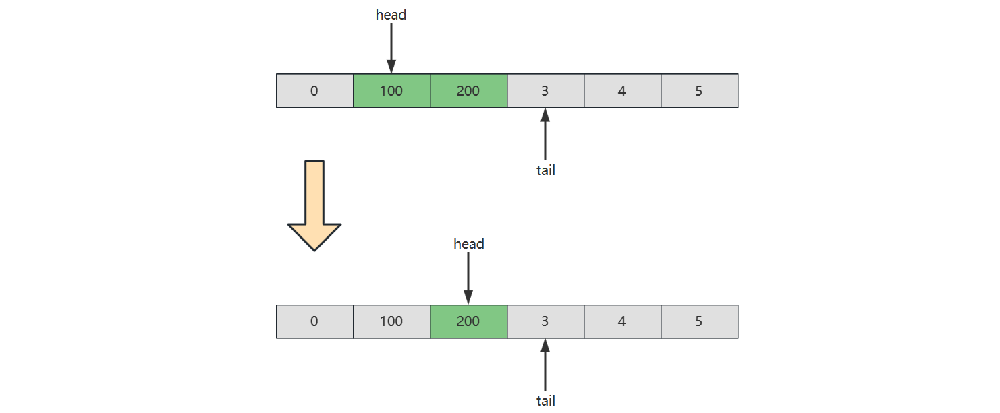

但如果存储的是引用类型，应当设置该位置的引用为 null，以便内存及时释放

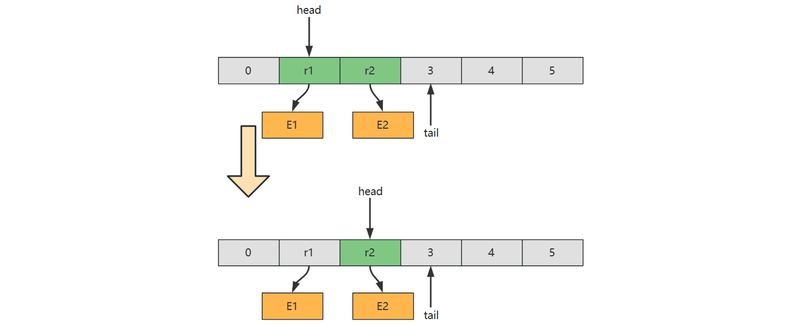


## 2.7 优先级队列

### 无序数组实现

**要点**

1. 入队保持顺序
2. 出队前找到优先级最高的出队，相当于一次选择排序

```java
public class PriorityQueue1<E extends Priority> implements Queue<E> {

    Priority[] array;
    int size;

    public PriorityQueue1(int capacity) {
        array = new Priority[capacity];
    }

    @Override // O(1)
    public boolean offer(E e) {
        if (isFull()) {
            return false;
        }
        array[size++] = e;
        return true;
    }

    // 返回优先级最高的索引值
    private int selectMax() {
        int max = 0;
        for (int i = 1; i < size; i++) {
            if (array[i].priority() > array[max].priority()) {
                max = i;
            }
        }
        return max;
    }

    @Override // O(n)
    public E poll() {
        if (isEmpty()) {
            return null;
        }
        int max = selectMax();
        E e = (E) array[max];
        remove(max);
        return e;
    }

    private void remove(int index) {
        if (index < size - 1) {
            System.arraycopy(array, index + 1,
                    array, index, size - 1 - index);
        }
        array[--size] = null; // help GC
    }

    @Override
    public E peek() {
        if (isEmpty()) {
            return null;
        }
        int max = selectMax();
        return (E) array[max];
    }

    @Override
    public boolean isEmpty() {
        return size == 0;
    }

    @Override
    public boolean isFull() {
        return size == array.length;
    }
}
```

* 视频中忘记了 help GC，注意一下


### 有序数组实现

**要点**

1. 入队后排好序，优先级最高的排列在尾部
2. 出队只需删除尾部元素即可

```java
public class PriorityQueue2<E extends Priority> implements Queue<E> {

    Priority[] array;
    int size;

    public PriorityQueue2(int capacity) {
        array = new Priority[capacity];
    }

    // O(n)
    @Override
    public boolean offer(E e) {
        if (isFull()) {
            return false;
        }
        insert(e);
        size++;
        return true;
    }

    // 一轮插入排序
    private void insert(E e) {
        int i = size - 1;
        while (i >= 0 && array[i].priority() > e.priority()) {
            array[i + 1] = array[i];
            i--;
        }
        array[i + 1] = e;
    }

    // O(1)
    @Override
    public E poll() {
        if (isEmpty()) {
            return null;
        }
        E e = (E) array[size - 1];
        array[--size] = null; // help GC
        return e;
    }

    @Override
    public E peek() {
        if (isEmpty()) {
            return null;
        }
        return (E) array[size - 1];
    }

    @Override
    public boolean isEmpty() {
        return size == 0;
    }

    @Override
    public boolean isFull() {
        return size == array.length;
    }
}
```


### 堆实现

计算机科学中，堆是一种基于树的数据结构，通常用**完全二叉树**实现。堆的特性如下

* 在大顶堆中，任意节点 C 与它的父节点 P 符合 $P.value \geq C.value$
* 而小顶堆中，任意节点 C 与它的父节点 P 符合 $P.value \leq C.value$
* 最顶层的节点（没有父亲）称之为 root 根节点

> In computer science, a **heap** is a specialized tree-based data structure which is essentially an almost complete tree that satisfies the **heap property**: in a *max heap*, for any given node C, if P is a parent node of C, then the *key* (the *value*) of P is greater than or equal to the key of C. In a *min heap*, the key of P is less than or equal to the key of C. The node at the "top" of the heap (with no parents) is called the **root** node


例1 - 满二叉树（Full Binary Tree）特点：每一层都是填满的

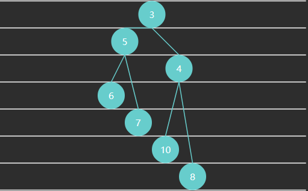

例2 - 完全二叉树（Complete Binary Tree）特点：最后一层可能未填满，靠左对齐

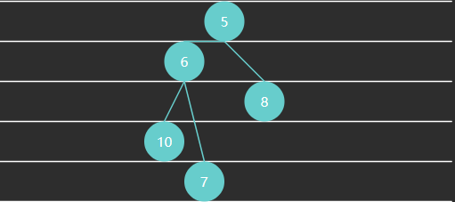

例3 - 大顶堆


例4 - 小顶堆


完全二叉树可以使用数组来表示

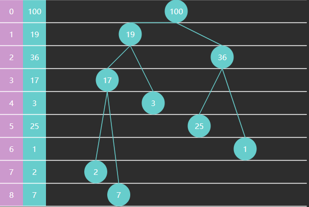


特征

* 如果从索引 0 开始存储节点数据
  * 节点 $i$ 的父节点为 $floor((i-1)/2)$，当 $i>0$ 时
  * 节点 $i$ 的左子节点为 $2i+1$，右子节点为 $2i+2$，当然它们得 $< size$
* 如果从索引 1 开始存储节点数据
  * 节点 $i$ 的父节点为 $floor(i/2)$，当 $i > 1$ 时
  * 节点 $i$ 的左子节点为 $2i$，右子节点为 $2i+1$，同样得 $< size$

代码

```java
public class PriorityQueue4<E extends Priority> implements Queue<E> {

    Priority[] array;
    int size;

    public PriorityQueue4(int capacity) {
        array = new Priority[capacity];
    }

    @Override
    public boolean offer(E offered) {
        if (isFull()) {
            return false;
        }
        int child = size++;
        int parent = (child - 1) / 2;
        while (child > 0 && offered.priority() > array[parent].priority()) {
            array[child] = array[parent];
            child = parent;
            parent = (child - 1) / 2;
        }
        array[child] = offered;
        return true;
    }


    private void swap(int i, int j) {
        Priority t = array[i];
        array[i] = array[j];
        array[j] = t;
    }

    @Override
    public E poll() {
        if (isEmpty()) {
            return null;
        }
        swap(0, size - 1);
        size--;
        Priority e = array[size];
        array[size] = null;
        
        shiftDown(0);        
        return (E) e;
    }

    void shiftDown(int parent) {
        int left = 2 * parent + 1;
        int right = left + 1;
        int max = parent;
        if (left < size && array[left].priority() > array[max].priority()) {
            max = left;
        }
        if (right < size && array[right].priority() > array[max].priority()) {
            max = right;
        }
        if (max != parent) {
            swap(max, parent);
            shiftDown(max);
        }
    }

    @Override
    public E peek() {
        if (isEmpty()) {
            return null;
        }
        return (E) array[0];
    }

    @Override
    public boolean isEmpty() {
        return size == 0;
    }

    @Override
    public boolean isFull() {
        return size == array.length;
    }
}
```


## 2.8 阻塞队列

之前的队列在很多场景下都不能很好地工作，例如

1. 大部分场景要求分离向队列放入（生产者）、从队列拿出（消费者）两个角色、它们得由不同的线程来担当，而之前的实现根本没有考虑线程安全问题
2. 队列为空，那么在之前的实现里会返回 null，如果就是硬要拿到一个元素呢？只能不断循环尝试
3. 队列为满，那么再之前的实现里会返回 false，如果就是硬要塞入一个元素呢？只能不断循环尝试

因此我们需要解决的问题有

1. 用锁保证线程安全
2. 用条件变量让**等待非空线程**与**等待不满线程**进入**等待**状态，而不是不断循环尝试，让 CPU 空转

有同学对线程安全还没有足够的认识，下面举一个反例，两个线程都要执行入队操作（几乎在同一时刻）

```java
public class TestThreadUnsafe {
    private final String[] array = new String[10];
    private int tail = 0;

    public void offer(String e) {
        array[tail] = e;
        tail++;
    }

    @Override
    public String toString() {
        return Arrays.toString(array);
    }

    public static void main(String[] args) {
        TestThreadUnsafe queue = new TestThreadUnsafe();
        new Thread(()-> queue.offer("e1"), "t1").start();
        new Thread(()-> queue.offer("e2"), "t2").start();
    }
}
```

执行的时间序列如下，假设初始状态 tail = 0，在执行过程中由于 CPU 在两个线程之间切换，造成了指令交错

| 线程1          | 线程2          | 说明                                                         |
| -------------- | -------------- | ------------------------------------------------------------ |
| array[tail]=e1 |                | 线程1 向 tail 位置加入 e1 这个元素，但还没来得及执行  tail++ |
|                | array[tail]=e2 | 线程2 向 tail 位置加入 e2 这个元素，覆盖掉了 e1              |
|                | tail++         | tail 自增为1                                                 |
| tail++         |                | tail 自增为2                                                 |
|                |                | 最后状态 tail 为 2，数组为 [e2, null, null ...]              |

糟糕的是，由于指令交错的顺序不同，得到的结果不止以上一种，宏观上造成混乱的效果


### 单锁实现

Java 中要防止代码段交错执行，需要使用锁，有两种选择

* synchronized 代码块，属于关键字级别提供锁保护，功能少
* ReentrantLock 类，功能丰富

以 ReentrantLock 为例

```java
ReentrantLock lock = new ReentrantLock();

public void offer(String e) {
    lock.lockInterruptibly();
    try {
        array[tail] = e;
        tail++;
    } finally {
        lock.unlock();
    }
}
```

只要两个线程执行上段代码时，锁对象是同一个，就能保证 try 块内的代码的执行不会出现指令交错现象，即执行顺序只可能是下面两种情况之一

| 线程1                    | 线程2                    | 说明                                                         |
| ------------------------ | ------------------------ | ------------------------------------------------------------ |
| lock.lockInterruptibly() |                          | t1对锁对象上锁                                               |
| array[tail]=e1           |                          |                                                              |
|                          | lock.lockInterruptibly() | 即使 CPU 切换到线程2，但由于t1已经对该对象上锁，因此线程2卡在这儿进不去 |
| tail++                   |                          | 切换回线程1 执行后续代码                                     |
| lock.unlock()            |                          | 线程1 解锁                                                   |
|                          | array[tail]=e2           | 线程2 此时才能获得锁，执行它的代码                           |
|                          | tail++                   |                                                              |

* 另一种情况是线程2 先获得锁，线程1 被挡在外面
* 要明白**保护的本质**，本例中是保护的是 tail 位置读写的安全


事情还没有完，上面的例子是队列还没有放满的情况，考虑下面的代码（这回锁同时保护了 tail 和 size 的读写安全）

```java
ReentrantLock lock = new ReentrantLock();
int size = 0;

public void offer(String e) {
    lock.lockInterruptibly();
    try {
        if(isFull()) {
            // 满了怎么办?
        }
        array[tail] = e;
        tail++;
        
        size++;
    } finally {
        lock.unlock();
    }
}

private boolean isFull() {
    return size == array.length;
}
```

之前是返回 false 表示添加失败，前面分析过想达到这么一种效果：

* 在队列满时，不是立刻返回，而是当前线程进入等待
* 什么时候队列不满了，再唤醒这个等待的线程，从上次的代码处继续向下运行

ReentrantLock 可以配合条件变量来实现，代码进化为

```java
ReentrantLock lock = new ReentrantLock();
Condition tailWaits = lock.newCondition(); // 条件变量
int size = 0;

public void offer(String e) {
    lock.lockInterruptibly();
    try {
        while (isFull()) {
            tailWaits.await();	// 当队列满时, 当前线程进入 tailWaits 等待
        }
        array[tail] = e;
        tail++;
        
        size++;
    } finally {
        lock.unlock();
    }
}

private boolean isFull() {
    return size == array.length;
}
```

* 条件变量底层也是个队列，用来存储这些需要等待的线程，当队列满了，就会将 offer 线程加入条件队列，并暂时释放锁
* 将来我们的队列如果不满了（由 poll 线程那边得知）可以调用 tailWaits.signal() 来唤醒 tailWaits 中首个等待的线程，被唤醒的线程会再次抢到锁，从上次 await 处继续向下运行

思考为何要用 while 而不是 if，设队列容量是 3

| 操作前  | offer(4)                   | offer(5)                     | poll()                     | 操作后    |
| ------- | -------------------------- | ---------------------------- | -------------------------- | --------- |
| [1 2 3] | 队列满，进入tailWaits 等待 |                              |                            | [1 2 3]   |
| [1 2 3] |                            |                              | 取走 1，队列不满，唤醒线程 | [2 3]     |
| [2 3]   |                            | 抢先获得锁，发现不满，放入 5 |                            | [2 3 5]   |
| [2 3 5] | 从上次等待处直接向下执行   |                              |                            | [2 3 5 ?] |

关键点：

* 从 tailWaits 中唤醒的线程，会与新来的 offer 的线程争抢锁，谁能抢到是不一定的，如果后者先抢到，就会导致条件又发生变化
* 这种情况称之为**虚假唤醒**，唤醒后应该重新检查条件，看是不是得重新进入等待


最后的实现代码

```java
/**
 * 单锁实现
 * @param <E> 元素类型
 */
public class BlockingQueue1<E> implements BlockingQueue<E> {
    private final E[] array;
    private int head = 0;
    private int tail = 0;
    private int size = 0; // 元素个数

    @SuppressWarnings("all")
    public BlockingQueue1(int capacity) {
        array = (E[]) new Object[capacity];
    }

    ReentrantLock lock = new ReentrantLock();
    Condition tailWaits = lock.newCondition();
    Condition headWaits = lock.newCondition();

    @Override
    public void offer(E e) throws InterruptedException {
        lock.lockInterruptibly();
        try {
            while (isFull()) {
                tailWaits.await();
            }
            array[tail] = e;
            if (++tail == array.length) {
                tail = 0;
            }
            size++;
            headWaits.signal();
        } finally {
            lock.unlock();
        }
    }

    @Override
    public void offer(E e, long timeout) throws InterruptedException {
        lock.lockInterruptibly();
        try {
            long t = TimeUnit.MILLISECONDS.toNanos(timeout);
            while (isFull()) {
                if (t <= 0) {
                    return;
                }
                t = tailWaits.awaitNanos(t);
            }
            array[tail] = e;
            if (++tail == array.length) {
                tail = 0;
            }
            size++;
            headWaits.signal();
        } finally {
            lock.unlock();
        }
    }

    @Override
    public E poll() throws InterruptedException {
        lock.lockInterruptibly();
        try {
            while (isEmpty()) {
                headWaits.await();
            }
            E e = array[head];
            array[head] = null; // help GC
            if (++head == array.length) {
                head = 0;
            }
            size--;
            tailWaits.signal();
            return e;
        } finally {
            lock.unlock();
        }
    }

    private boolean isEmpty() {
        return size == 0;
    }

    private boolean isFull() {
        return size == array.length;
    }
}
```

* public void offer(E e, long timeout) throws InterruptedException 是带超时的版本，可以只等待一段时间，而不是永久等下去，类似的 poll 也可以做带超时的版本，这个留给大家了


> **注意**
>
> * JDK 中 BlockingQueue 接口的方法命名与我的示例有些差异
>   * 方法 offer(E e) 是非阻塞的实现，阻塞实现方法为 put(E e)
>   * 方法 poll() 是非阻塞的实现，阻塞实现方法为 take()


### 双锁实现

单锁的缺点在于：

* 生产和消费几乎是不冲突的，唯一冲突的是生产者和消费者它们有可能同时修改 size
* 冲突的主要是生产者之间：多个 offer 线程修改 tail
* 冲突的还有消费者之间：多个 poll 线程修改 head

如果希望进一步提高性能，可以用两把锁

* 一把锁保护 tail
* 另一把锁保护 head

```java
ReentrantLock headLock = new ReentrantLock();  // 保护 head 的锁
Condition headWaits = headLock.newCondition(); // 队列空时，需要等待的线程集合

ReentrantLock tailLock = new ReentrantLock();  // 保护 tail 的锁
Condition tailWaits = tailLock.newCondition(); // 队列满时，需要等待的线程集合
```

先看看 offer 方法的初步实现

```java
@Override
public void offer(E e) throws InterruptedException {
    tailLock.lockInterruptibly();
    try {
        // 队列满等待
        while (isFull()) {
            tailWaits.await();
        }
        
        // 不满则入队
        array[tail] = e;
        if (++tail == array.length) {
            tail = 0;
        }
        
        // 修改 size （有问题）
        size++;
        
    } finally {
        tailLock.unlock();
    }
}
```

上面代码的缺点是 size 并不受 tailLock 保护，tailLock 与 headLock 是两把不同的锁，并不能实现互斥的效果。因此，size 需要用下面的代码保证原子性

```java
AtomicInteger size = new AtomicInteger(0);	   // 保护 size 的原子变量

size.getAndIncrement(); // 自增
size.getAndDecrement(); // 自减
```

代码修改为

```java
@Override
public void offer(E e) throws InterruptedException {
    tailLock.lockInterruptibly();
    try {
        // 队列满等待
        while (isFull()) {
            tailWaits.await();
        }
        
        // 不满则入队
        array[tail] = e;
        if (++tail == array.length) {
            tail = 0;
        }
        
        // 修改 size
        size.getAndIncrement();
        
    } finally {
        tailLock.unlock();
    }
}
```

对称地，可以写出 poll 方法

```java
@Override
public E poll() throws InterruptedException {
    E e;
    headLock.lockInterruptibly();
    try {
        // 队列空等待
        while (isEmpty()) {
            headWaits.await();
        }
        
        // 不空则出队
        e = array[head];
        if (++head == array.length) {
            head = 0;
        }
        
        // 修改 size
        size.getAndDecrement();
        
    } finally {
        headLock.unlock();
    }
    return e;
}
```

下面来看一个难题，就是如何通知 headWaits 和 tailWaits 中等待的线程，比如 poll 方法拿走一个元素，通知 tailWaits：我拿走一个，不满了噢，你们可以放了，因此代码改为

```java
@Override
public E poll() throws InterruptedException {
    E e;
    headLock.lockInterruptibly();
    try {
        // 队列空等待
        while (isEmpty()) {
            headWaits.await();
        }
        
        // 不空则出队
        e = array[head];
        if (++head == array.length) {
            head = 0;
        }
        
        // 修改 size
        size.getAndDecrement();
        
        // 通知 tailWaits 不满（有问题）
        tailWaits.signal();
        
    } finally {
        headLock.unlock();
    }
    return e;
}
```

问题在于要使用这些条件变量的 await()， signal() 等方法需要先获得与之关联的锁，上面的代码若直接运行会出现以下错误

```java
java.lang.IllegalMonitorStateException
```

那有同学说，加上锁不就行了吗，于是写出了下面的代码

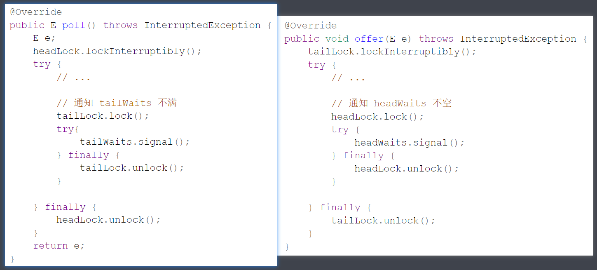

发现什么问题了？两把锁这么嵌套使用，非常容易出现死锁，如下所示

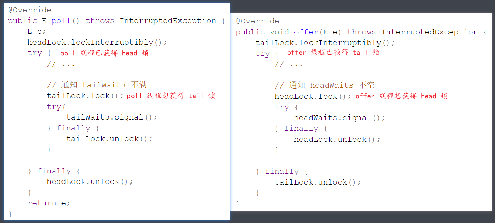

因此得避免嵌套，两段加锁的代码变成了下面平级的样子

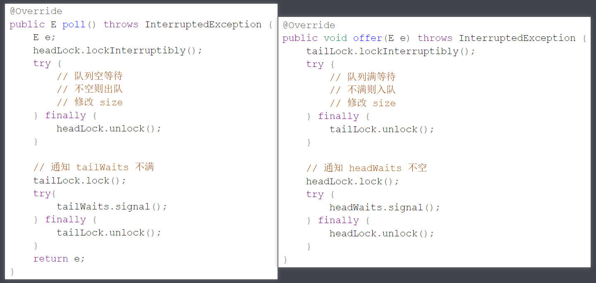

性能还可以进一步提升

1. 代码调整后 offer 并没有同时获取 tailLock 和 headLock 两把锁，因此两次加锁之间会有**空隙**，这个空隙内可能有其它的 offer 线程添加了更多的元素，那么这些线程都要执行 signal()，通知 poll 线程队列非空吗？
   * 每次调用 signal() 都需要这些 offer 线程先获得 headLock 锁，成本较高，要想法减少 offer 线程获得 headLock 锁的次数
   * 可以加一个条件：当 offer 增加前队列为空，即从 0 变化到不空，才由此 offer 线程来通知 headWaits，其它情况不归它管

2. 队列从 0 变化到不空，会唤醒一个等待的 poll 线程，这个线程被唤醒后，肯定能拿到 headLock 锁，因此它具备了唤醒 headWaits 上其它 poll 线程的先决条件。如果检查出此时有其它 offer 线程新增了元素（不空，但不是从0变化而来），那么不妨由此 poll 线程来唤醒其它 poll 线程

这个技巧被称之为级联通知（cascading notifies），类似的原因

3. 在 poll 时队列从满变化到不满，才由此 poll 线程来唤醒一个等待的 offer 线程，目的也是为了减少 poll 线程对 tailLock 上锁次数，剩下等待的 offer 线程由这个 offer 线程间接唤醒

最终的代码为

```java
public class BlockingQueue2<E> implements BlockingQueue<E> {

    private final E[] array;
    private int head = 0;
    private int tail = 0;
    private final AtomicInteger size = new AtomicInteger(0);
    ReentrantLock headLock = new ReentrantLock();
    Condition headWaits = headLock.newCondition();
    ReentrantLock tailLock = new ReentrantLock();
    Condition tailWaits = tailLock.newCondition();

    public BlockingQueue2(int capacity) {
        this.array = (E[]) new Object[capacity];
    }

    @Override
    public void offer(E e) throws InterruptedException {
        int c;
        tailLock.lockInterruptibly();
        try {
            while (isFull()) {
                tailWaits.await();
            }
            array[tail] = e;
            if (++tail == array.length) {
                tail = 0;
            }            
            c = size.getAndIncrement();
            // a. 队列不满, 但不是从满->不满, 由此offer线程唤醒其它offer线程
            if (c + 1 < array.length) {
                tailWaits.signal();
            }
        } finally {
            tailLock.unlock();
        }
        // b. 从0->不空, 由此offer线程唤醒等待的poll线程
        if (c == 0) {
            headLock.lock();
            try {
                headWaits.signal();
            } finally {
                headLock.unlock();
            }
        }
    }

    @Override
    public E poll() throws InterruptedException {
        E e;
        int c;
        headLock.lockInterruptibly();
        try {
            while (isEmpty()) {
                headWaits.await(); 
            }
            e = array[head]; 
            if (++head == array.length) {
                head = 0;
            }
            c = size.getAndDecrement();
            // b. 队列不空, 但不是从0变化到不空，由此poll线程通知其它poll线程
            if (c > 1) {
                headWaits.signal();
            }
        } finally {
            headLock.unlock();
        }
        // a. 从满->不满, 由此poll线程唤醒等待的offer线程
        if (c == array.length) {
            tailLock.lock();
            try {
                tailWaits.signal();
            } finally {
                tailLock.unlock();
            }
        }
        return e;
    }

    private boolean isEmpty() {
        return size.get() == 0;
    }

    private boolean isFull() {
        return size.get() == array.length;
    }

}
```

双锁实现的非常精巧，据说作者 Doug Lea 花了一年的时间才完善了此段代码


## 2.9 堆

以大顶堆为例，相对于之前的优先级队列，增加了堆化等方法

```java
public class MaxHeap {
    int[] array;
    int size;

    public MaxHeap(int capacity) {
        this.array = new int[capacity];
    }

    /**
     * 获取堆顶元素
     *
     * @return 堆顶元素
     */
    public int peek() {
        return array[0];
    }

    /**
     * 删除堆顶元素
     *
     * @return 堆顶元素
     */
    public int poll() {
        int top = array[0];
        swap(0, size - 1);
        size--;
        down(0);
        return top;
    }

    /**
     * 删除指定索引处元素
     *
     * @param index 索引
     * @return 被删除元素
     */
    public int poll(int index) {
        int deleted = array[index];
        swap(index, size - 1);
        size--;
        down(index);
        return deleted;
    }

    /**
     * 替换堆顶元素
     * @param replaced 新元素
     */
    public void replace(int replaced) {
        array[0] = replaced;
        down(0);
    }

    /**
     * 堆的尾部添加元素
     *
     * @param offered 新元素
     * @return 是否添加成功
     */
    public boolean offer(int offered) {
        if (size == array.length) {
            return false;
        }
        up(offered);
        size++;
        return true;
    }

    // 将 offered 元素上浮: 直至 offered 小于父元素或到堆顶
    private void up(int offered) {
        int child = size;
        while (child > 0) {
            int parent = (child - 1) / 2;
            if (offered > array[parent]) {
                array[child] = array[parent];
            } else {
                break;
            }
            child = parent;
        }
        array[child] = offered;
    }

    public MaxHeap(int[] array) {
        this.array = array;
        this.size = array.length;
        heapify();
    }

    // 建堆
    private void heapify() {
        // 如何找到最后这个非叶子节点  size / 2 - 1
        for (int i = size / 2 - 1; i >= 0; i--) {
            down(i);
        }
    }

    // 将 parent 索引处的元素下潜: 与两个孩子较大者交换, 直至没孩子或孩子没它大
    private void down(int parent) {
        int left = parent * 2 + 1;
        int right = left + 1;
        int max = parent;
        if (left < size && array[left] > array[max]) {
            max = left;
        }
        if (right < size && array[right] > array[max]) {
            max = right;
        }
        if (max != parent) { // 找到了更大的孩子
            swap(max, parent);
            down(max);
        }
    }

    // 交换两个索引处的元素
    private void swap(int i, int j) {
        int t = array[i];
        array[i] = array[j];
        array[j] = t;
    }

    public static void main(String[] args) {

        int[] array = {1, 2, 3, 4, 5, 6, 7};
        MaxHeap maxHeap = new MaxHeap(array);
        System.out.println(Arrays.toString(maxHeap.array));
    }
}
```


**建堆**

Floyd 建堆算法作者（也是之前龟兔赛跑判环作者）：


1. 找到最后一个非叶子节点
2. 从后向前，对每个节点执行下潜

一些规律

* 一棵满二叉树节点个数为 $2^h-1$，如下例中高度 $h=3$ 节点数是 $2^3-1=7$
* 非叶子节点范围为 $[0, size/2-1]$


算法时间复杂度分析

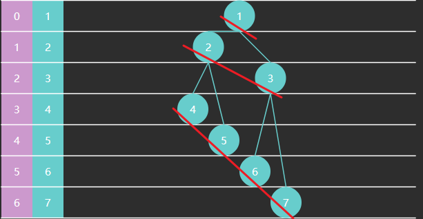

下面看交换次数的推导：设节点高度为 3

|           | 本层节点数 | 高度 | 下潜最多交换次数（高度-1） |
| --------- | ---------- | ---- | -------------------------- |
| 4567 这层 | 4          | 1    | 0                          |
| 23这层    | 2          | 2    | 1                          |
| 1这层     | 1          | 3    | 2                          |

每一层的交换次数为：$节点个数*此节点交换次数$，总的交换次数为
$$
\begin{aligned}
& 4 * 0 + 2 * 1 + 1 * 2 \\

& \frac{8}{2}*0 + \frac{8}{4}*1 + \frac{8}{8}*2 \\

& \frac{8}{2^1}*0 + \frac{8}{2^2}*1 + \frac{8}{2^3}*2\\

\end{aligned}
$$
即
$$
\sum_{i=1}^{h}(\frac{2^h}{2^i}*(i-1))
$$
在 https://www.wolframalpha.com/ 输入

```
Sum[\(40)Divide[Power[2,x],Power[2,i]]*\(40)i-1\(41)\(41),{i,1,x}]
```

推导出 
$$
2^h -h -1
$$
其中 $2^h \approx n$，$h \approx \log_2{n}$，因此有时间复杂度 $O(n)$


## 2.10 二叉树

二叉树是这么一种树状结构：每个节点最多有两个孩子，左孩子和右孩子

重要的二叉树结构

* 完全二叉树（complete binary tree）是一种二叉树结构，除最后一层以外，每一层都必须填满，填充时要遵从先左后右
* 平衡二叉树（balance binary tree）是一种二叉树结构，其中每个节点的左右子树高度相差不超过 1


### 存储

存储方式分为两种

1. 定义树节点与左、右孩子引用（TreeNode）
2. 使用数组，前面讲堆时用过，若以 0 作为树的根，索引可以通过如下方式计算
   * 父 = floor((子 - 1) / 2)
   * 左孩子 = 父 * 2 + 1
   * 右孩子 = 父 * 2 + 2


### 遍历

遍历也分为两种

1. 广度优先遍历（Breadth-first order）：尽可能先访问距离根最近的节点，也称为层序遍历
2. 深度优先遍历（Depth-first order）：对于二叉树，可以进一步分成三种（要深入到叶子节点）
   1. pre-order 前序遍历，对于每一棵子树，先访问该节点，然后是左子树，最后是右子树
   2. in-order 中序遍历，对于每一棵子树，先访问左子树，然后是该节点，最后是右子树
   3. post-order 后序遍历，对于每一棵子树，先访问左子树，然后是右子树，最后是该节点


#### 广度优先

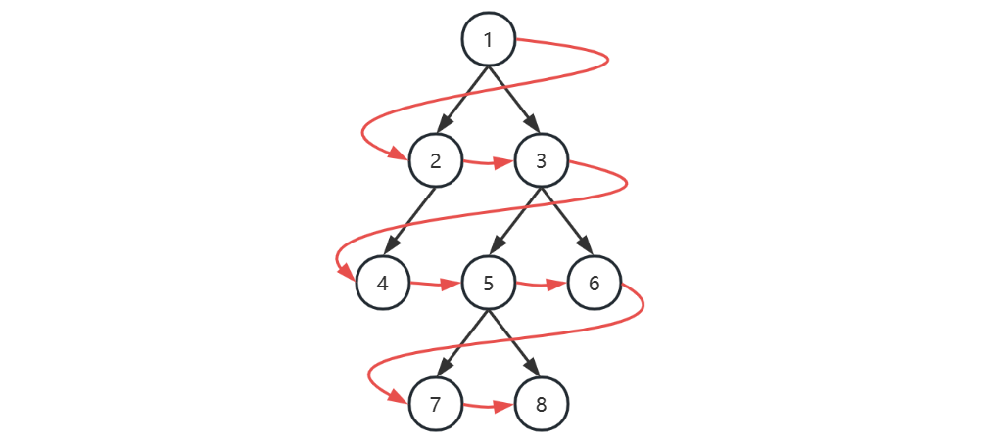

| 本轮开始时队列 | 本轮访问节点 |
| -------------- | ------------ |
| [1]            | 1            |
| [2, 3]         | 2            |
| [3, 4]         | 3            |
| [4, 5, 6]      | 4            |
| [5, 6]         | 5            |
| [6, 7, 8]      | 6            |
| [7, 8]         | 7            |
| [8]            | 8            |
| []             |              |

1. 初始化，将根节点加入队列
2. 循环处理队列中每个节点，直至队列为空
3. 每次循环内处理节点后，将它的孩子节点（即下一层的节点）加入队列

> 注意
>
> * 以上用队列来层序遍历是针对  TreeNode 这种方式表示的二叉树
>
> * 对于数组表现的二叉树，则直接遍历数组即可，自然为层序遍历的顺序


#### 深度优先

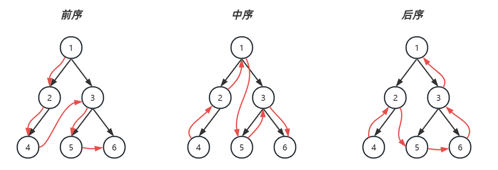

| 栈暂存    | 已处理                                     | 前序遍历 | 中序遍历 |
| --------- | ------------------------------------------ | -------- | -------- |
| [1]       | 1 ✔️ 左💤 右💤                                | 1        |          |
| [1, 2]    | 2✔️ 左💤 右💤<br />1✔️ 左💤 右💤                 | 2        |          |
| [1, 2, 4] | 4✔️ 左✔️ 右✔️<br />2✔️ 左💤 右💤<br />1✔️ 左💤 右💤 | 4        | 4        |
| [1, 2]    | 2✔️ 左✔️ 右✔️<br />1✔️ 左💤 右💤                 |          | 2        |
| [1]       | 1✔️ 左✔️ 右💤                                 |          | 1        |
| [1, 3]    | 3✔️ 左💤 右💤<br />1✔️ 左✔️ 右💤                 | 3        |          |
| [1, 3, 5] | 5✔️ 左✔️ 右✔️<br />3✔️ 左💤 右💤<br />1✔️ 左✔️ 右💤 | 5        | 5        |
| [1, 3]    | 3✔️ 左✔️ 右💤<br />1✔️ 左✔️ 右💤                 |          | 3        |
| [1, 3, 6] | 6✔️ 左✔️ 右✔️<br />3✔️ 左✔️ 右💤<br />1✔️ 左✔️ 右💤 | 6        | 6        |
| [1, 3]    | 3✔️ 左✔️ 右✔️<br />1✔️ 左✔️ 右💤                 |          |          |
| [1]       | 1✔️ 左✔️ 右✔️                                 |          |          |
| []        |                                            |          |          |

#### 递归实现

```java
/**
 * <h3>前序遍历</h3>
 * @param node 节点
 */
static void preOrder(TreeNode node) {
    if (node == null) {
        return;
    }
    System.out.print(node.val + "\t"); // 值
    preOrder(node.left); // 左
    preOrder(node.right); // 右
}

/**
 * <h3>中序遍历</h3>
 * @param node 节点
 */
static void inOrder(TreeNode node) {
    if (node == null) {
        return;
    }
    inOrder(node.left); // 左
    System.out.print(node.val + "\t"); // 值
    inOrder(node.right); // 右
}

/**
 * <h3>后序遍历</h3>
 * @param node 节点
 */
static void postOrder(TreeNode node) {
    if (node == null) {
        return;
    }
    postOrder(node.left); // 左
    postOrder(node.right); // 右
    System.out.print(node.val + "\t"); // 值
}
```


#### 非递归实现

**前序遍历**

```java
LinkedListStack<TreeNode> stack = new LinkedListStack<>();
TreeNode curr = root;

while (!stack.isEmpty() || curr != null) {
    if (curr != null) {
        stack.push(curr);
        System.out.println(curr);
        curr = curr.left;
    } else {
        TreeNode pop = stack.pop();
        curr = pop.right;
    }

}
```

**中序遍历**

```java
LinkedListStack<TreeNode> stack = new LinkedListStack<>();
TreeNode curr = root;

while (!stack.isEmpty() || curr != null) {
    if (curr != null) {
        stack.push(curr);
        curr = curr.left;
    } else {
        TreeNode pop = stack.pop();
        System.out.println(pop);
        curr = pop.right;
    }
}
```

**后序遍历**

```java
LinkedListStack<TreeNode> stack = new LinkedListStack<>();
TreeNode curr = root;
TreeNode pop = null;

while (!stack.isEmpty() || curr != null) {
    if (curr != null) {
        stack.push(curr);
        curr = curr.left;
    } else {
        TreeNode peek = stack.peek();
        if (peek.right == null || peek.right == pop) {
            pop = stack.pop();
            System.out.println(pop);
        } else {
            curr = peek.right;
        }
    }
}
```

对于后序遍历，向回走时，需要处理完右子树才能 pop 出栈。如何知道右子树处理完成呢？

* 如果栈顶元素的 $right \equiv null$ 表示没啥可处理的，可以出栈

* 如果栈顶元素的 $right \neq null$，

  * 那么使用 lastPop 记录最近出栈的节点，即表示从这个节点向回走
  * 如果栈顶元素的 $right==lastPop$ 此时应当出栈


对于前、中两种遍历，实际以上代码从右子树向回走时，并未走完全程（stack 提前出栈了）后序遍历以上代码是走完全程了

**统一写法**

下面是一种统一的写法，依据后序遍历修改

```java
LinkedList<TreeNode> stack = new LinkedList<>();

TreeNode curr = root; // 代表当前节点
TreeNode pop = null; // 最近一次弹栈的元素
while (curr != null || !stack.isEmpty()) {
    if (curr != null) {
        colorPrintln("前: " + curr.val, 31);
        stack.push(curr); // 压入栈，为了记住回来的路
        curr = curr.left;
    } else {
        TreeNode peek = stack.peek();
        // 右子树可以不处理, 对中序来说, 要在右子树处理之前打印
        if (peek.right == null) {
            colorPrintln("中: " + peek.val, 36);
            pop = stack.pop();
            colorPrintln("后: " + pop.val, 34);
        }
        // 右子树处理完成, 对中序来说, 无需打印
        else if (peek.right == pop) {
            pop = stack.pop();
            colorPrintln("后: " + pop.val, 34);
        }
        // 右子树待处理, 对中序来说, 要在右子树处理之前打印
        else {
            colorPrintln("中: " + peek.val, 36);
            curr = peek.right;
        }
    }
}

public static void colorPrintln(String origin, int color) {
    System.out.printf("\033[%dm%s\033[0m%n", color, origin);
}
```

一张图演示三种遍历


* 红色：前序遍历顺序
* 绿色：中序遍历顺序
* 蓝色：后续遍历顺序

# 三. 练习

## 3.1 时间复杂度

用函数 $f(n)$ 表示算法效率与数据规模的关系，假设每次解决问题需要 1 微秒（$10^{-6}$ 秒），进行估算：

1. 如果 $f(n) = n^2$ 那么 1 秒能解决多少次问题？1 天呢？
2. 如果 $f(n) = log_2(n)$  那么 1 秒能解决多少次问题？1 天呢？
3. 如果 $f(n) = n!$ 那么 1 秒能解决多少次问题？1 天呢？


参考解答

1. 1秒 $\sqrt{10^6} = 1000$ 次，1 天 $\sqrt{10^6 * 3600 * 24} \approx 293938$ 次
2. 1秒 $2^{1,000,000} $ 次，一天 $2^{86,400,000,000}$
3. 推算如下
   * $10! = 3,628,800$ 1秒能解决 $1,000,000$ 次，因此次数为 9 次
   * $14!=87,178,291,200$，一天能解决 $86,400,000,000$ 次，因此次数为 13 次


## 3.2 二分查找

* [69. x 的平方根 - 力扣（LeetCode）](https://leetcode.cn/problems/sqrtx/)


### E01. 二分查找-力扣 704 题

**要点**：减而治之，可以用递归或非递归实现

给定一个 n 个元素有序的（升序）整型数组 nums 和一个目标值 target  ，写一个函数搜索 nums 中的 target，如果目标值存在返回下标，否则返回 -1

例如

```java
输入: nums = [-1,0,3,5,9,12], target = 9
输出: 4
解释: 9 出现在 nums 中并且下标为 4
    
输入: nums = [-1,0,3,5,9,12], target = 2
输出: -1
解释: 2 不存在 nums 中因此返回 -1    
```

**参考答案**：略，可以用讲过的任意一种二分求解


### E02. 搜索插入位置-力扣 35 题

**要点**：理解谁代表插入位置

给定一个排序数组和一个目标值

* 在数组中找到目标值，并返回其索引
* 如果目标值不存在于数组中，返回它将会被按顺序插入的位置

例如

```
输入: nums = [1,3,5,6], target = 5
输出: 2

输入: nums = [1,3,5,6], target = 2
输出: 1

输入: nums = [1,3,5,6], target = 7
输出: 4
```


**参考答案1**：用二分查找基础版代码改写，基础版中，找到返回 m，没找到 i 代表插入点，因此有

```java
public int searchInsert(int[] a, int target) {
    int i = 0, j = a.length - 1;
    while (i <= j) {
        int m = (i + j) >>> 1;
        if (target < a[m]) {
            j = m - 1;
        } else if (a[m] < target) {
            i = m + 1;
        } else {
            return m;
        }
    }
    return i; // 原始 return -1
}
```


**参考答案2**：用二分查找平衡版改写，平衡版中

* 如果 target == a[i] 返回 i 表示找到
* 如果 target < a[i]，例如 target = 2，a[i] = 3，这时就应该在 i 位置插入 2
* 如果 a[i] < target，例如 a[i] = 3，target = 4，这时就应该在 i+1 位置插入 4

```java
public static int searchInsert(int[] a, int target) {
    int i = 0, j = a.length;
    while (1 < j - i) {
        int m = (i + j) >>> 1;
        if (target < a[m]) {
            j = m;
        } else {
            i = m;
        }
    }
    return (target <= a[i]) ? i : i + 1;
    // 原始 (target == a[i]) ? i : -1;
}
```


**参考答案3**：用 leftmost 版本解，返回值即为插入位置（并能处理元素重复的情况）

```java
public int searchInsert(int[] a, int target) {
    int i = 0, j = a.length - 1;
    while(i <= j) {
        int m = (i + j) >>> 1;
        if(target <= a[m]) {
            j = m - 1;
        } else {
            i = m + 1;
        } 
    }
    return i;
}
```


### E03. 搜索开始结束位置-力扣 34 题

给你一个按照非递减顺序排列的整数数组 nums，和一个目标值 target。请你找出给定目标值在数组中的开始位置和结束位置。

如果数组中不存在目标值 target，返回 [-1, -1]。

你必须设计并实现时间复杂度为 O(log n) 的算法解决此问题


例如

```
输入：nums = [5,7,7,8,8,10], target = 8
输出：[3,4]

输入：nums = [5,7,7,8,8,10], target = 6
输出：[-1,-1]

输入：nums = [], target = 0
输出：[-1,-1]
```


**参考答案**

```java
public static int left(int[] a, int target) {
    int i = 0, j = a.length - 1;
    int candidate = -1;
    while (i <= j) {
        int m = (i + j) >>> 1;
        if (target < a[m]) {
            j = m - 1;
        } else if (a[m] < target) {
            i = m + 1;
        } else {
            candidate = m;
            j = m - 1;
        }
    }
    return candidate;
}

public static int right(int[] a, int target) {
    int i = 0, j = a.length - 1;
    int candidate = -1;
    while (i <= j) {
        int m = (i + j) >>> 1;
        if (target < a[m]) {
            j = m - 1;
        } else if (a[m] < target) {
            i = m + 1;
        } else {
            candidate = m;
            i = m + 1;
        }
    }
    return candidate;
}

public static int[] searchRange(int[] nums, int target) {
    int x = left(nums, target);
    if(x == -1) {
        return new int[] {-1, -1};
    } else {
        return new int[] {x, right(nums, target)};
    }
}
```


## 3.3 递归 - single recursion

### E03. 二分查找

```java
public static int binarySearch(int[] a, int target) {
    return recursion(a, target, 0, a.length - 1);
}

public static int recursion(int[] a, int target, int i, int j) {
    if (i > j) {
        return -1;
    }
    int m = (i + j) >>> 1;
    if (target < a[m]) {
        return recursion(a, target, i, m - 1);
    } else if (a[m] < target) {
        return recursion(a, target, m + 1, j);
    } else {
        return m;
    }
}
```


### E04. 冒泡排序

```java
public static void main(String[] args) {
    int[] a = {3, 2, 6, 1, 5, 4, 7};
    bubble(a, 0, a.length - 1);
    System.out.println(Arrays.toString(a));
}

private static void bubble(int[] a, int low, int high) {
    if(low == high) {
        return;
    }
    int j = low;
    for (int i = low; i < high; i++) {
        if (a[i] > a[i + 1]) {
            swap(a, i, i + 1);
            j = i;
        }
    }
    bubble(a, low, j);
}

private static void swap(int[] a, int i, int j) {
    int t = a[i];
    a[i] = a[j];
    a[j] = t;
}
```

* low 与 high 为未排序范围
* j 表示的是未排序的边界，下一次递归时的 high
  * 发生交换，意味着有无序情况
  * 最后一次交换（以后没有无序）时，左侧 i 仍是无序，右侧 i+1 已然有序
* 视频中讲解的是只考虑 high 边界的情况，参考以上代码，理解在 low .. high 范围内的处理方法


### E05. 插入排序

```java
public static void main(String[] args) {
    int[] a = {3, 2, 6, 1, 5, 7, 4};
    insertion(a, 1, a.length - 1);
    System.out.println(Arrays.toString(a));
}

private static void insertion(int[] a, int low, int high) {
    if (low > high) {
        return;
    }
    int i = low - 1;
    int t = a[low];
    while (i >= 0 && a[i] > i) {
        a[i + 1] = a[i];
        i--;
    }
    if(i + 1 != low) {
        a[i + 1] = t;
    }    
    insertion(a, low + 1, high);
}
```

* 已排序区域：[0 .. i .. low-1]
* 未排序区域：[low .. high]
* 视频中讲解的是只考虑 low 边界的情况，参考以上代码，理解 low-1 ..  high 范围内的处理方法
* 扩展：利用二分查找 leftmost 版本，改进寻找插入位置的代码


### E06. 约瑟夫问题[^16]

$n$ 个人排成圆圈，从头开始报数，每次数到第 $m$ 个人（$m$ 从 $1$ 开始）杀之，继续从下一个人重复以上过程，求最后活下来的人是谁？


**方法1**

根据最后的存活者 a 倒推出它在上一轮的索引号

| f(n,m) | 本轮索引 | 为了让 a 是这个索引，上一轮应当这样排 | 规律        |
| ------ | -------- | ------------------------------------- | ----------- |
| f(1,3) | 0        | x x x a                               | (0 + 3) % 2 |
| f(2,3) | 1        | x x x 0 a                             | (1 + 3) % 3 |
| f(3,3) | 1        | x x x 0 a                             | (1 + 3) % 4 |
| f(4,3) | 0        | x x x a                               | (0 + 3) % 5 |
| f(5,3) | 3        | x x x 0 1 2 a                         | (3 + 3) % 6 |
| f(6,3) | 0        | x x x a                               |             |


**方法2**

设 n 为总人数，m 为报数次数，解返回的是这些人的索引，从0开始

| f(n, m) | 解                       | 规律  |
| ------- | ------------------------ | ----- |
| f(1, 3) | 0                        |       |
| f(2, 3) | 0 1 => 1                 | 3%2=1 |
| f(3, 3) | 0 1 2 => 0 1             | 3%3=0 |
| f(4, 3) | 0 1 2 3 => 3 0 1         | 3%4=3 |
| f(5, 3) | 0 1 2 3 4  => 3 4 0 1    | 3%5=3 |
| f(6, 3) | 0 1 2 3 4 5 => 3 4 5 0 1 | 3%6=3 |

**一. 找出等价函数**

规律：下次报数的起点为 $k = m \% n$

* 首次出列人的序号是 $k-1$，剩下的的 $n-1$ 个人重新组成约瑟夫环
* 下次从 $k$ 开始数，序号如下
  * $k,\ k+1, \ ...\ ,\ 0,\ 1,\ k-2$，如上例中 $3\ 4\ 5\ 0\ 1$

这个函数称之为 $g(n-1,m)$，它的最终结果与 $f(n,m)$ 是相同的。


**二. 找到映射函数**

现在想办法找到 $g(n-1,m)$ 与 $f(n-1, m)$ 的对应关系，即
$$
3 \rightarrow 0 \\
4 \rightarrow 1 \\
5 \rightarrow 2 \\
0 \rightarrow 3 \\
1 \rightarrow 4 \\
$$
映射函数为
$$
mapping(x) = 
\begin{cases}
x-k & x=[k..n-1] \\
x+n-k & x=[0..k-2]
\end{cases}
$$
等价于下面函数
$$
mapping(x) = (x + n - k)\%{n}
$$
代入测试一下
$$
3 \rightarrow (3+6-3)\%6 \rightarrow 0 \\
4 \rightarrow (4+6-3)\%6 \rightarrow 1 \\
5 \rightarrow (5+6-3)\%6 \rightarrow 2 \\
0 \rightarrow (0+6-3)\%6 \rightarrow 3 \\
1 \rightarrow (1+6-3)\%6 \rightarrow 4 \\
$$
综上有
$$
f(n-1,m) = mapping(g(n-1,m))
$$


**三. 求逆映射函数**

映射函数是根据 x 计算 y，逆映射函数即根据 y 得到 x
$$
mapping^{-1}(x) = (x + k)\%n
$$
代入测试一下
$$
0 \rightarrow (0+3)\%6 \rightarrow 3 \\
1 \rightarrow (1+3)\%6 \rightarrow 4 \\
2 \rightarrow (2+3)\%6 \rightarrow 5 \\
3 \rightarrow (3+3)\%6 \rightarrow 0 \\
4 \rightarrow (4+3)\%6 \rightarrow 1 \\
$$
因此可以求得
$$
g(n-1,m) = mapping^{-1}(f(n-1,m))
$$


**四. 递推式**

代入推导
$$
\begin{aligned}
f(n,m) = \ & g(n-1,m) \\
= \ & mapping^{-1}(f(n-1,m)) \\
= \ & (f(n-1,m) + k) \% n \\
= \ & (f(n-1,m) + m\%n) \% n \\
= \ & (f(n-1,m) + m) \% n \\
\end{aligned}
$$
最后一步化简是利用了模运算法则

$(a+b)\%n = (a\%n + b\%n) \%n$  例如 

* $(6+6)\%5 = 2 = (6+6\%5)\%5$
* $(6+5)\%5 = 1 = (6+5\%5)\%5$
* $(6+4)\%5 = 0 = (6+4\%5)\%5$

最终递推式
$$
f(n,m) = 
\begin{cases}
(f(n-1,m) + m) \% n & n>1\\
0 & n = 1
\end{cases}
$$


## 3.4 递归 - multi recursion


### E02. 汉诺塔[^13]

Tower of Hanoi，是一个源于印度古老传说：大梵天创建世界时做了三根金刚石柱，在一根柱子从下往上按大小顺序摞着 64 片黄金圆盘，大梵天命令婆罗门把圆盘重新摆放在另一根柱子上，并且规定

* 一次只能移动一个圆盘
* 小圆盘上不能放大圆盘

下面的动图演示了4片圆盘的移动方法


使用程序代码模拟圆盘的移动过程，并估算出时间复杂度


**思路**

* 假设每根柱子标号 a，b，c，每个圆盘用 1，2，3 ... 表示其大小，圆盘初始在 a，要移动到的目标是 c

* 如果只有一个圆盘，此时是最小问题，可以直接求解

  * 移动圆盘1 $a \mapsto c$  

  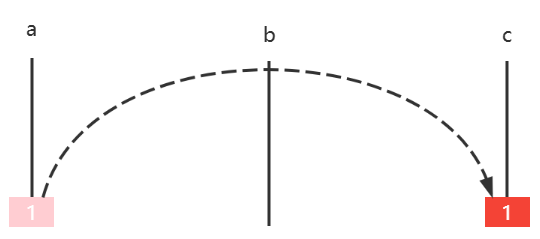

* 如果有两个圆盘，那么

  * 圆盘1 $a \mapsto b$ 
  * 圆盘2 $a \mapsto c$
  * 圆盘1 $b \mapsto c$

  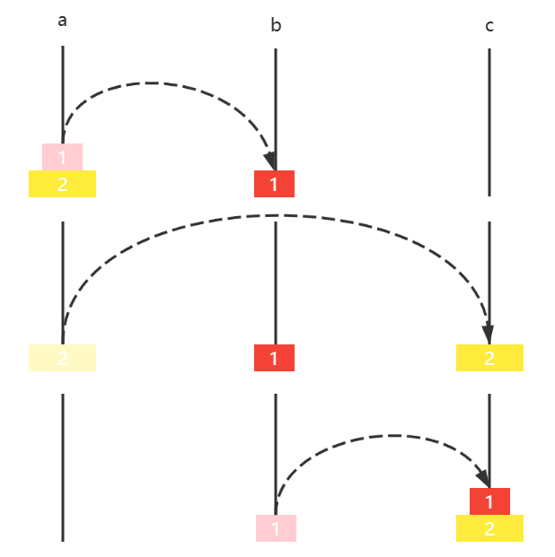

* 如果有三个圆盘，那么

  * 圆盘12 $a \mapsto b$
  * 圆盘3 $a \mapsto c$
  * 圆盘12 $b \mapsto c$

  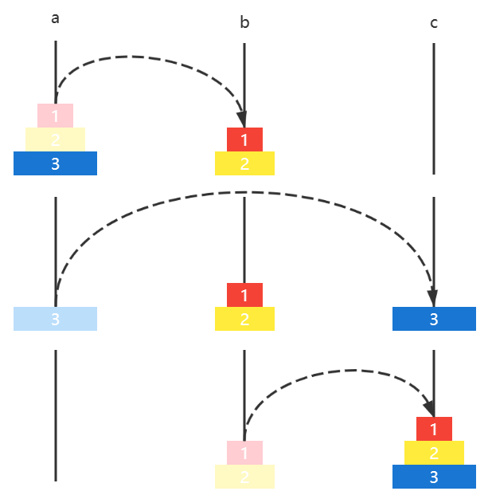

* 如果有四个圆盘，那么
  * 圆盘 123 $a \mapsto b$
  * 圆盘4 $a \mapsto c$
  * 圆盘 123 $b \mapsto c$

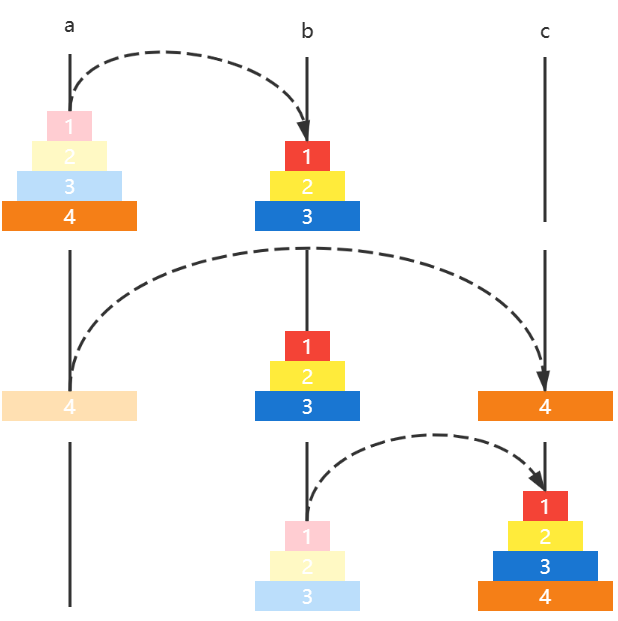


**题解**

```java
public class E02HanoiTower {


    /*
             源 借 目
        h(4, a, b, c) -> h(3, a, c, b)
                         a -> c
                         h(3, b, a, c)
     */
    static LinkedList<Integer> a = new LinkedList<>();
    static LinkedList<Integer> b = new LinkedList<>();
    static LinkedList<Integer> c = new LinkedList<>();

    static void init(int n) {
        for (int i = n; i >= 1; i--) {
            a.add(i);
        }
    }

    static void h(int n, LinkedList<Integer> a, 
                  LinkedList<Integer> b, 
                  LinkedList<Integer> c) {
        if (n == 0) {
            return;
        }
        h(n - 1, a, c, b);
        c.addLast(a.removeLast());
        print();
        h(n - 1, b, a, c);
    }

    private static void print() {
        System.out.println("-----------------------");
        System.out.println(a);
        System.out.println(b);
        System.out.println(c);
    }

    public static void main(String[] args) {
        init(3);
        print();
        h(3, a, b, c);
    }
}
```


### E03. 杨辉三角[^6]

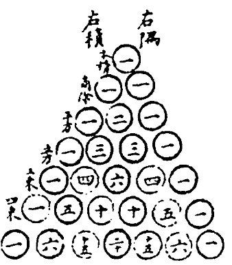

**分析**

把它斜着看

```
        1
      1   1
    1   2   1
  1   3   3   1
1   4   6   4   1
```

* 行 $i$，列 $j$，那么 $[i][j]$ 的取值应为 $[i-1][j-1] + [i-1][j]$
* 当 $j=0$ 或 $i=j$ 时，$[i][j]$ 取值为 $1$


**题解**

```java
public static void print(int n) {
    for (int i = 0; i < n; i++) {
        if (i < n - 1) {
            System.out.printf("%" + 2 * (n - 1 - i) + "s", " ");
        }

        for (int j = 0; j < i + 1; j++) {
            System.out.printf("%-4d", element(i, j));
        }
        System.out.println();
    }
}

public static int element(int i, int j) {
    if (j == 0 || i == j) {
        return 1;
    }
    return element(i - 1, j - 1) + element(i - 1, j);
}
```


**优化1**

是 multiple recursion，因此很多递归调用是重复的，例如

* recursion(3, 1) 分解为
  * recursion(2, 0) + recursion(2, 1) 
* 而 recursion(3, 2) 分解为
  * recursion(2, 1) + recursion(2, 2)

这里 recursion(2, 1) 就重复调用了，事实上它会重复很多次，可以用 static AtomicInteger counter = new AtomicInteger(0) 来查看递归函数的调用总次数

事实上，可以用 **memoization** 来进行优化：

```java
public static void print1(int n) {
    int[][] triangle = new int[n][];
    for (int i = 0; i < n; i++) {
        // 打印空格
        triangle[i] = new int[i + 1];
        for (int j = 0; j <= i; j++) {
            System.out.printf("%-4d", element1(triangle, i, j));
        }
        System.out.println();
    }
}

public static int element1(int[][] triangle, int i, int j) {
    if (triangle[i][j] > 0) {
        return triangle[i][j];
    }

    if (j == 0 || i == j) {
        triangle[i][j] = 1;
        return triangle[i][j];
    }
    triangle[i][j] = element1(triangle, i - 1, j - 1) + element1(triangle, i - 1, j);
    return triangle[i][j];
}
```

* 将数组作为递归函数内可以访问的遍历，如果 $triangle[i][j]$ 已经有值，说明该元素已经被之前的递归函数计算过，就不必重复计算了


**优化2**

```java
public static void print2(int n) {
    int[] row = new int[n];
    for (int i = 0; i < n; i++) {
        // 打印空格
        createRow(row, i);
        for (int j = 0; j <= i; j++) {
            System.out.printf("%-4d", row[j]);
        }
        System.out.println();
    }
}

private static void createRow(int[] row, int i) {
    if (i == 0) {
        row[0] = 1;
        return;
    }
    for (int j = i; j > 0; j--) {
        row[j] = row[j - 1] + row[j];
    }
}
```

> 注意：还可以通过每一行的前一项计算出下一项，不必借助上一行，这与杨辉三角的另一个特性有关，暂不展开了


力扣对应题目，但递归不适合在力扣刷高分，因此只列出相关题目，不做刷题讲解了

* [118. 杨辉三角 - 力扣（LeetCode）](https://leetcode.cn/problems/pascals-triangle/)
* [119. 杨辉三角 II - 力扣（LeetCode）](https://leetcode.cn/problems/pascals-triangle-ii/solution/yang-hui-san-jiao-ii-by-leetcode-solutio-shuk/)


## 3.5 链表

### E01. 反转单向链表-力扣 206 题

对应力扣题目 [206. 反转链表 - 力扣（LeetCode）](https://leetcode.cn/problems/reverse-linked-list/)

```
输入：head = [1,2,3,4,5]
输出：[5,4,3,2,1]

输入：[1,2]
输出：[2,1]

输入：[]
输出：[]
```


**方法1**

构造一个新链表，从**旧链表**依次拿到每个节点，创建新节点添加至**新链表**头部，完成后新链表即是倒序的

```java
public ListNode reverseList(ListNode o1) {
    ListNode n1 = null;
    ListNode p = o1;
    while (p != null) {
        n1 = new ListNode(p.val, n1);
        p = p.next;
    }
    return n1;
}
```

评价：简单直白，就是得新创建节点对象


**方法2**

与方法1 类似，构造一个新链表，从**旧链表头部**移除节点，添加到**新链表头部**，完成后新链表即是倒序的，区别在于原题目未提供节点外层的容器类，这里提供一个，另外一个区别是并不去构造新节点

```java
static class List {
    ListNode head;

    public List(ListNode head) {
        this.head = head;
    }

    public ListNode removeFirst(){
        ListNode first = head;
        if (first != null) {
            head = first.next;
        }
        return first;
    }

    public void addFirst(ListNode first) {
        first.next = head;
        head = first;
    }
}
```

代码

```java
public ListNode reverseList(ListNode head) {
    List list1 = new List(head);
    List list2 = new List(null);
    ListNode first;
    while ((first = list1.removeFirst()) != null) {
        list2.addFirst(first);
    }
    return list2.head;
}
```

评价：更加面向对象，如果实际写代码而非刷题，更多会这么做


**方法3**

递归，在**归**时让 $5 \rightarrow 4$，$4 \rightarrow 3$ ...

首先，写一个递归方法，返回值用来拿到最后一个节点

```java
public ListNode reverseList(ListNode p) {
    if (p == null || p.next == null) { // 不足两个节点
        return p; // 最后一个节点
    }
    ListNode last = reverseList(p.next);
    return last;
}
```

* 注意1：递归终止条件是 curr.next == null，目的是到最后一个节点就结束递归，与之前递归遍历不一样
* 注意2：需要考虑空链表即 p == null 的情况

可以先测试一下

```java
ListNode o5 = new ListNode(5, null);
ListNode o4 = new ListNode(4, o5);
ListNode o3 = new ListNode(3, o4);
ListNode o2 = new ListNode(2, o3);
ListNode o1 = new ListNode(1, o2);
ListNode n1 = new E01Leetcode206().reverseList(o1);
System.out.println(n1);
```

会打印

```
[5]
```

下面为**伪码**调用过程，假设节点分别是 $1 \rightarrow 2 \rightarrow 3 \rightarrow 4 \rightarrow 5 \rightarrow null$，先忽略返回值

```java
reverseList(ListNode p = 1) {
    reverseList(ListNode p = 2) {
    	reverseList(ListNode p = 3) {
    		reverseList(ListNode p = 4) {
    			reverseList(ListNode p = 5) {
    				if (p == null || p.next == null) {
                        return p; // 返回5
                    }
				}
                // 此时p是4, p.next是5
			}
            // 此时p是3, p.next是4
		}
        // 此时p是2, p.next是3
	}
    // 此时p是1, p.next是2
}
```

接下来，从 p = 4 开始，要让 $5 \rightarrow 4$，$4 \rightarrow 3$ ...

```java
reverseList(ListNode p = 1) {
    reverseList(ListNode p = 2) {
    	reverseList(ListNode p = 3) {
    		reverseList(ListNode p = 4) {
    			reverseList(ListNode p = 5) {
    				if (p == null || p.next == null) {
                        return p; // 返回5
                    }
				}
                // 此时p是4, p.next是5, 要让5指向4,代码写成 p.next.next=p
                // 还要注意4要指向 null, 否则就死链了
			}
            // 此时p是3, p.next是4
		}
        // 此时p是2, p.next是3
	}
    // 此时p是1, p.next是2
}
```

最终代码为：

```java
public ListNode reverseList(ListNode p) {    
    if (p == null || p.next == null) { // 不足两个节点
        return p; // 最后一个节点
    }
    ListNode last = reverseList(p.next);
    p.next.next = p;
    p.next = null;
    return last;
}
```

Q：为啥不能在**递**的过程中倒序？

A：比如

* $ 1 \rightarrow 2 \rightarrow 3 $ 如果递的过程中让 $2 \rightarrow 1$ 那么此时 $2 \rightarrow 3$ 就被覆盖，不知道接下来递给谁
* 而归的时候让 $3 \rightarrow 2$ 不会影响上一层的 $1 \rightarrow 2$

评价：单向链表没有 prev 指针，但利用递归的特性【记住了】链表每次调用时相邻两个节点是谁


**方法4**

从链表每次拿到第二个节点，将其从链表断开，插入头部，直至它为 null 结束

1. 设置指针 o1(旧头)、n1(新头)、o2(旧老二)，分别指向第一，第一，第二节点

$\frac{n1 \ o1}{1} \rightarrow \frac{o2}{2} \rightarrow 3 \rightarrow 4 \rightarrow 5 \rightarrow null$

2. 将 o2 节点从链表断开，即 o1 节点指向第三节点

$ \frac{n1 \ o1}{1} \rightarrow 3 \rightarrow 4 \rightarrow 5 \rightarrow null$ ，$\frac{o2}{2}$

3. o2 节点链入链表头部，即

$\frac{o2}{2} \rightarrow \frac{n1 \ o1}{1} \rightarrow 3 \rightarrow 4 \rightarrow 5 \rightarrow null$

4. n1 指向 o2

$\frac{n1 \ o2}{2} \rightarrow \frac{o1}{1} \rightarrow 3 \rightarrow 4 \rightarrow 5 \rightarrow null$

5. o2 指向 o1 的下一个节点，即

$\frac{n1}{2} \rightarrow \frac{o1}{1} \rightarrow \frac{o2}{3} \rightarrow 4 \rightarrow 5 \rightarrow null$

6. 重复以上 $2\sim5$ 步，直到 o2 指向 null

7. 还应当考虑边界条件，即链表中不满两个元素时，无需走以上逻辑


参考答案

```java
public ListNode reverseList(ListNode o1) {    
    if (o1 == null || o1.next == null) { // 不足两个节点
        return o1;
    }
    ListNode o2 = o1.next;
    ListNode n1 = o1;
    while (o2 != null) {
        o1.next = o2.next; 
        o2.next = n1;
        n1 = o2;
        o2 = o1.next;
    }
    return n1;
}
```


**方法5**

要点：把链表分成两部分，思路就是不断从链表2的头，往链表1的头搬移

1. n1 指向 null，代表**新链表**一开始没有元素，o1 指向**原链表**的首节点

$\frac{n1}{null}$，$\frac{o1}{1} \rightarrow 2 \rightarrow 3 \rightarrow 4 \rightarrow 5 \rightarrow null$

2. 开始循环，o2 指向**原链表**次节点

$\frac{n1}{null}$，$\frac{o1}{1} \rightarrow \frac{o2}{2} \rightarrow 3 \rightarrow 4 \rightarrow 5 \rightarrow null$

3. 搬移

$\frac{o1}{1} \rightarrow \frac{n1}{null}$  ， $\frac{o2}{2} \rightarrow 3 \rightarrow 4 \rightarrow 5 \rightarrow null$

4. 指针复位

$\frac{n1}{1} \rightarrow null$ ， $\frac{o1 \ o2}{2} \rightarrow 3 \rightarrow 4 \rightarrow 5 \rightarrow null$

5. 重复 $2\sim4$ 步
6. 当 o1 = null 时退出循环


**参考答案**

```java
public ListNode reverseList(ListNode o1) {
    if (o1 == null || o1.next == null) {
        return o1;
    }
    ListNode n1 = null;
    while (o1 != null) {
        ListNode o2 = o1.next;
        o1.next = n1;
        n1 = o1;
        o1 = o2;
    }
    return n1;
}
```

评价：本质上与方法2 相同，只是方法2更为面向对象


### E02. 根据值删除节点-力扣 203 题

例如

```
输入：head = [1,2,6,3,6], val = 6
输出：[1,2,3]

输入：head = [], val = 1
输出：[]

输入：head = [7,7,7,7], val = 7
输出：[]
```


**方法1**

图中 s 代表 sentinel 哨兵（如果不加哨兵，则删除第一个节点要特殊处理），例如要删除 6

```
p1   p2
s -> 1 -> 2 -> 6 -> 3 -> 6 -> null
```

* 如果 p2 不等于目标，则 p1，p2 不断后移

```
	 p1   p2
s -> 1 -> 2 -> 6 -> 3 -> 6 -> null

	 	  p1   p2
s -> 1 -> 2 -> 6 -> 3 -> 6 -> null
```

* p2 == 6，删除它，注意 p1 此时保持不变，p2 后移

```
	 	  p1   p2
s -> 1 -> 2 -> 3 -> 6 -> null
```

* p2 不等于目标，则 p1，p2 不断后移

```
	 	  	   p1   p2
s -> 1 -> 2 -> 3 -> 6 -> null
```

* p2 == 6，删除它，注意 p1 此时保持不变，p2 后移

```
	 	  	   p1   p2
s -> 1 -> 2 -> 3 -> null
```

* p2 == null 退出循环

最后代码

```java
public ListNode removeElements(ListNode head, int val) {
    ListNode sentinel = new ListNode(-1, head);
    ListNode p1 = sentinel;
    ListNode p2;
    while ((p2 = p1.next) != null) {
        if (p2.val == val) {
            p1.next = p2.next;
        } else {
            p1 = p1.next;
        }
    }
    return sentinel.next;
}
```


**方法2**

思路，递归函数负责返回：从当前节点（我）开始，完成删除的子链表

1. 若我与 v 相等，应该返回下一个节点递归结果
2. 若我与 v 不等，应该返回我，但我的 next 应该更新（让我能带上后续删过的子链表）

```java
removeElements(ListNode p=1, int v=6){
    1.next=removeElements(ListNode p=2, int v=6){
    	2.next=removeElements(ListNode p=6, int v=6){
    		removeElements(ListNode p=3, int v=6){
    			3.next=removeElements(ListNode p=6, int v=6){
    				removeElements(ListNode p=null, int v=6){
    					// 没有节点,返回
                        return null
					}
				}
                return 3
			}
		}
        return 2
    }
    return 1
}
```

代码

```java
public ListNode removeElements(ListNode head, int val) {
    if (head == null) {
        return null;
    }
    if (head.val == val) {
        return removeElements(head.next, val);
    } else {
        head.next = removeElements(head.next, val);
        return head;
    }
}
```


### E03.  删除倒数节点-力扣 19 题

例如

```
输入：head = [1,2,3,4,5], n = 2
输出：[1,2,3,5]

输入：head = [1], n = 1
输出：[]

输入：head = [1,2], n = 1
输出：[1]
```

另外题目提示

* 链表至少一个节点
* n 只会在合理范围


**方法1**

思路，写一个递归函数，用来返回下一个节点的倒数序号

```java
recursion(ListNode p=1, int n=2) {
    recursion(ListNode p=2, int n=2) {
    	recursion(ListNode p=3, int n=2) {
    		recursion(ListNode p=4, int n=2) {
    			recursion(ListNode p=5, int n=2) {
    				recursion(ListNode p=null, int n=2) {
    					return 0; // 最内层序号0
					}
                    return 1; // 上一次返回值+1
				}
                return 2;
			}
            if(返回值 == n == 2) {
                // 删除 next
            }
            return 3;
		}
        return 4;
	}
    return 5;
}
```

但上述代码有一个问题，就是若删除的是第一个节点，它没有上一个节点，因此可以加一个哨兵来解决

代码

```java
public ListNode removeNthFromEnd(ListNode head, int n) {
    ListNode sentinel = new ListNode(-1, head);
    recursion(sentinel, n);
    return sentinel.next;
}

public int recursion(ListNode p, int n) {
    if (p == null) {
        return 0;
    }
    int nth = recursion(p.next, n);
    if (nth == n) {
        p.next = p.next.next;
    }
    return nth + 1;
}
```

Q：p.next.next 不怕空指针吗？

A：

* p 是待删除节点的上一个节点，如果能递归回到 p，那么 p.next 肯定有值，不会是 null
* 且题目说明了 n >=1，不会因为 nth == 0 而让 p.next 指向最后的 null


**方法2**

快慢指针，p1 指向待删节点的上一个，p2 先走 n + 1 步

```java
i=0
p2
s -> 1 -> 2 -> 3 -> 4 -> 5 -> null

     i=1
     p2
s -> 1 -> 2 -> 3 -> 4 -> 5 -> null

          i=2
          p2
s -> 1 -> 2 -> 3 -> 4 -> 5 -> null

               i=3 从此开始 p1 p2 依次向右平移, 直到 p2 移动到末尾
p1             p2
s -> 1 -> 2 -> 3 -> 4 -> 5 -> null

               p1             p2
s -> 1 -> 2 -> 3 -> 4 -> 5 -> null
```

代码

```java
public ListNode removeNthFromEnd(ListNode head, int n) {
    ListNode s = new ListNode(-1, head);
    ListNode p1 = s;
    ListNode p2 = s;
    for (int i = 0; i < n + 1; i++) {
        p2 = p2.next;
    }
    while (p2 != null) {
        p1 = p1.next;
        p2 = p2.next;
    }
    p1.next = p1.next.next;
    return s.next;
}
```


**方法3**

```java
public ListNode removeNthFromEnd(ListNode head, int n) {
    Composite c = recursion(head, n);
    return c.node;
}

static class Composite {
    ListNode node;
    int nth;

    public Composite(ListNode node, int nth) {
        this.node = node;
        this.nth = nth;
    }
}

public Composite recursion(ListNode p, int n) {
    if (p == null) {
        return new Composite(null, 1);
    }
    Composite c = recursion(p.next, n);
    if (c.nth != n) {
        p.next = c.node;
        c.node = p;
    }
    c.nth +=1;
    return c;
}
```


### E04. 有序链表去重-力扣 83 题

例如

```
输入：head = [1,1,2]
输出：[1,2]

输入：head = [1,1,2,3,3]
输出：[1,2,3]
```

注意：**重复元素保留一个**

**方法1**

```
p1   p2
1 -> 1 -> 2 -> 3 -> 3 -> null
```

* p1.val == p2.val 那么删除 p2，注意 p1 此时保持不变

```
p1   p2
1 -> 2 -> 3 -> 3 -> null
```

* p1.val != p2.val 那么 p1，p2 向后移动

```java
     p1   p2
1 -> 2 -> 3 -> 3 -> null
         
          p1   p2
1 -> 2 -> 3 -> 3 -> null     
```

* p1.val == p2.val 那么删除 p2

```
          p1   p2
1 -> 2 -> 3 -> null   
```

* 当 p2 == null 退出循环

代码

```java
public ListNode deleteDuplicates(ListNode head) {
    // 链表节点 < 2
    if (head == null || head.next == null) {
        return head;
    }
    // 链表节点 >= 2
    ListNode p1 = head;
    ListNode p2;
    while ((p2 = p1.next) != null) {
        if (p1.val == p2.val) {
            p1.next = p2.next;
        } else {
            p1 = p1.next;
        }
    }
    return head;
}
```


**方法2**

递归函数负责返回：从当前节点（我）开始，完成去重的链表

1. 若我与 next 重复，返回 next
2. 若我与 next 不重复，返回我，但 next 应当更新

```java
deleteDuplicates(ListNode p=1) {
    deleteDuplicates(ListNode p=1) {
        1.next=deleteDuplicates(ListNode p=2) {
            2.next=deleteDuplicates(ListNode p=3) {
                deleteDuplicates(ListNode p=3) {
					// 只剩一个节点，返回
                    return 3
                }                
            }
            return 2
        }
        return 1
    }
}
```

代码

```java
public ListNode deleteDuplicates(ListNode p) {
    if (p == null || p.next == null) {
        return p;
    }
    if(p.val == p.next.val) {
        return deleteDuplicates(p.next);
    } else {
        p.next = deleteDuplicates(p.next);
        return p;
    }
}
```


### E05. 有序链表去重-力扣 82 题

例如

```
输入：head = [1,2,3,3,4,4,5]
输出：[1,2,5]

输入：head = [1,1,1,2,3]
输出：[2,3]
```

注意：**重复元素一个不留**

**方法1**

递归函数负责返回：从当前节点（我）开始，完成去重的链表

1. 若我与 next 重复，一直找到下一个不重复的节点，以它的返回结果为准
2. 若我与 next 不重复，返回我，同时更新 next

```java
deleteDuplicates(ListNode p = 1) {
    // 找下个不重复的
	deleteDuplicates(ListNode p = 1) {
        deleteDuplicates(ListNode p = 1) {
			deleteDuplicates(ListNode p = 2) {
                2.next=deleteDuplicates(ListNode p = 3) {
					// 只剩一个节点，返回
                    return 3
                }
                return 2
			}
        }
    }
}
```

代码

```java
public ListNode deleteDuplicates(ListNode p) {
    if (p == null || p.next == null) {
        return p;
    }
    if (p.val == p.next.val) {
        ListNode x = p.next.next;
        while (x != null && x.val == p.val) {
            x = x.next;
        }
        return deleteDuplicates(x);
    } else {
        p.next = deleteDuplicates(p.next);
        return p;
    }
}
```


**方法2**

p1 是待删除的上一个节点，每次循环对比 p2、p3 的值

* 如果 p2 与 p3 的值重复，那么 p3 继续后移，直到找到与 p2 不重复的节点，p1 指向 p3 完成删除
* 如果 p2 与 p3 的值不重复，p1，p2，p3 向后平移一位，继续上面的操作
* p2 或 p3 为 null 退出循环
  * p2 为 null 的情况，比如链表为 1 1 1 null


```
p1 p2 p3
s, 1, 1, 1, 2, 3, null

p1 p2    p3
s, 1, 1, 1, 2, 3, null

p1 p2       p3
s, 1, 1, 1, 2, 3, null

p1 p3
s, 2, 3, null

p1 p2 p3
s, 2, 3, null

   p1 p2 p3
s, 2, 3, null
```


代码

```java
public ListNode deleteDuplicates(ListNode head) {
    if (head == null || head.next == null) {
        return head;
    }

    ListNode s = new ListNode(-1, head);
    ListNode p1 = s;
    ListNode p2;
    ListNode p3;
    while ((p2 = p1.next) != null && (p3 = p2.next) != null) {
        if (p2.val == p3.val) {
            while ((p3 = p3.next) != null 
                   && p3.val == p2.val) {
            }
            p1.next = p3;
        } else {
            p1 = p1.next;
        }
    }
    return s.next;
}
```


### E06. 合并有序链表-力扣 21 题

例

```
输入：l1 = [1,2,4], l2 = [1,3,4]
输出：[1,1,2,3,4,4]
    
输入：l1 = [], l2 = []
输出：[]

输入：l1 = [], l2 = [0]
输出：[0]
```

**方法1**

* 谁小，把谁链给 p，p 和小的都向后平移一位
* 当 p1、p2 有一个为 null，退出循环，把不为 null 的链给 p

```
p1
1	3	8	9	null

p2
2	4	null

p		
s	null
```

代码

```java
public ListNode mergeTwoLists(ListNode p1, ListNode p2) {
    ListNode s = new ListNode(-1, null);
    ListNode p = s;
    while (p1 != null && p2 != null) {
        if (p1.val < p2.val) {
            p.next = p1;
            p1 = p1.next;
        } else {
            p.next = p2;
            p2 = p2.next;
        }
        p = p.next;
    }
    if (p1 != null) {
        p.next = p1;
    }
    if (p2 != null) {
        p.next = p2;
    }
    return s.next;
}
```

* 可以自行验证**例**中后两种情况


**方法2**

递归函数应该返回

* 更小的那个链表节点，并把它剩余节点与另一个链表再次递归
* 返回之前，更新此节点的 next

```java
mergeTwoLists(p1=[1,3,8,9], p2=[2,4]) {
    1.next=mergeTwoLists(p1=[3,8,9], p2=[2,4]) {
        2.next=mergeTwoLists(p1=[3,8,9], p2=[4]) {            
            3.next=mergeTwoLists(p1=[8,9], p2=[4]) {
                4.next=mergeTwoLists(p1=[8,9], p2=null) {
                    return [8,9]
                }
                return 4
            }
            return 3
        }
        return 2
    }
	return 1
}
```


### E07. 合并多个有序链表-力扣 23 题

例

```
输入：lists = [[1,4,5],[1,3,4],[2,6]]
输出：[1,1,2,3,4,4,5,6]
解释：链表数组如下：
[
  1->4->5,
  1->3->4,
  2->6
]
将它们合并到一个有序链表中得到。
1->1->2->3->4->4->5->6
```


**方法1**

递归

```java
public ListNode mergeKLists(ListNode[] lists) {
    if (lists.length == 0) {
        return null;
    }
    return merge(lists, 0, lists.length - 1);
}

public ListNode split(ListNode[] lists, int i, int j) {
    System.out.println(i + " " + j);
    if (j == i) {
        return lists[i];
    }
    int m = (i + j) >>> 1;
    return mergeTwoLists(
        split(lists, i, m),
        split(lists, m + 1, j)
    );
}
```

还可以用优先级队列求解，这个放在后面讲


### E08. 查找链表中间节点-力扣 876 题

例如

```
输入：[1,2,3,4,5]
输出：此列表中的结点 3 (序列化形式：[3,4,5])

输入：[1,2,3,4,5,6]
输出：此列表中的结点 4 (序列化形式：[4,5,6])
```

* **偶数**节点时，中间点是靠右的那个

解法：快慢指针，快指针一次走两步，慢指针一次走一步，当快指针到链表结尾时，慢指针恰好走到链表的一半

```java
public ListNode middleNode(ListNode head) {
    ListNode p1 = head;	// 慢指针，中间点
    ListNode p2 = head;	// 快指针
    while (p2 != null && p2.next != null) {
        p1 = p1.next;
        p2 = p2.next;
        p2 = p2.next;
    }
    return p1;
}
```


### E09. 回文链表-力扣 234 题

所谓回文指正着读、反着读，结果一样，例如

```
[1,2,2,1]
[1,2,3,2,1]
```

它们都是回文链表，不是回文的例子

```
[1,2,3,1]  --反过来-->  [1,3,2,1]
```


解法

```java
/*
    步骤1. 找中间点
    步骤2. 中间点后半个链表反转
    步骤3. 反转后链表与原链表逐一比较
*/
public boolean isPalindrome(ListNode head) {
    ListNode middle = middle(head);
    ListNode newHead = reverse(middle);
    while (newHead != null) {
        if (newHead.val != head.val) {
            return false;
        }
        newHead = newHead.next;
        head = head.next;
    }
    return true;
}

private ListNode reverse(ListNode o1) {
    ListNode n1 = null;
    while (o1 != null) {
        ListNode o2 = o1.next;
        o1.next = n1;
        n1 = o1;
        o1 = o2;
    }
    return n1;
}

private ListNode middle(ListNode head) {
    ListNode p1 = head; // 慢
    ListNode p2 = head; // 快
    while (p2 != null && p2.next != null) {
        p1 = p1.next;
        p2 = p2.next.next;
    }
    return p1;
}
```


优化后解法

```java
public boolean isPalindrome(ListNode h1) {
    if (h1 == null || h1.next == null) {
        return true;
    }
    ListNode p1 = h1; 	// 慢指针，中间点
    ListNode p2 = h1; 	// 快指针
    ListNode n1 = null;	// 新头
    ListNode o1 = h1;	// 旧头
    // 快慢指针找中间点
    while (p2 != null && p2.next != null) {
        p1 = p1.next;
        p2 = p2.next.next;

        // 反转前半部分
        o1.next = n1;
        n1 = o1;
        o1 = p1;
    }
    if (p2 != null) { // 节点数为奇数
        p1 = p1.next;
    }
    // 同步比较新头和后半部分
    while (n1 != null) {
        if (n1.val != p1.val) {
            return false;
        }
        p1 = p1.next;
        n1 = n1.next;
    }
    return true;
}
```


### E10. 环形链表-力扣 141 题

本题以及下题，实际是 Floyd's Tortoise and Hare Algorithm （Floyd 龟兔赛跑算法）[^15]

> 除了 Floyd 判环算法外，还有其它的判环算法，详见 https://en.wikipedia.org/wiki/Cycle_detection

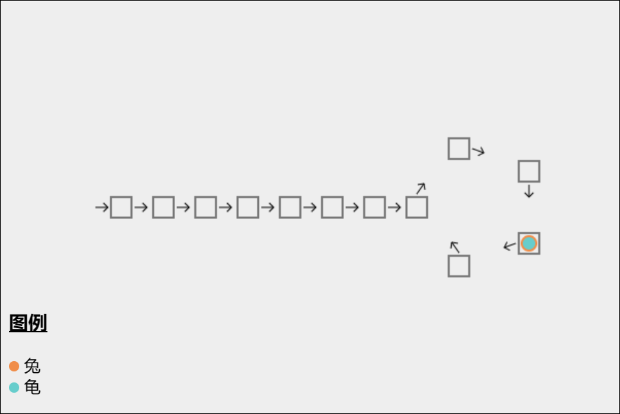

如果链表上存在环，那么在环上以不同速度前进的两个指针必定会在某个时刻相遇。算法分为两个阶段

阶段1

* 龟一次走一步，兔子一次走两步
* 当兔子能走到终点时，不存在环
* 当兔子能追上龟时，可以判断存在环

阶段2

* 从它们第一次相遇开始，龟回到起点，兔子保持原位不变
* 龟和兔子一次都走一步
* 当再次相遇时，地点就是环的入口

为什么呢？

* 设起点到入口走 a 步（本例是 7），绕环一圈长度为 b（本例是 5），
* 那么**从起点开始，走 a + 绕环 n 圈，都能找到环入口**
* 第一次相遇时
  * 兔走了 a + 绕环 n 圈（本例 2 圈） + k，k 是它们相遇距环入口位置（本例 3，不重要）
  * 龟走了 a + 绕环 n 圈（本例 0 圈） + k，当然它绕的圈数比兔少
  * 兔走的距离是龟的两倍，所以**龟走的** = 兔走的 - 龟走的 = **绕环 n 圈**
* 而前面分析过，如果走 a + 绕环 n 圈，都能找到环入口，因此从相遇点开始，再走 a 步，就是环入口


阶段1 参考代码（判断是否有环）

```java
public boolean hasCycle(ListNode head) {
    ListNode h = head; // 兔
    ListNode t = head; // 龟
    while (h != null && h.next != null) {
        t = t.next;
        h = h.next.next;
        if(h == t){
            return true;
        }
    }
    return false;
}
```


### E11. 环形链表-力扣 142 题

阶段2 参考代码（找到环入口）

```java
public ListNode detectCycle(ListNode head) {
    ListNode t = head; // 龟
    ListNode h = head; // 兔
    while (h != null && h.next != null) {
        t = t.next;
        h = h.next.next;
        if (h == t) {
            t = head;
            while (true) {
                if (h == t) {
                    return h;
                }
                h = h.next;
                t = t.next;
            }
        }
    }
    return null;
}
```


### Ex1. 删除节点-力扣 237 题

这道题目比较简单，留给大家自己练习

例如

```
输入：head = [4,5,1,9], node = 5
输出：[4,1,9]


输入：head = [4,5,1,9], node = 1
输出：[4,5,9]
```

注意：被删除的节点**不是**末尾节点

**参考答案**

```java
public class Ex1Leetcode237 {
    /**
     *
     * @param node 待删除节点, 题目已说明肯定不是最后一个节点
     */
    public void deleteNode(ListNode node) {
        node.val = node.next.val;		// 下一个节点值赋值给待"删除"节点
        node.next = node.next.next;		// 把下一个节点删除
    }

    public static void main(String[] args) {
        ListNode o5 = new ListNode(5, null);
        ListNode o4 = new ListNode(4, o5);
        ListNode o3 = new ListNode(3, o4);
        ListNode o2 = new ListNode(2, o3);
        ListNode o1 = new ListNode(1, o2);
        System.out.println(o1);
        new E0xLeetcode237().deleteNode(o3);
        System.out.println(o1);
    }
}
```

输出

```
[1,2,3,4,5]
[1,2,4,5]
```


### Ex2. 共尾链表-力扣 160 题

原题叫做**相交**链表，个人觉得用**共尾**链表更形象些，此题更像是一道脑筋急转弯，留给大家练习

例如，下图的两个链表 [1, 2, 4, 5] 与 [3, 4, 5] 它们中 [4, 5] 是相同的，此时应返回节点 4

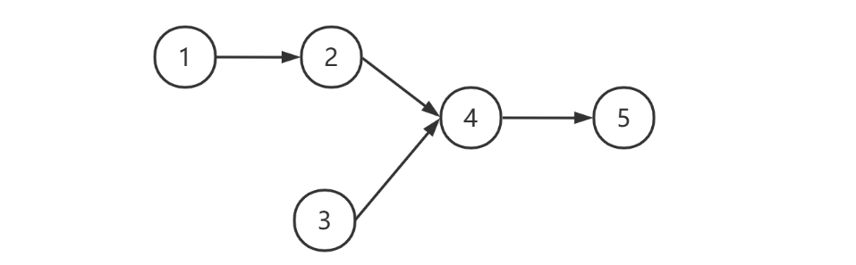

非共尾的情况，如下图所示，此时返回 null


思路，称两个链表为 a=[1, 2, 4, 5]，b=[3, 4, 5]，图中用 N 代表 null

1. 遍历 a，遇到 null 时改道遍历 b
2. 与此同时，遍历 b，遇到 null 时改道遍历 a
3. 在此过程中，如果**遇到相同**的节点，即为找寻目标，返回即可，如下图中的第二次出现的 4
4. 相同节点应该比较其**引用值**，图中数字只是为了便于区分

```
1	2	4	5	N	3	4	5	N
3	4	5	N	1	2	4	5	N
```

如果两个链表长度相同，则可以更早找到目标，例如 a=[1, 4, 5]，b=[3, 4, 5]，第一次出现 4 时，即可返回

```
1	4	5	N	3	4	5	N
3	4	5	N	1	4	5	N
```

如果是非共尾的情况，如 a=[1, 2, 4]，b=[3, 5]，可以看到，唯一相等的情况，是遍历到最后那个 N 此时退出循环

```
1	2	4	N	3	5	N
3	5	N	1	2	4	N
```

代码

```java
public ListNode getIntersectionNode(ListNode a, ListNode b) {
    ListNode p1 = a;
    ListNode p2 = b;
    while (true) {
        if (p1 == p2) {
            return p1;
        }
        if (p1 == null) {
            p1 = b;
        } else {
            p1 = p1.next;
        }
        if (p2 == null) {
            p2 = a;
        } else {
            p2 = p2.next;
        }            
    }
}
```


## 3.6 数组

### E01. 合并有序数组

将数组内两个区间内的有序元素合并

例

```
[1, 5, 6, 2, 4, 10, 11]
```

可以视作两个有序区间

```
[1, 5, 6] 和 [2, 4, 10, 11]
```

合并后，结果仍存储于原有空间

```
[1, 2, 4, 5, 6, 10, 11]
```


**方法1**

递归

* 每次递归把更小的元素复制到结果数组

```java
merge(left=[1,5,6],right=[2,4,10,11],a2=[]){
    merge(left=[5,6],right=[2,4,10,11],a2=[1]){
        merge(left=[5,6],right=[4,10,11],a2=[1,2]){
            merge(left=[5,6],right=[10,11],a2=[1,2,4]){
                merge(left=[6],right=[10,11],a2=[1,2,4,5]){
                    merge(left=[],right=[10,11],a2=[1,2,4,5,6]){
						// 拷贝10，11
                    }
                }
            }
        }
    }
}
```

代码

```java
public static void merge(int[] a1, int i, int iEnd, int j, int jEnd,
                              int[] a2, int k) {
    if (i > iEnd) {
        System.arraycopy(a1, j, a2, k, jEnd - j + 1);
        return;
    }
    if (j > jEnd) {
        System.arraycopy(a1, i, a2, k, iEnd - i + 1);
        return;
    }
    if (a1[i] < a1[j]) {
        a2[k] = a1[i];
        merge(a1, i + 1, iEnd, j, jEnd, a2, k + 1);
    } else {
        a2[k] = a1[j];
        merge(a1, i, iEnd, j + 1, jEnd, a2, k + 1);
    }
}
```

测试

```java
int[] a1 = {1, 5, 6, 2, 4, 10, 11};
int[] a2 = new int[a1.length];
merge(a1, 0, 2, 3, 6, a2, 0);
```


**方法2**

代码

```java
public static void merge(int[] a1, int i, int iEnd,
                             int j, int jEnd,
                             int[] a2) {
    int k = i;
    while (i <= iEnd && j <= jEnd) {
        if (a1[i] < a1[j]) {
            a2[k] = a1[i];
            i++;
        } else {
            a2[k] = a1[j];
            j++;
        }
        k++;
    }
    if (i > leftEnd) {
        System.arraycopy(a1, j, a2, k, jEnd - j + 1);
    }
    if (j > rightEnd) {
        System.arraycopy(a1, i, a2, k, iEnd - i + 1);
    }
}
```

测试

```java
int[] a1 = {1, 5, 6, 2, 4, 10, 11};
int[] a2 = new int[a3.length];
merge(a1, 0, 2, 3, 6, a2);
```


归并排序代码备份

```java
public static void split(int[] a1, int i, int j, int[] a2) {
    System.out.println("i=" + i + " j=" + j + " a1=" + Arrays.toString(Arrays.copyOfRange(a1, i, j + 1)));
    if (i == j) {
        return;
    }
    int m = (i + j) >>> 1;
    split(a1, i, m, a2);
    split(a1, m + 1, j, a2);
    //merge(a1, i, m, m+1, j, a2); // 非递归
    //merge(a1, i, m, m + 1, j, a2, i); // 递归
    System.arraycopy(a2, i, a1, i, (j - i + 1));
    System.out.println("i=" + i + " m=" + m + " j=" + j + " a1=" + Arrays.toString(a1) + " a2=" + Arrays.toString(a2));
}


int[] a1 = {1, 5, 6, 2, 4, 10, 11};
int[] a2 = new int[a1.length];
split(a1, 0, a1.length - 1, a2);
System.out.println(Arrays.toString(a1));
```


## 3.7 队列

### E01. 二叉树层序遍历-力扣 102 题

```java
class Solution {
    public List<List<Integer>> levelOrder(TreeNode root) {
        List<List<Integer>> result = new ArrayList<>();
        if(root == null) {
            return result;
        }
        LinkedListQueue<TreeNode> queue = new LinkedListQueue<>();
        queue.offer(root);
        int c1 = 1;		// 本层节点个数
        while (!queue.isEmpty()) {
            int c2 = 0; 	// 下层节点个数
            List<Integer> level = new ArrayList<>();
            for (int i = 0; i < c1; i++) {
                TreeNode node = queue.poll();
                level.add(node.val);
                if (node.left != null) {
                    queue.offer(node.left);
                    c2++;
                }
                if (node.right != null) {
                    queue.offer(node.right);
                    c2++;
                }
            }
            c1 = c2;
            result.add(level);
        }
        return result;
    }

    // 自定义队列
    static class LinkedListQueue<E> {

        private static class Node<E> {
            E value;
            Node<E> next;

            public Node(E value, Node<E> next) {
                this.value = value;
                this.next = next;
            }
        }

        private final Node<E> head = new Node<>(null, null);
        private Node<E> tail = head;
        int size = 0;
        private int capacity = Integer.MAX_VALUE;

        {
            tail.next = head;
        }

        public LinkedListQueue() {
        }

        public LinkedListQueue(int capacity) {
            this.capacity = capacity;
        }

        public boolean offer(E value) {
            if (isFull()) {
                return false;
            }
            Node<E> added = new Node<>(value, head);
            tail.next = added;
            tail = added;
            size++;
            return true;
        }

        public E poll() {
            if (isEmpty()) {
                return null;
            }
            Node<E> first = head.next;
            head.next = first.next;
            if (first == tail) {
                tail = head;
            }
            size--;
            return first.value;
        }

        public E peek() {
            if (isEmpty()) {
                return null;
            }
            return head.next.value;
        }

        public boolean isEmpty() {
            return head == tail;
        }

        public boolean isFull() {
            return size == capacity;
        }
    }
}
```


### Ex1. 设计队列-力扣 622 题

由于与课堂例题差别不大，这里只给出参考解答

基于链表的实现

```java
public class Ex1Leetcode622 {

    private static class Node {
        int value;
        Node next;
        Node(int value, Node next) {
            this.value = value;
            this.next = next;
        }
    }
    private final Node head = new Node(-1, null);
    private Node tail = head;
    private int size = 0;
    private int capacity = 0;

    {
        tail.next = head;
    }

    public Ex1Leetcode622(int capacity) {
        this.capacity = capacity;
    }

    public boolean enQueue(int value) {
        if(isFull()) {
            return false;
        }
        Node added = new Node(value, head);
        tail.next = added;
        tail = added;
        size++;
        return true;
    }

    public boolean deQueue() {
        if(isEmpty()) {
            return false;
        }
        Node first = head.next;
        head.next = first.next;
        if (first == tail) {
            tail = head;
        }
        size--;
        return true;
    }

    public int Front() {
        if(isEmpty()) {
            return -1;
        }
        return head.next.value;
    }

    public int Rear() {
        if(isEmpty()) {
            return -1;
        }
        return tail.value;
    }

    public boolean isEmpty() {
        return head == tail;
    }

    public boolean isFull() {
        return size == capacity;
    }
}
```

注意：

* Leetcode 的实现里 deQueue（出队）返回值是布尔值，并不会返回队头元素
* 它期望用法是先用 Front 返回对头元素，再 deQueue 出队


## 3.8 栈

### E01. 有效的括号-力扣 20 题

一个字符串中可能出现 `[]` `()` 和 `{}` 三种括号，判断该括号是否有效

有效的例子

```
()[]{}

([{}])

()
```

无效的例子

```
[)

([)]

([]
```

思路

* 遇到左括号, 把要配对的右括号放入栈顶
* 遇到右括号, 若此时栈为空, 返回 false，否则把它与栈顶元素对比
  * 若相等, 栈顶元素弹出, 继续对比下一组
  * 若不等, 无效括号直接返回 false
* 循环结束
  * 若栈为空, 表示所有括号都配上对, 返回 true
  * 若栈不为空, 表示右没配对的括号, 应返回 false

答案（用到了课堂案例中的 ArrayStack 类）

```java
public boolean isValid(String s) {
    ArrayStack<Character> stack = new ArrayStack<>(s.length() / 2 + 1);
    for (int i = 0; i < s.length(); i++) {
        char c = s.charAt(i);
        if (c == '(') {
            stack.push(')');
        } else if (c == '[') {
            stack.push(']');
        } else if (c == '{') {
            stack.push('}');
        } else {
            if (!stack.isEmpty() && stack.peek() == c) {
                stack.pop();
            } else {
                return false;
            }
        }
    }
    return stack.isEmpty();
}
```


### E02. 后缀表达式求值-力扣 120 题

后缀表达式也称为逆波兰表达式，即运算符写在后面

* 从左向右进行计算
* 不必考虑运算符优先级，即不用包含括号

示例

```
输入：tokens = ["2","1","+","3","*"]
输出：9
即：(2 + 1) * 3

输入：tokens = ["4","13","5","/","+"]
输出：6
即：4 + (13 / 5)
```

题目假设

* 数字都视为整数
* 数字和运算符个数给定正确，不会有除零发生

代码

```java
public int evalRPN(String[] tokens) {
    LinkedList<Integer> numbers = new LinkedList<>();
    for (String t : tokens) {
        switch (t) {
            case "+" -> {
                Integer b = numbers.pop();
                Integer a = numbers.pop();
                numbers.push(a + b);
            }
            case "-" -> {
                Integer b = numbers.pop();
                Integer a = numbers.pop();
                numbers.push(a - b);
            }
            case "*" -> {
                Integer b = numbers.pop();
                Integer a = numbers.pop();
                numbers.push(a * b);
            }
            case "/" -> {
                Integer b = numbers.pop();
                Integer a = numbers.pop();
                numbers.push(a / b);
            }
            default -> numbers.push(Integer.parseInt(t));
        }
    }
    return numbers.pop();
}
```


### E03. 中缀表达式转后缀

```java
public class E03InfixToSuffix {
    /*
        思路
        1. 遇到数字, 拼串
        2. 遇到 + - * /
            - 优先级高于栈顶运算符 入栈
            - 否则将栈中高级或平级运算符出栈拼串, 本运算符入栈
        3. 遍历完成, 栈中剩余运算符出栈拼串
            - 先出栈,意味着优先运算
        4. 带 ()
            - 左括号直接入栈
            - 右括号要将栈中直至左括号为止的运算符出栈拼串

        |   |
        |   |
        |   |
        _____

        a+b
        a+b-c
        a+b*c
        a*b+c
        (a+b)*c

     */
    public static void main(String[] args) {
        System.out.println(infixToSuffix("a+b"));
        System.out.println(infixToSuffix("a+b-c"));
        System.out.println(infixToSuffix("a+b*c"));
        System.out.println(infixToSuffix("a*b-c"));
        System.out.println(infixToSuffix("(a+b)*c"));
        System.out.println(infixToSuffix("a+b*c+(d*e+f)*g"));
    }

    static String infixToSuffix(String exp) {
        LinkedList<Character> stack = new LinkedList<>();
        StringBuilder sb = new StringBuilder(exp.length());
        for (int i = 0; i < exp.length(); i++) {
            char c = exp.charAt(i);
            switch (c) {
                case '+', '-', '*', '/' -> {
                    if (stack.isEmpty()) {
                        stack.push(c);
                    } else {
                        if (priority(c) > priority(stack.peek())) {
                            stack.push(c);
                        } else {
                            while (!stack.isEmpty() 
                                   && priority(stack.peek()) >= priority(c)) {
                                sb.append(stack.pop());
                            }
                            stack.push(c);
                        }
                    }
                }
                case '(' -> {
                    stack.push(c);
                }
                case ')' -> {
                    while (!stack.isEmpty() && stack.peek() != '(') {
                        sb.append(stack.pop());
                    }
                    stack.pop();
                }
                default -> {
                    sb.append(c);
                }
            }
        }
        while (!stack.isEmpty()) {
            sb.append(stack.pop());
        }
        return sb.toString();
    }

    static int priority(char c) {
        return switch (c) {
            case '(' -> 0;
            case '*', '/' -> 2;
            case '+', '-' -> 1;
            default -> throw new IllegalArgumentException("不合法字符:" + c);
        };
    }
}
```


### E04. 双栈模拟队列-力扣 232 题

给力扣题目用的**自实现**栈，可以定义为静态内部类

```java
class ArrayStack<E> {

    private E[] array;
    private int top; // 栈顶指针

    @SuppressWarnings("all")
    public ArrayStack(int capacity) {
        this.array = (E[]) new Object[capacity];
    }

    public boolean push(E value) {
        if (isFull()) {
            return false;
        }
        array[top++] = value;
        return true;
    }

    public E pop() {
        if (isEmpty()) {
            return null;
        }
        return array[--top];
    }

    public E peek() {
        if (isEmpty()) {
            return null;
        }
        return array[top - 1];
    }

    public boolean isEmpty() {
        return top == 0;
    }

    public boolean isFull() {
        return top == array.length;
    }
}
```

参考解答，注意：题目已说明

* 调用 push、pop 等方法的次数最多 100

```java
public class E04Leetcode232 {

    /*
        队列头      队列尾
        s1       s2
        顶   底   底   顶
                 abc

        push(a)
        push(b)
        push(c)
        pop()
     */
    ArrayStack<Integer> s1 = new ArrayStack<>(100);
    ArrayStack<Integer> s2 = new ArrayStack<>(100);

    public void push(int x) {
        s2.push(x);
    }

    public int pop() {
        if (s1.isEmpty()) {
            while (!s2.isEmpty()) {
                s1.push(s2.pop());
            }
        }
        return s1.pop();
    }

    public int peek() {
        if (s1.isEmpty()) {
            while (!s2.isEmpty()) {
                s1.push(s2.pop());
            }
        }
        return s1.peek();
    }

    public boolean empty() {
        return s1.isEmpty() && s2.isEmpty();
    }

}
```


### E05. 单队列模拟栈-力扣 225 题

给力扣题目用的**自实现**队列，可以定义为静态内部类

```java
public class ArrayQueue3<E> {

    private final E[] array;
    int head = 0;
    int tail = 0;

    @SuppressWarnings("all")
    public ArrayQueue3(int c) {
        c -= 1;
        c |= c >> 1;
        c |= c >> 2;
        c |= c >> 4;
        c |= c >> 8;
        c |= c >> 16;
        c += 1;
        array = (E[]) new Object[c];
    }
    
    public boolean offer(E value) {
        if (isFull()) {
            return false;
        }        
        array[tail & (array.length - 1)] = value;
        tail++;
        return true;
    }

    public E poll() {
        if (isEmpty()) {
            return null;
        }
        E value = array[head & (array.length - 1)];
        head++;
        return value;
    }

    public E peek() {
        if (isEmpty()) {
            return null;
        }
        return array[head & (array.length - 1)];
    }

    public boolean isEmpty() {
        return head == tail;
    }

    public boolean isFull() {
        return tail - head == array.length;
    }
}
```

参考解答，注意：题目已说明

* 调用 push、pop 等方法的次数最多 100
* 每次调用 pop 和 top 都能保证栈不为空

```java
public class E05Leetcode225 {
    /*
        队列头     队列尾
        cba
        顶           底

        queue.offer(a)
        queue.offer(b)
        queue.offer(c)
     */
    ArrayQueue3<Integer> queue = new ArrayQueue3<>(100);
    int size = 0;
    public void push(int x) {
        queue.offer(x);
        for (int i = 0; i < size; i++) {
            queue.offer(queue.poll());
        }
        size++;
    }

    public int pop() {
        size--;
        return queue.poll();
    }

    public int top() {
        return queue.peek();
    }

    public boolean empty() {
        return queue.isEmpty();
    }
}
```


## 3.9 双端队列

### E01. 二叉树 Z 字层序遍历-力扣 103 题

```java
public class E01Leetcode103 {
    public List<List<Integer>> zigzagLevelOrder(TreeNode root) {
        List<List<Integer>> result = new ArrayList<>();
        if (root == null) {
            return result;
        }
        LinkedList<TreeNode> queue = new LinkedList<>();
        queue.offer(root);
        boolean leftToRight = true;
        int c1 = 1;
        while (!queue.isEmpty()) {
            int c2 = 0;
            LinkedList<Integer> deque = new LinkedList<>();
            for (int i = 0; i < c1; i++) {
                TreeNode n = queue.poll();
                if (leftToRight) {
                    deque.offerLast(n.val);
                } else {
                    deque.offerFirst(n.val);
                }
                if (n.left != null) {
                    queue.offer(n.left);
                    c2++;
                }
                if (n.right != null) {
                    queue.offer(n.right);
                    c2++;
                }
            }
            c1 = c2;
            leftToRight = !leftToRight;
            result.add(deque);
        }

        return result;
    }

    public static void main(String[] args) {
        TreeNode root = new TreeNode(
                new TreeNode(
                        new TreeNode(4),
                        2,
                        new TreeNode(5)
                ),
                1,
                new TreeNode(
                        new TreeNode(6),
                        3,
                        new TreeNode(7)
                )
        );
        List<List<Integer>> lists = new E01Leetcode103().zigzagLevelOrder(root);
        for (List<Integer> list : lists) {
            System.out.println(list);
        }
    }
}
```


### Ex1. 设计双端队列-力扣 641 题

与课堂例题也是差别不大，请参考

## 3.10 优先级队列

### E01. 合并多个有序链表-力扣 23 题

这道题目之前解答过，现在用刚学的优先级队列来实现一下

题目中要从小到大排列，因此选择用小顶堆来实现，自定义小顶堆如下

```java
public class MinHeap {

    ListNode[] array;
    int size;

    public MinHeap(int capacity) {
        array = new ListNode[capacity];
    }

    public void offer(ListNode offered) {
        int child = size++;
        int parent = (child - 1) / 2;
        while (child > 0 && offered.val < array[parent].val) {
            array[child] = array[parent];
            child = parent;
            parent = (child - 1) / 2;
        }
        array[child] = offered;
    }

    public ListNode poll() {
        if (isEmpty()) {
            return null;
        }
        swap(0, size - 1);
        size--;
        ListNode e = array[size];
        array[size] = null; // help GC

        down(0);

        return e;
    }

    private void down(int parent) {
        int left = 2 * parent + 1;
        int right = left + 1;
        int min = parent;
        if (left < size && array[left].val < array[min].val) {
            min = left;
        }
        if (right < size && array[right].val < array[min].val) {
            min = right;
        }
        if (min != parent) {
            swap(min, parent);
            down(min);
        }
    }

    private void swap(int i, int j) {
        ListNode t = array[i];
        array[i] = array[j];
        array[j] = t;
    }

    public boolean isEmpty() {
        return size == 0;
    }
}
```

代码

```java
public class E01Leetcode23 {
    public ListNode mergeKLists(ListNode[] lists) {
        // 1. 使用 jdk 的优先级队列实现
//        PriorityQueue<ListNode> queue = new PriorityQueue<>(Comparator.comparingInt(a -> a.val));
        // 2. 使用自定义小顶堆实现
        MinHeap queue = new MinHeap(lists.length);
        for (ListNode head : lists) {
            if (head != null) {
                queue.offer(head);
            }
        }
        ListNode s = new ListNode(-1, null);
        ListNode p = s;
        while (!queue.isEmpty()) {
            ListNode node = queue.poll();
            p.next = node;
            p = node;
            if (node.next != null) {
                queue.offer(node.next);
            }
        }
        return s.next;
    }
}
```

提问：

* 能否将每个链表的所有元素全部加入堆，再一个个从堆顶移除？

回答：

* 可以是可以，但对空间占用就高了，堆的一个优点就是用有限的空间做事情


## 3.11 堆

### E01. 堆排序

算法描述

1. heapify 建立大顶堆
2. 将堆顶与堆底交换（最大元素被交换到堆底），缩小并下潜调整堆
3. 重复第二步直至堆里剩一个元素

可以使用之前课堂例题的大顶堆来实现

```java
int[] array = {1, 2, 3, 4, 5, 6, 7};
MaxHeap maxHeap = new MaxHeap(array);
System.out.println(Arrays.toString(maxHeap.array));

while (maxHeap.size > 1) {
    maxHeap.swap(0, maxHeap.size - 1);
    maxHeap.size--;
    maxHeap.down(0);
}
System.out.println(Arrays.toString(maxHeap.array));
```


### E02. 数组中第K大元素-力扣 215 题 

小顶堆（可删去用不到代码）

```java
class MinHeap {
    int[] array;
    int size;

    public MinHeap(int capacity) {
        array = new int[capacity];
    }

    private void heapify() {
        for (int i = (size >> 1) - 1; i >= 0; i--) {
            down(i);
        }
    }

    public int poll() {
        swap(0, size - 1);
        size--;
        down(0);
        return array[size];
    }

    public int poll(int index) {
        swap(index, size - 1);
        size--;
        down(index);
        return array[size];
    }

    public int peek() {
        return array[0];
    }

    public boolean offer(int offered) {
        if (size == array.length) {
            return false;
        }
        up(offered);
        size++;
        return true;
    }

    public void replace(int replaced) {
        array[0] = replaced;
        down(0);
    }

    private void up(int offered) {
        int child = size;
        while (child > 0) {
            int parent = (child - 1) >> 1;
            if (offered < array[parent]) {
                array[child] = array[parent];
            } else {
                break;
            }
            child = parent;
        }
        array[child] = offered;
    }

    private void down(int parent) {
        int left = (parent << 1) + 1;
        int right = left + 1;
        int min = parent;
        if (left < size && array[left] < array[min]) {
            min = left;
        }
        if (right < size && array[right] < array[min]) {
            min = right;
        }
        if (min != parent) {
            swap(min, parent);
            down(min);
        }
    }

    // 交换两个索引处的元素
    private void swap(int i, int j) {
        int t = array[i];
        array[i] = array[j];
        array[j] = t;
    }
}
```

题解

```java
public int findKthLargest(int[] numbers, int k) {
    MinHeap heap = new MinHeap(k);
    for (int i = 0; i < k; i++) {
        heap.offer(numbers[i]);
    }
    for (int i = k; i < numbers.length; i++) {
        if(numbers[i] > heap.peek()){
            heap.replace(numbers[i]);
        }
    }
    return heap.peek();
}
```

> 求数组中的第 K 大元素，使用堆并不是最佳选择，可以采用快速选择算法


### E03. 数据流中第K大元素-力扣 703 题 

上题的小顶堆加一个方法

```java
class MinHeap {
    // ...
	public boolean isFull() {
        return size == array.length;
    }
}
```

题解

```java
class KthLargest {

    private MinHeap heap;

    public KthLargest(int k, int[] nums) {
        heap = new MinHeap(k);
        for(int i = 0; i < nums.length; i++) {
            add(nums[i]);
        }
    }
    
    public int add(int val) {
        if(!heap.isFull()){
            heap.offer(val);
        } else if(val > heap.peek()){
            heap.replace(val);
        }
        return heap.peek();
    }
    
}
```

> 求数据流中的第 K 大元素，使用堆最合适不过


### E04. 数据流的中位数-力扣 295 题

可以扩容的 heap, max 用于指定是大顶堆还是小顶堆

```java
public class Heap {
    int[] array;
    int size;
    boolean max;

    public int size() {
        return size;
    }

    public Heap(int capacity, boolean max) {
        this.array = new int[capacity];
        this.max = max;
    }

    /**
     * 获取堆顶元素
     *
     * @return 堆顶元素
     */
    public int peek() {
        return array[0];
    }

    /**
     * 删除堆顶元素
     *
     * @return 堆顶元素
     */
    public int poll() {
        int top = array[0];
        swap(0, size - 1);
        size--;
        down(0);
        return top;
    }

    /**
     * 删除指定索引处元素
     *
     * @param index 索引
     * @return 被删除元素
     */
    public int poll(int index) {
        int deleted = array[index];
        swap(index, size - 1);
        size--;
        down(index);
        return deleted;
    }

    /**
     * 替换堆顶元素
     *
     * @param replaced 新元素
     */
    public void replace(int replaced) {
        array[0] = replaced;
        down(0);
    }

    /**
     * 堆的尾部添加元素
     *
     * @param offered 新元素
     */
    public void offer(int offered) {
        if (size == array.length) {
            grow();
        }
        up(offered);
        size++;
    }

    private void grow() {
        int capacity = size + (size >> 1);
        int[] newArray = new int[capacity];
        System.arraycopy(array, 0,
                newArray, 0, size);
        array = newArray;
    }

    // 将 offered 元素上浮: 直至 offered 小于父元素或到堆顶
    private void up(int offered) {
        int child = size;
        while (child > 0) {
            int parent = (child - 1) / 2;
            boolean cmp = max ? offered > array[parent] : offered < array[parent];
            if (cmp) {
                array[child] = array[parent];
            } else {
                break;
            }
            child = parent;
        }
        array[child] = offered;
    }

    public Heap(int[] array, boolean max) {
        this.array = array;
        this.size = array.length;
        this.max = max;
        heapify();
    }

    // 建堆
    private void heapify() {
        // 如何找到最后这个非叶子节点  size / 2 - 1
        for (int i = size / 2 - 1; i >= 0; i--) {
            down(i);
        }
    }

    // 将 parent 索引处的元素下潜: 与两个孩子较大者交换, 直至没孩子或孩子没它大
    private void down(int parent) {
        int left = parent * 2 + 1;
        int right = left + 1;
        int min = parent;
        if (left < size && (max ? array[left] > array[min] : array[left] < array[min])) {
            min = left;
        }
        if (right < size && (max ? array[right] > array[min] : array[right] < array[min])) {
            min = right;
        }
        if (min != parent) { // 找到了更大的孩子
            swap(min, parent);
            down(min);
        }
    }

    // 交换两个索引处的元素
    private void swap(int i, int j) {
        int t = array[i];
        array[i] = array[j];
        array[j] = t;
    }
}
```

题解

```java
private Heap left = new Heap(10, false);
private Heap right = new Heap(10, true);

/**
 为了保证两边数据量的平衡
 <ul>
  <li>两边数据一样时,加入左边</li>
  <li>两边数据不一样时,加入右边</li>
 </ul>
 但是, 随便一个数能直接加入吗?
 <ul>
  <li>加入左边前, 应该挑右边最小的加入</li>
  <li>加入右边前, 应该挑左边最大的加入</li>
 </ul>
 */
public void addNum(int num) {
    if (left.size() == right.size()) {
        right.offer(num);
        left.offer(right.poll());
    } else {
        left.offer(num);
        right.offer(left.poll());
    }
}

/**
 * <ul>
 *     <li>两边数据一致, 左右各取堆顶元素求平均</li>
 *     <li>左边多一个, 取左边元素</li>
 * </ul>
 */
public double findMedian() {
    if (left.size() == right.size()) {
        return (left.peek() + right.peek()) / 2.0;
    } else {
        return left.peek();
    }
}
```

> 本题还可以使用平衡二叉搜索树求解，不过代码比两个堆复杂


## 3.12 二叉树

### E04. 对称二叉树-力扣 101 题

```java
public boolean isSymmetric(TreeNode root) {
    return check(root.left, root.right);
}

public boolean check(TreeNode left, TreeNode right) {
    // 若同时为 null
    if (left == null && right == null) {
        return true;
    }
    // 若有一个为 null (有上一轮筛选，另一个肯定不为 null)
    if (left == null || right == null) {
        return false;
    }
    if (left.val != right.val) {
        return false;
    }
    return check(left.left, right.right) && check(left.right, right.left);
}
```

类似题目：Leetcode 100 题 - 相同的树


### E05. 二叉树最大深度-力扣 104 题

**后序遍历求解**

```java
/*
    思路：
    1. 得到左子树深度, 得到右子树深度, 二者最大者加一, 就是本节点深度
    2. 因为需要先得到左右子树深度, 很显然是后序遍历典型应用
    3. 关于深度的定义：从根出发, 离根最远的节点总边数,
        注意: 力扣里的深度定义要多一

        深度2         深度3         深度1
        1            1            1
       / \          / \
      2   3        2   3
                        \
                         4
 */
public int maxDepth(TreeNode node) {
    if (node == null) {
        return 0; // 非力扣题目改为返回 -1
    }
    int d1 = maxDepth(node.left);
    int d2 = maxDepth(node.right);
    return Integer.max(d1, d2) + 1;
}
```


**后序遍历求解-非递归**

```java
/*
    思路：
    1. 使用非递归后序遍历, 栈的最大高度即为最大深度
 */
public int maxDepth(TreeNode root) {
    TreeNode curr = root;
    LinkedList<TreeNode> stack = new LinkedList<>();
    int max = 0;
    TreeNode pop = null;
    while (curr != null || !stack.isEmpty()) {
        if (curr != null) {
            stack.push(curr);
            int size = stack.size();
            if (size > max) {
                max = size;
            }
            curr = curr.left;
        } else {
            TreeNode peek = stack.peek();
            if(peek.right == null || peek.right == pop) {
                pop = stack.pop();
            } else {
                curr = peek.right;
            }
        }
    }
    return max;
}
```


**层序遍历求解**

```java
/*
    思路：
    1. 使用层序遍历, 层数即最大深度
 */
public int maxDepth(TreeNode root) {
    if(root == null) {
        return 0;
    }
    Queue<TreeNode> queue = new LinkedList<>();
    queue.offer(root);
    int level = 0;
    while (!queue.isEmpty()) {
        level++;
        int size = queue.size();
        for (int i = 0; i < size; i++) {
            TreeNode node = queue.poll();
            if (node.left != null) {
                queue.offer(node.left);
            }
            if (node.right != null) {
                queue.offer(node.right);
            }
        }
    }
    return level;
}
```


### E06. 二叉树最小深度-力扣 111 题

**后序遍历求解**

```java
public int minDepth(TreeNode node) {
    if (node == null) {
        return 0;
    }
    int d1 = minDepth(node.left);
    int d2 = minDepth(node.right);
    if (d1 == 0 || d2 == 0) {
        return d1 + d2 + 1;
    }
    return Integer.min(d1, d2) + 1;
}
```

相较于求最大深度，应当考虑：

* 当右子树为 null，应当返回左子树深度加一
* 当左子树为 null，应当返回右子树深度加一

上面两种情况满足时，不应该再把为 null 子树的深度 0 参与最小值比较，例如这样

```
    1
   /
  2
```

* 正确深度为 2，若把为 null 的右子树的深度 0 考虑进来，会得到错误结果 1

```
    1
     \
      3
       \
        4
```

* 正确深度为 3，若把为 null 的左子树的深度 0 考虑进来，会得到错误结果 1


**层序遍历求解**

遇到的第一个叶子节点所在层就是最小深度

例如，下面的树遇到的第一个叶子节点 3 所在的层就是最小深度，其他 4，7 等叶子节点深度更深，也更晚遇到

```
     1
    / \     
   2   3
  / \
 4   5 
    /
   7 
```

代码

```java
public int minDepth(TreeNode root) {
    if(root == null) {
        return 0;
    }
    Queue<TreeNode> queue = new LinkedList<>();
    queue.offer(root);
    int level = 0;
    while (!queue.isEmpty()) {
        level++;
        int size = queue.size();
        for (int i = 0; i < size; i++) {
            TreeNode node = queue.poll();
            if (node.left == null && node.right == null) {
                return level;
            }
            if (node.left != null) {
                queue.offer(node.left);
            }
            if (node.right != null) {
                queue.offer(node.right);
            }
        }
    }
    return level;
}
```

效率会高于之前后序遍历解法，因为找到第一个叶子节点后，就无需后续的层序遍历了


### E07. 翻转二叉树-力扣 226 题

```java
public TreeNode invertTree(TreeNode root) {
    fn(root);
    return root;
}

private void fn(TreeNode node){
    if (node == null) {
        return;
    }
    TreeNode t = node.left;
    node.left = node.right;
    node.right = t;
    fn(node.left);
    fn(node.right);
}
```

先交换、再递归或是先递归、再交换都可以


### E08. 后缀表达式转二叉树

```java
static class TreeNode {
    public String val;
    public TreeNode left;
    public TreeNode right;

    public TreeNode(String val) {
        this.val = val;
    }

    public TreeNode(TreeNode left, String val, TreeNode right) {
        this.left = left;
        this.val = val;
        this.right = right;
    }

    @Override
    public String toString() {
        return this.val;
    }
}

/*
    中缀表达式           (2-1)*3
    后缀（逆波兰）表达式   21-3*

    1.遇到数字入栈
    2.遇到运算符, 出栈两次, 与当前节点建立父子关系, 当前节点入栈

    栈
    |   |
    |   |
    |   |
    _____

    表达式树
        *
       / \
      -   3
     / \
    2   1

    21-3*
 */
public TreeNode constructExpressionTree(String[] tokens) {
    LinkedList<TreeNode> stack = new LinkedList<>();
    for (String t : tokens) {
        switch (t) {
            case "+", "-", "*", "/" -> { // 运算符
                TreeNode right = stack.pop();
                TreeNode left = stack.pop();
                TreeNode parent = new TreeNode(t);
                parent.left = left;
                parent.right = right;
                stack.push(parent);
            }
            default -> { // 数字
                stack.push(new TreeNode(t));
            }
        }
    }
    return stack.peek();
}
```


### E09. 根据前序与中序遍历结果构造二叉树-力扣 105 题

* 先通过前序遍历结果定位根节点
* 再结合中序遍历结果切分左右子树

```java
public class E09Leetcode105 {

    /*
        preOrder = {1,2,4,3,6,7}
        inOrder = {4,2,1,6,3,7}

        根 1
            pre         in
        左  2,4         4,2
        右  3,6,7       6,3,7


        根 2
        左 4

        根 3
        左 6
        右 7
     */

    public TreeNode buildTree(int[] preOrder, int[] inOrder) {
        if (preOrder.length == 0) {
            return null;
        }
        // 创建根节点
        int rootValue = preOrder[0];
        TreeNode root = new TreeNode(rootValue);
        // 区分左右子树
        for (int i = 0; i < inOrder.length; i++) {
            if (inOrder[i] == rootValue) {
                // 0 ~ i-1 左子树
                // i+1 ~ inOrder.length -1 右子树
                int[] inLeft = Arrays.copyOfRange(inOrder, 0, i); // [4,2]
                int[] inRight = Arrays.copyOfRange(inOrder, i + 1, inOrder.length); // [6,3,7]

                int[] preLeft = Arrays.copyOfRange(preOrder, 1, i + 1); // [2,4]
                int[] preRight = Arrays.copyOfRange(preOrder, i + 1, inOrder.length); // [3,6,7]

                root.left = buildTree(preLeft, inLeft); // 2
                root.right = buildTree(preRight, inRight); // 3
                break;
            }
        }
        return root;
    }

}
```

* 代码可以进一步优化，涉及新数据结构，以后实现


### E10. 根据中序与后序遍历结果构造二叉树-力扣 106 题  

* 先通过后序遍历结果定位根节点
* 再结合中序遍历结果切分左右子树

```java
public TreeNode buildTree(int[] inOrder, int[] postOrder) {
    if (inOrder.length == 0) {
        return null;
    }
    // 根
    int rootValue = postOrder[postOrder.length - 1];
    TreeNode root = new TreeNode(rootValue);
    // 切分左右子树
    for (int i = 0; i < inOrder.length; i++) {
        if (inOrder[i] == rootValue) {
            int[] inLeft = Arrays.copyOfRange(inOrder, 0, i);
            int[] inRight = Arrays.copyOfRange(inOrder, i + 1, inOrder.length);

            int[] postLeft = Arrays.copyOfRange(postOrder, 0, i);
            int[] postRight = Arrays.copyOfRange(postOrder, i, postOrder.length - 1);

            root.left = buildTree(inLeft, postLeft);
            root.right = buildTree(inRight, postRight);
            break;
        }
    }
    return root;
}
```

* 代码可以进一步优化，涉及新数据结构，以后实现


# 附录

## 参考文章

[^1]: ["Definition of ALGORITHM"](https://www.merriam-webster.com/dictionary/algorithm). *Merriam-Webster Online Dictionary*. [Archived](https://web.archive.org/web/20200214074446/https://www.merriam-webster.com/dictionary/algorithm) from the original on February 14, 2020. Retrieved November 14, 2019.
[^2]: Introduction to Algorithm 中文译作《算法导论》
[^3]: 主要参考文档 https://en.wikipedia.org/wiki/Binary_search_algorithm
[^4]: 图片及概念均摘自 Introduction to Algorithm 4th，3.1节，3.2 节
[^5]: 图片引用自 wikipedia linkedlist 条目，https://en.wikipedia.org/wiki/Linked_list

[^6]: 也称为 Pascal's triangle https://en.wikipedia.org/wiki/Pascal%27s_triangle

[^7]: [递归求解斐波那契数列的时间复杂度——几种简洁证明 - 知乎 (zhihu.com)](https://zhuanlan.zhihu.com/p/257214075)
[^8]: Fibonacci 介绍：https://en.wikipedia.org/wiki/Fibonacci_number
[^9]: [几种计算Fibonacci数列算法的时间复杂度比较 - 知乎 (zhihu.com)](https://zhuanlan.zhihu.com/p/165877869)
[^10]: 几种斐波那契数列算法比较 [Fast Fibonacci algorithms (nayuki.io)](https://www.nayuki.io/page/fast-fibonacci-algorithms)

[^11]: 我知道的有 C++，Scala
[^12]: jdk 版本有关，64 位 jdk，按 8 字节对齐
[^13]: 汉诺塔图片资料均来自 https://en.wikipedia.org/wiki/Tower_of_Hanoi
[^14]: 与主定理类似的还有 Akra–Bazzi method，https://en.wikipedia.org/wiki/Akra%E2%80%93Bazzi_method

[^15]: 龟兔赛跑动画来自于 [Floyd's Hare and Tortoise Algorithm Demo - One Step! Code (onestepcode.com)](https://onestepcode.com/floyd-hare-tortoise-algorithm-demo/)

[^16]: Josephus problem 主要参考 https://en.wikipedia.org/wiki/Josephus_problem

## 落选题目

### 反转字符数组

```java
public static void main(String[] args) {
    char[] array = "abcde".toCharArray();
    recursion(array, 0, array.length - 1);
    System.out.println(Arrays.toString(array));
}

public static void recursion(char[] array, int i, int j) {
    if (i >= j) {
        return;
    }
    swap(array, i, j);
    recursion(array, ++i, --j);
}

public static void swap(char[] array, int i, int j) {
    char c = array[i];
    array[i] = array[j];
    array[j] = c;
}
```

* 第一次交换的是 array[0] 和 array[4]
* 第二次交换的是 array[1] 和 array[3]
* 第三次 i = j = 2，开始返回
* 如果 array.length 是偶数，则会在 i > j 时返回


## 力扣高评价题目列表

引用自 [面试最常考的 100 道算法题分类整理！ - 知乎 (zhihu.com)](https://zhuanlan.zhihu.com/p/449686402)

> 带 ✔️ 是本课程讲解过的

- **[1. Two Sum (两数之和)](https://link.zhihu.com/?target=https%3A//leetcode-cn.com/problems/two-sum/)**, Easy, 11757 likes
- **[2. Add Two Numbers (两数相加)](https://link.zhihu.com/?target=https%3A//leetcode-cn.com/problems/add-two-numbers/)**, Medium, 6524 likes
- **[3. Longest Substring Without Repeating Characters (无重复字符的最长子串)](https://link.zhihu.com/?target=https%3A//leetcode-cn.com/problems/longest-substring-without-repeating-characters/)**, Medium, 5845 likes
- **[4. Median of Two Sorted Arrays (寻找两个正序数组的中位数)](https://link.zhihu.com/?target=https%3A//leetcode-cn.com/problems/median-of-two-sorted-arrays/)**, Hard, 4303 likes
- **[5. Longest Palindromic Substring (最长回文子串)](https://link.zhihu.com/?target=https%3A//leetcode-cn.com/problems/longest-palindromic-substring/)**, Medium, 3896 likes
- **[15. 3Sum (三数之和)](https://link.zhihu.com/?target=https%3A//leetcode-cn.com/problems/3sum/)**, Medium, 3582 likes
- **[53. Maximum Subarray (最大子序和)](https://link.zhihu.com/?target=https%3A//leetcode-cn.com/problems/maximum-subarray/)**, Easy, 3533 likes
- **[7. Reverse Integer (整数反转)](https://link.zhihu.com/?target=https%3A//leetcode-cn.com/problems/reverse-integer/)**, Easy, 2970 likes
- **[11. Container With Most Water (盛最多水的容器)](https://link.zhihu.com/?target=https%3A//leetcode-cn.com/problems/container-with-most-water/)**, Medium, 2659 likes
- **[42. Trapping Rain Water (接雨水)](https://link.zhihu.com/?target=https%3A//leetcode-cn.com/problems/trapping-rain-water/)**, Hard, 2552 likes
- **[20. Valid Parentheses (有效的括号)](https://link.zhihu.com/?target=https%3A//leetcode-cn.com/problems/valid-parentheses/)**, Easy, 2544 likes ✔️
- **[10. Regular Expression Matching (正则表达式匹配)](https://link.zhihu.com/?target=https%3A//leetcode-cn.com/problems/regular-expression-matching/)**, Hard, 2273 likes
- **[26. Remove Duplicates from Sorted Array (删除有序数组中的重复项)](https://link.zhihu.com/?target=https%3A//leetcode-cn.com/problems/remove-duplicates-from-sorted-array/)**, Easy, 2146 likes ✔️
- **[136. Single Number (只出现一次的数字)](https://link.zhihu.com/?target=https%3A//leetcode-cn.com/problems/single-number/)**, Easy, 1958 likes
- **[22. Generate Parentheses (括号生成)](https://link.zhihu.com/?target=https%3A//leetcode-cn.com/problems/generate-parentheses/)**, Medium, 1946 likes
- **[206. Reverse Linked List (反转链表)](https://link.zhihu.com/?target=https%3A//leetcode-cn.com/problems/reverse-linked-list/)**, Easy, 1886 likes ✔️
- **[21. Merge Two Sorted Lists (合并两个有序链表)](https://link.zhihu.com/?target=https%3A//leetcode-cn.com/problems/merge-two-sorted-lists/)**, Easy, 1832 likes ✔️
- **[70. Climbing Stairs (爬楼梯)](https://link.zhihu.com/?target=https%3A//leetcode-cn.com/problems/climbing-stairs/)**, Easy, 1791 likes ✔️
- **[300. Longest Increasing Subsequence (最长递增子序列)](https://link.zhihu.com/?target=https%3A//leetcode-cn.com/problems/longest-increasing-subsequence/)**, Medium, 1773 likes
- **[121. Best Time to Buy and Sell Stock (买卖股票的最佳时机)](https://link.zhihu.com/?target=https%3A//leetcode-cn.com/problems/best-time-to-buy-and-sell-stock/)**, Easy, 1766 likes
- **[72. Edit Distance (编辑距离)](https://link.zhihu.com/?target=https%3A//leetcode-cn.com/problems/edit-distance/)**, Hard, 1743 likes
- **[14. Longest Common Prefix (最长公共前缀)](https://link.zhihu.com/?target=https%3A//leetcode-cn.com/problems/longest-common-prefix/)**, Easy, 1707 likes
- **[198. House Robber (打家劫舍)](https://link.zhihu.com/?target=https%3A//leetcode-cn.com/problems/house-robber/)**, Medium, 1585 likes
- **[9. Palindrome Number (回文数)](https://link.zhihu.com/?target=https%3A//leetcode-cn.com/problems/palindrome-number/)**, Easy, 1568 likes
- **[146. LRU Cache (LRU 缓存机制)](https://link.zhihu.com/?target=https%3A//leetcode-cn.com/problems/lru-cache/)**, Medium, 1544 likes
- **[19. Remove Nth Node From End of List (删除链表的倒数第 N 个结点)](https://link.zhihu.com/?target=https%3A//leetcode-cn.com/problems/remove-nth-node-from-end-of-list/)**, Medium, 1494 likes ✔️
- **[33. Search in Rotated Sorted Array (搜索旋转排序数组)](https://link.zhihu.com/?target=https%3A//leetcode-cn.com/problems/search-in-rotated-sorted-array/)**, Medium, 1493 likes
- **[46. Permutations (全排列)](https://link.zhihu.com/?target=https%3A//leetcode-cn.com/problems/permutations/)**, Medium, 1484 likes
- **[101. Symmetric Tree (对称二叉树)](https://link.zhihu.com/?target=https%3A//leetcode-cn.com/problems/symmetric-tree/)**, Easy, 1483 likes ✔️
- **[84. Largest Rectangle in Histogram (柱状图中最大的矩形)](https://link.zhihu.com/?target=https%3A//leetcode-cn.com/problems/largest-rectangle-in-histogram/)**, Hard, 1472 likes
- **[39. Combination Sum (组合总和)](https://link.zhihu.com/?target=https%3A//leetcode-cn.com/problems/combination-sum/)**, Medium, 1466 likes
- **[13. Roman to Integer (罗马数字转整数)](https://link.zhihu.com/?target=https%3A//leetcode-cn.com/problems/roman-to-integer/)**, Easy, 1436 likes
- **[23. Merge k Sorted Lists (合并K个升序链表)](https://link.zhihu.com/?target=https%3A//leetcode-cn.com/problems/merge-k-sorted-lists/)**, Hard, 1436 likes ✔️
- **[17. Letter Combinations of a Phone Number (电话号码的字母组合)](https://link.zhihu.com/?target=https%3A//leetcode-cn.com/problems/letter-combinations-of-a-phone-number/)**, Medium, 1436 likes
- **[322. Coin Change (零钱兑换)](https://link.zhihu.com/?target=https%3A//leetcode-cn.com/problems/coin-change/)**, Medium, 1414 likes
- **[32. Longest Valid Parentheses (最长有效括号)](https://link.zhihu.com/?target=https%3A//leetcode-cn.com/problems/longest-valid-parentheses/)**, Hard, 1400 likes
- **[287. Find the Duplicate Number (寻找重复数)](https://link.zhihu.com/?target=https%3A//leetcode-cn.com/problems/find-the-duplicate-number/)**, Medium, 1325 likes
- **[122. Best Time to Buy and Sell Stock II (买卖股票的最佳时机 II)](https://link.zhihu.com/?target=https%3A//leetcode-cn.com/problems/best-time-to-buy-and-sell-stock-ii/)**, Easy, 1306 likes
- **[160. Intersection of Two Linked Lists (相交链表)](https://link.zhihu.com/?target=https%3A//leetcode-cn.com/problems/intersection-of-two-linked-lists/)**, Easy, 1302 likes ✔️
- **[55. Jump Game (跳跃游戏)](https://link.zhihu.com/?target=https%3A//leetcode-cn.com/problems/jump-game/)**, Medium, 1292 likes
- **[76. Minimum Window Substring (最小覆盖子串)](https://link.zhihu.com/?target=https%3A//leetcode-cn.com/problems/minimum-window-substring/)**, Hard, 1280 likes
- **[200. Number of Islands (岛屿数量)](https://link.zhihu.com/?target=https%3A//leetcode-cn.com/problems/number-of-islands/)**, Medium, 1270 likes
- **[78. Subsets (子集)](https://link.zhihu.com/?target=https%3A//leetcode-cn.com/problems/subsets/)**, Medium, 1269 likes
- **[31. Next Permutation (下一个排列)](https://link.zhihu.com/?target=https%3A//leetcode-cn.com/problems/next-permutation/)**, Medium, 1260 likes
- **[96. Unique Binary Search Trees (不同的二叉搜索树)](https://link.zhihu.com/?target=https%3A//leetcode-cn.com/problems/unique-binary-search-trees/)**, Medium, 1257 likes
- **[148. Sort List (排序链表)](https://link.zhihu.com/?target=https%3A//leetcode-cn.com/problems/sort-list/)**, Medium, 1248 likes
- **[236. Lowest Common Ancestor of a Binary Tree (二叉树的最近公共祖先)](https://link.zhihu.com/?target=https%3A//leetcode-cn.com/problems/lowest-common-ancestor-of-a-binary-tree/)**, Medium, 1238 likes ✔️
- **[25. Reverse Nodes in k-Group (K 个一组翻转链表)](https://link.zhihu.com/?target=https%3A//leetcode-cn.com/problems/reverse-nodes-in-k-group/)**, Hard, 1230 likes
- **[6. ZigZag Conversion (Z 字形变换)](https://link.zhihu.com/?target=https%3A//leetcode-cn.com/problems/zigzag-conversion/)**, Medium, 1226 likes
- **[152. Maximum Product Subarray (乘积最大子数组)](https://link.zhihu.com/?target=https%3A//leetcode-cn.com/problems/maximum-product-subarray/)**, Medium, 1223 likes
- **[215. Kth Largest Element in an Array (数组中的第K个最大元素)](https://link.zhihu.com/?target=https%3A//leetcode-cn.com/problems/kth-largest-element-in-an-array/)**, Medium, 1211 likes
- **[8. String to Integer (atoi) (字符串转换整数 (atoi))](https://link.zhihu.com/?target=https%3A//leetcode-cn.com/problems/string-to-integer-atoi/)**, Medium, 1168 likes
- **[41. First Missing Positive (缺失的第一个正数)](https://link.zhihu.com/?target=https%3A//leetcode-cn.com/problems/first-missing-positive/)**, Hard, 1163 likes
- **[283. Move Zeroes (移动零)](https://link.zhihu.com/?target=https%3A//leetcode-cn.com/problems/move-zeroes/)**, Easy, 1162 likes
- **[141. Linked List Cycle (环形链表)](https://link.zhihu.com/?target=https%3A//leetcode-cn.com/problems/linked-list-cycle/)**, Easy, 1161 likes ✔️
- **[98. Validate Binary Search Tree (验证二叉搜索树)](https://link.zhihu.com/?target=https%3A//leetcode-cn.com/problems/validate-binary-search-tree/)**, Medium, 1156 likes ✔️
- **[124. Binary Tree Maximum Path Sum (二叉树中的最大路径和)](https://link.zhihu.com/?target=https%3A//leetcode-cn.com/problems/binary-tree-maximum-path-sum/)**, Hard, 1152 likes
- **[105. Construct Binary Tree from Preorder and Inorder Traversal (从前序与中序遍历序列构造二叉树)](https://link.zhihu.com/?target=https%3A//leetcode-cn.com/problems/construct-binary-tree-from-preorder-and-inorder-traversal/)**, Medium, 1149 likes ✔️
- **[34. Find First and Last Position of Element in Sorted Array (在排序数组中查找元素的第一个和最后一个位置)](https://link.zhihu.com/?target=https%3A//leetcode-cn.com/problems/find-first-and-last-position-of-element-in-sorted-array/)**, Medium, 1137 likes ✔️
- **[239. Sliding Window Maximum (滑动窗口最大值)](https://link.zhihu.com/?target=https%3A//leetcode-cn.com/problems/sliding-window-maximum/)**, Hard, 1114 likes
- **[142. Linked List Cycle II (环形链表 II)](https://link.zhihu.com/?target=https%3A//leetcode-cn.com/problems/linked-list-cycle-ii/)**, Medium, 1097 likes ✔️
- **[139. Word Break (单词拆分)](https://link.zhihu.com/?target=https%3A//leetcode-cn.com/problems/word-break/)**, Medium, 1097 likes
- **[45. Jump Game II (跳跃游戏 II)](https://link.zhihu.com/?target=https%3A//leetcode-cn.com/problems/jump-game-ii/)**, Medium, 1094 likes
- **[169. Majority Element (多数元素)](https://link.zhihu.com/?target=https%3A//leetcode-cn.com/problems/majority-element/)**, Easy, 1089 likes
- **[234. Palindrome Linked List (回文链表)](https://link.zhihu.com/?target=https%3A//leetcode-cn.com/problems/palindrome-linked-list/)**, Easy, 1072 likes ✔️
- **[62. Unique Paths (不同路径)](https://link.zhihu.com/?target=https%3A//leetcode-cn.com/problems/unique-paths/)**, Medium, 1072 likes
- **[189. Rotate Array (旋转数组)](https://link.zhihu.com/?target=https%3A//leetcode-cn.com/problems/rotate-array/)**, Medium, 1057 likes
- **[94. Binary Tree Inorder Traversal (二叉树的中序遍历)](https://link.zhihu.com/?target=https%3A//leetcode-cn.com/problems/binary-tree-inorder-traversal/)**, Easy, 1052 likes ✔️
- **[56. Merge Intervals (合并区间)](https://link.zhihu.com/?target=https%3A//leetcode-cn.com/problems/merge-intervals/)**, Medium, 1051 likes
- **[88. Merge Sorted Array (合并两个有序数组)](https://link.zhihu.com/?target=https%3A//leetcode-cn.com/problems/merge-sorted-array/)**, Easy, 1041 likes ✔️
- **[560. Subarray Sum Equals K (和为K的子数组)](https://link.zhihu.com/?target=https%3A//leetcode-cn.com/problems/subarray-sum-equals-k/)**, Medium, 1036 likes
- **[279. Perfect Squares (完全平方数)](https://link.zhihu.com/?target=https%3A//leetcode-cn.com/problems/perfect-squares/)**, Medium, 1035 likes
- **[35. Search Insert Position (搜索插入位置)](https://link.zhihu.com/?target=https%3A//leetcode-cn.com/problems/search-insert-position/)**, Easy, 1005 likes
- **[24. Swap Nodes in Pairs (两两交换链表中的节点)](https://link.zhihu.com/?target=https%3A//leetcode-cn.com/problems/swap-nodes-in-pairs/)**, Medium, 996 likes
- **[85. Maximal Rectangle (最大矩形)](https://link.zhihu.com/?target=https%3A//leetcode-cn.com/problems/maximal-rectangle/)**, Hard, 983 likes
- **[28. Implement strStr() (实现 strStr())](https://link.zhihu.com/?target=https%3A//leetcode-cn.com/problems/implement-strstr/)**, Easy, 982 likes
- **[92. Reverse Linked List II (反转链表 II)](https://link.zhihu.com/?target=https%3A//leetcode-cn.com/problems/reverse-linked-list-ii/)**, Medium, 980 likes
- **[155. Min Stack (最小栈)](https://link.zhihu.com/?target=https%3A//leetcode-cn.com/problems/min-stack/)**, Easy, 979 likes
- **[79. Word Search (单词搜索)](https://link.zhihu.com/?target=https%3A//leetcode-cn.com/problems/word-search/)**, Medium, 979 likes
- **[27. Remove Element (移除元素)](https://link.zhihu.com/?target=https%3A//leetcode-cn.com/problems/remove-element/)**, Easy, 967 likes
- **[51. N-Queens (N 皇后)](https://link.zhihu.com/?target=https%3A//leetcode-cn.com/problems/n-queens/)**, Hard, 965 likes
- **[75. Sort Colors (颜色分类)](https://link.zhihu.com/?target=https%3A//leetcode-cn.com/problems/sort-colors/)**, Medium, 961 likes
- **[102. Binary Tree Level Order Traversal (二叉树的层序遍历)](https://link.zhihu.com/?target=https%3A//leetcode-cn.com/problems/binary-tree-level-order-traversal/)**, Medium, 960 likes ✔️
- **[48. Rotate Image (旋转图像)](https://link.zhihu.com/?target=https%3A//leetcode-cn.com/problems/rotate-image/)**, Medium, 960 likes
- **[95. Unique Binary Search Trees II (不同的二叉搜索树 II)](https://link.zhihu.com/?target=https%3A//leetcode-cn.com/problems/unique-binary-search-trees-ii/)**, Medium, 955 likes
- **[64. Minimum Path Sum (最小路径和)](https://link.zhihu.com/?target=https%3A//leetcode-cn.com/problems/minimum-path-sum/)**, Medium, 954 likes
- **[406. Queue Reconstruction by Height (根据身高重建队列)](https://link.zhihu.com/?target=https%3A//leetcode-cn.com/problems/queue-reconstruction-by-height/)**, Medium, 947 likes
- **[226. Invert Binary Tree (翻转二叉树)](https://link.zhihu.com/?target=https%3A//leetcode-cn.com/problems/invert-binary-tree/)**, Easy, 941 likes ✔️
- **[437. Path Sum III (路径总和 III)](https://link.zhihu.com/?target=https%3A//leetcode-cn.com/problems/path-sum-iii/)**, Medium, 937 likes
- **[104. Maximum Depth of Binary Tree (二叉树的最大深度)](https://link.zhihu.com/?target=https%3A//leetcode-cn.com/problems/maximum-depth-of-binary-tree/)**, Easy, 937 likes ✔️
- **[237. Delete Node in a Linked List (删除链表中的节点)](https://link.zhihu.com/?target=https%3A//leetcode-cn.com/problems/delete-node-in-a-linked-list/)**, Easy, 936 likes ✔️
- **[337. House Robber III (打家劫舍 III)](https://link.zhihu.com/?target=https%3A//leetcode-cn.com/problems/house-robber-iii/)**, Medium, 929 likes
- **[18. 4Sum (四数之和)](https://link.zhihu.com/?target=https%3A//leetcode-cn.com/problems/4sum/)**, Medium, 918 likes
- **[91. Decode Ways (解码方法)](https://link.zhihu.com/?target=https%3A//leetcode-cn.com/problems/decode-ways/)**, Medium, 904 likes
- **[207. Course Schedule (课程表)](https://link.zhihu.com/?target=https%3A//leetcode-cn.com/problems/course-schedule/)**, Medium, 897 likes
- **[37. Sudoku Solver (解数独)](https://link.zhihu.com/?target=https%3A//leetcode-cn.com/problems/sudoku-solver/)**, Hard, 897 likes
- **[175. Combine Two Tables (组合两个表)](https://link.zhihu.com/?target=https%3A//leetcode-cn.com/problems/combine-two-tables/)**, Easy, 891 likes
- **[416. Partition Equal Subset Sum (分割等和子集)](https://link.zhihu.com/?target=https%3A//leetcode-cn.com/problems/partition-equal-subset-sum/)**, Medium, 886 likes
- **[238. Product of Array Except Self (除自身以外数组的乘积)](https://link.zhihu.com/?target=https%3A//leetcode-cn.com/problems/product-of-array-except-self/)**, Medium, 885 likes
- **[114. Flatten Binary Tree to Linked List (二叉树展开为链表)](https://link.zhihu.com/?target=https%3A//leetcode-cn.com/problems/flatten-binary-tree-to-linked-list/)**, Medium, 877 likes ✔️
